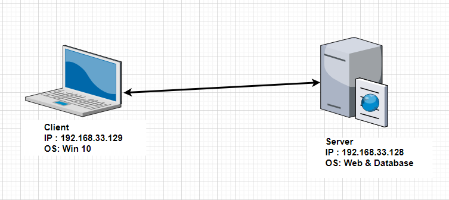
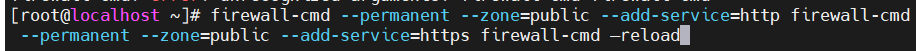
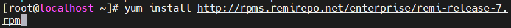
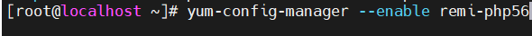

- [Tìm hiểu về Wordpress](#tìm-hiểu-về-wordpress)
  - [1. Wordpress là gì ?](#1-wordpress-là-gì-)
  - [2. Cài đặt Wordpress](#2-cài-đặt-wordpress)
    - [1. Cài đặt CSDL Mariadb-Server](#1-cài-đặt-csdl-mariadb-server)
    - [2. Cài đặt Apache](#2-cài-đặt-apache)
    - [3. Cài đặt PHP](#3-cài-đặt-php)
    - [4. Cài đặt Wordpress](#4-cài-đặt-wordpress)


Tool Install_WordPress

**https://github.com/tuannt76/Linux/blob/main/LinuxBasic/Ghi_chep_WordPress/wordpress.sh**

# Tìm hiểu về Wordpress 

## 1. Wordpress là gì ?
Wordpress là 1 phần mềm mã nguồn mở dùng để tạo trang web ,quản trị trang web,web server
## 2. Cài đặt Wordpress
Mô hình mạng


Các bước cài đặt Wordpress

### 1. Cài đặt CSDL Mariadb-Server
-	Bước 1: Cài đặt:

```yum -y install mariadb-server```


-	Bước 2 :  Đặt mật khẩu mariadb:

```mysql_secure_installation```


Nhấn enter 


•	Bước 3 : Khởi động dịch vụ:


```
systemctl start mariadb
systemctl enable mariadb
```
Bước 4 : Cấu hình tưởng lửa 

```
firewall-cmd --add-service=mysql --permanent
firewall-cmd –reload
```

### 2. Cài đặt Apache
- Bước 1 Cài đặt:
  
``` yum install httpd –y ```


- Bước 2 Khởi động dịch vụ:

```
systemctl start httpd
systemctl enable httpd
```


- Bước 4 : Cấu hình tường lửa:
  
```firewall-cmd --permanent --zone=public --add-service=http firewall-cmd --permanent --zone=public --add-service=https firewall-cmd –reload```





### 3. Cài đặt PHP

- Bước 1 : Cài đặt kho lưu trữ EPLE và Remi

``` yum install http://rpms.remirepo.net/enterprise/remi-release-7.rpm ```



Bước 2: Cài đặt yum-utils
```yum install yum-utils –y```


Bước 3: Cài đặt PHP 5.6

yum-config-manager --enable remi-php56



```
 yum install php php-mcrypt php-cli php-gd php-curl php-mysql php-ldap php-zip php-fileinfo
 ```


•	Kiểm tra phiên bản:

``` php –v ```


### 4. Cài đặt Wordpress

 Bước 1: Tạo cơ sở dữ liệu trên mariadb

- Đăng nhập vào Mariadb:

```
mysql -u root –p 
```


- Tạo cơ sở dữ liệu bằng lệnh:
  

```
CREATE DATABASE tuannguyen;
```


- Tạo user cho CSDL wordpressdb:
  
 
```
CREATE USER userwp@localhost IDENTIFIED BY '123456';
```


- Cấp cho userwp quyền truy cập vào CSDL:

  ``` 
  GRANT ALL PRIVILEGES ON tuannguyen.* TO userwp@localhost IDENTIFIED BY '123456';
  ```
  
- Lưu thay đổi:

    ```
    FLUSH PRIVILEGES;
    ```

- Cuối cùng thoát MySQL:

    ```
    exit
    ```

Bước 2 Cài đặt WordPress :

- Truy cập html

``` 
cd /var/www/html 
```


- Cài đặt Wordpress từ internet:

    ```
    wget https://wordpress.org/latest.tar.gz
    ```


- Giải nén tệp:

    ```
    tar -xzvf latest.tar.gz
    ```

Tạo file cấu hình :

 ```
 cp wp-config-sample.php wp-config.php
 ```

•	Chỉnh sửa tệp cấu hình:

```
vi wp-config.php
```


Sửa file Cấu Hình


4.3 Kiểm tra
Trên Client: Truy cập Wordpress bằng trình duyệt

