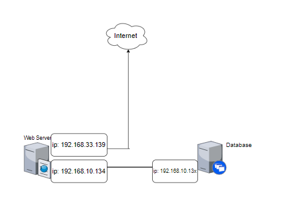
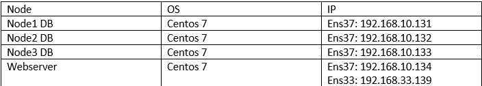

**Cài đặt WP+ DB maria cluser**


- [1. Mô hình mạng](#1-mô-hình-mạng)
- [2. 2. Cài đặt WP+ DB maria cluser](#2-2-cài-đặt-wp-db-maria-cluser)
  - [2.1 Cài đặt DB maria cluser](#21-cài-đặt-db-maria-cluser)
  - [2.2 Cài đặt WP+ kết nối với DB](#22-cài-đặt-wp-kết-nối-với-db)

## 1. Mô hình mạng



Ip Planning




## 2. 2. Cài đặt WP+ DB maria cluser
### 2.1 Cài đặt DB maria cluser

Thực hiện trên cả lần lượt trên  3 node

**Bước 1** : Cấu hình Hostname

```
hostnamectl set-hostname node1
```

```
echo "192.168.10.131 node1" >> /etc/hosts
echo "192.168.10.132 node2" >> /etc/hosts
echo "192.168.10.133 node3" >> /etc/hosts
```

**Bước 2**: Cài đặt Epel repository và Update các gói cài đặt

```
yum -y install epel-release
yum -y update
```

**Bước 3** : Cài đặt các gói hỗ trợ

```
yum -y install git wget vim
```

**Bước 4** : Cài đặt các gói Galera
```
yum -y install mariadb-server-galera galera rsync python3-PyMySQL
```

**Bước 5** : Tắt firewall, Selinux

```
sed -i 's/SELINUX=enforcing/SELINUX=disabled/g' /etc/sysconfig/selinux
sed -i 's/SELINUX=enforcing/SELINUX=disabled/g' /etc/selinux/config
systemctl disable --now firewalld
```

**Bước 6** : Khởi động lại máy để load được cấu hình selinux

```
reboot
```


**Thực hiện trên node-1**


**Bước 1** : Cấu hình Galera tại node-1

```
cp /etc/my.cnf.d/server.cnf /etc/my.cnf.d/server.cnf.bak

cat > /etc/my.cnf.d/server.cnf << EOF
[server]
[mysqld]

[galera]
wsrep_on=ON
wsrep_provider=/usr/lib64/galera/libgalera_smm.so
#add your node ips here
wsrep_cluster_address="gcomm://192.168.10.131,192.168.10.132,192.168.10.133"
binlog_format=row
default_storage_engine=InnoDB
innodb_autoinc_lock_mode=2
#Cluster name
wsrep_cluster_name="tuan_cluster"
#this server ip, change for each server
wsrep_node_address="192.168.10.131"
#this server name, change for each server
wsrep_node_name="node1"
wsrep_sst_method=rsync
[embedded]
[mariadb]
[mariadb-10.2]
EOF
```

**Thực hiện trên node-2**

Cấu hình Galera tại node mariadb-2

```
cp /etc/my.cnf.d/server.cnf /etc/my.cnf.d/server.cnf.bak

cat > /etc/my.cnf.d/server.cnf << EOF
[server]
[mysqld]

[galera]
wsrep_on=ON
wsrep_provider=/usr/lib64/galera/libgalera_smm.so
#add your node ips here
wsrep_cluster_address="gcomm://192.168.10.131,192.168.10.132,192.168.10.133"
binlog_format=row
default_storage_engine=InnoDB
innodb_autoinc_lock_mode=2
#Cluster name
wsrep_cluster_name="tuan_cluster"
# this server ip, change for each server
wsrep_node_address="192.168.10.132"
# this server name, change for each server
wsrep_node_name="node2"
wsrep_sst_method=rsync
[embedded]
[mariadb]
[mariadb-10.2]
EOF
```

**Thực hiện trên node-3**

```
cp /etc/my.cnf.d/server.cnf /etc/my.cnf.d/server.cnf.bak

cat > /etc/my.cnf.d/server.cnf << EOF
[server]
[mysqld]

[galera]
wsrep_on=ON
wsrep_provider=/usr/lib64/galera/libgalera_smm.so
#add your node ips here
wsrep_cluster_address="gcomm://192.168.10.131,192.168.10.132,192.168.10.133"
binlog_format=row
default_storage_engine=InnoDB
innodb_autoinc_lock_mode=2
#Cluster name
wsrep_cluster_name="tuan_cluster"
#this server ip, change for each server
wsrep_node_address="192.168.10.133"
#this server name, change for each server
wsrep_node_name="node3"
wsrep_sst_method=rsync
[embedded]
[mariadb]
[mariadb-10.2]
EOF
```


**Thực hiện tại node-1**

Ta sẽ dùng node mariadb-1 làm node khởi tạo Galera cluster ( Tức là các node khác sẽ đồng bộ dữ liệu từ mariadb-1 )

Ta thực hiện khởi tạo tại node-1

```
galera_new_cluster
systemctl enable mariadb
```

Khởi động dịch vụ MariaDB tại 2 node-2 và node-3

```
systemctl start mariadb
systemctl enable mariadb
```

**Kiểm tra hệ thống**

Kiểm tra số node thuộc cluster
```
mysql -u root -e "SHOW STATUS LIKE 'wsrep_cluster_size'"
```

Kết quả
```
[root@node1 ~]# mysql -u root -e "SHOW STATUS LIKE 'wsrep_cluster_size'"
```
```
+--------------------+-------+
| Variable_name      | Value |
+--------------------+-------+
| wsrep_cluster_size | 3     |
+--------------------+-------+
```


kiểm tra các thành viên thuộc cluster

```
[root@node1 ~]# mysql -u root -e "SHOW STATUS LIKE 'wsrep_incoming_addresses'"
```

```
+--------------------------+-------------------------------------------------------------+
| Variable_name            | Value                                                       |
+--------------------------+-------------------------------------------------------------+
| wsrep_incoming_addresses | 192.168.10.128:3306,192.168.10.129:3306,192.168.10.130:3306 |
+--------------------------+-------------------------------------------------------------+
```

### 2.2 Cài đặt WP+ kết nối với DB 

**Bước 1: Cài Apache**

Chạy lệnh sau để cài đặt

```
yum install httpd -y
```

Khởi động Apache và cho phép khởi động cùng hệ thống

```
systemctl start httpd

systemctl enable httpd
```

Để kiểm tra ta mở trình duyệt và truy cập vào địa chỉ IP của web server

http://địa-chỉ-IP

**Bước 2: Cài PHP**

Sử dụng yum để cài PHP

```
yum install php php-mysql php-gd php-pear –y
```

Để test PHP đã cài đặt thành công chưa

Thực hiện lệnh

```
echo "<?php phpinfo(); ?>" > /var/www/html/info.php
```

Sau đó restart lại httpd

```
systemctl restart httpd
```

Mở trình duyệt web truy cập địa chỉ http://địa chỉ Ip/info.php

**Bước 3: Cài wordpress**

Truy cập vào thư mục html
```
cd /var/www/html
```

Dowload file để cài wordpress từ internet

```
wget https://wordpress.org/latest.tar.gz
```

Giải nén tập tin

```
tar xzvf latest.tar.gz
```

Cấu hình wordpress để kết nối với MySQL

```
cd /var/www/html/

mv wordpress/* /var/www/html/

mv wp-config-sample.php wp-config.php
```

Sửa file

```
vi wp-config.php
```


Sau đó tìm các dòng sau để sửa thông tin

```
define('DB_NAME', 'database_name_here');    

define('DB_USER', 'username_here');    

define('DB_PASSWORD', 'password_here');      

define('DB_HOST', 'localhost');   
```

Trong đó:

database_name_here : tên của database
username_here : tên user login vào mysql
username_here : password của user login vào mysql
localhost : địa chỉ cuả máy MySQL Sever

**NOTE**

Dịa chỉ cuả 1 trong 3 node DB maria cluster Sever:

VD:

define('DB_NAME', 'wordpress');    

define('DB_USER', 'TuanNguyen');    

define('DB_PASSWORD', '123456');      

define('DB_HOST', '192.168.33.131'); 

