**Triển khai HTTPS cho dịch vụ web trong môi trường Linux**

- [1 Tìm hiểu về HTTPS](#1-tìm-hiểu-về-https)
  - [1.1 HTTP là gì?](#11-http-là-gì)
  - [1.2 Thế nào là HTTPS?](#12-thế-nào-là-https)
  - [1.3 SSL certificate](#13-ssl-certificate)
  - [1.4 Sự khác nhau giữa HTTP và HTTPS](#14-sự-khác-nhau-giữa-http-và-https)
- [2. Tìm hiểu về Chứng thư số](#2-tìm-hiểu-về-chứng-thư-số)
  - [2.1 Chứng thư số là gì?](#21-chứng-thư-số-là-gì)
  - [2.2 Hệ thống chứng thực](#22-hệ-thống-chứng-thực)
  - [2.3 Cơ quan chứng thực](#23-cơ-quan-chứng-thực)
  - [2.4 Cơ quan đăng ký](#24-cơ-quan-đăng-ký)
  - [2.5 Tại sao cần chứng thư số](#25-tại-sao-cần-chứng-thư-số)
  - [2.5 Ứng dụng chứng thư số để làm gì?](#25-ứng-dụng-chứng-thư-số-để-làm-gì)
- [3. Triển khai giao thức HTTPS cho dịch vụ Web trong môi trường Linux](#3-triển-khai-giao-thức-https-cho-dịch-vụ-web-trong-môi-trường-linux)
  - [3.1 Mô hình lab](#31-mô-hình-lab)
  - [3.2 Triển khai cấu hình](#32-triển-khai-cấu-hình)
    - [3.2.1 Cài đặt web trên Linux](#321-cài-đặt-web-trên-linux)
    - [3.2.2 Triển khai giao thức https](#322-triển-khai-giao-thức-https)
    - [**Bước 3: Định cấu hình Apache để sử dụng Chứng chỉ SSL**](#bước-3-định-cấu-hình-apache-để-sử-dụng-chứng-chỉ-ssl)


#
# 1 Tìm hiểu về HTTPS
## 1.1 HTTP là gì?
HTTP (HyperText Transfer Protocol):

- là giao thức truyền tải siêu văn bản(văn bản HTML, text, video, ảnh ...),
- dựa trên giao thức TCP/IP
- Sử dụng mô hình Client/Server. 
- Các yêu cầu (request hay HTTP Request) được tạo bởi client (thường là các Web browser như chrome, firefox ...) được gửi đến server http, server sẽ gửi lại dữ liệu (response hay HTTP Response) để client nhận được.
- Các request, response là các message có cấu trúc đơn giản gọi chung nó là các HTTP Message

*Ảnh mô tả việc fetching 1 trang web. Nguồn: Mozilla*

Sơ đồ làm việc HTTP truyền tải dữ liệu Client/Server

Khi client (như web browser, các Http API trong ngôn ngữ lập trình ...) kết nối đến server để gửi yêu cầu (request) và lấy về dữ liệu trả về (response) từ server thì nó trải qua các bước:

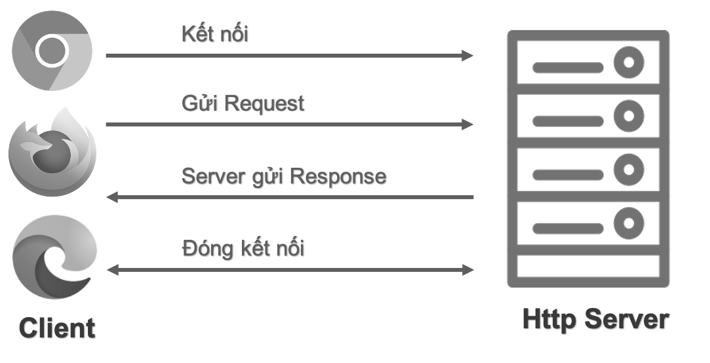

*Ảnh mô tả Sơ đồ làm việc HTTP truyền tải dữ liệu Client/Server*

- Bước 1: Mở kết nối TCP
  - Kết nối TCP (Giao thức HTTP dựa trên TCP) trên địa chỉ xác định bởi URL (Uniform Resource Locator) và cổng thường là 80, kết nối này được dùng để gửi các yêu cầu (request) và nhận phản hồi (response). Client có thể mở ra kết nối TCP mới hoặc sử dụng kết nối đang có, thậm chí nó tạo ra nhiều kết nối TCP cùng lúc đến server.
- Bước 2: Gửi HTTP Message (request) 
  - HTTP Message (request) chính là nội dung yêu cầu được client tạo ra và gửi đến server. HTTP Message có nội dung text (plain text) mà chúng ta có thể đọc được (người đọc được). Với phiên bản HTTP/2 thì nội dung HTTP Message được bao bọc trong các frame, nó làm cho người không đọc được một cách trực tiếp - tuy nhiên về mặt ý nghĩa nội dung không đổi so với HTTP/1.1
- Bước 3: Đọc HTTP Message nhận được từ server (response) 
  - Http Message (response) trả về từ server có cấu trúc tương tự Http Message (request).
- Bước 4: Đóng kết nối hoặc sử dụng lại cho các truy vấn khác
## 1.2 Thế nào là HTTPS?
**HTTPS (Hypertext Transfer Protocol Secure)** 

- Là giao thức truyền tải siêu văn bản an toàn. 
- Thực chất, đây chính là giao thức HTTP nhưng tích hợp thêm Chứng chỉ bảo mật SSL nhằm mã hóa các thông điệp giao tiếp để tăng tính bảo mật. 
- Có thể hiểu, HTTPS là phiên bản HTTP an toàn, bảo mật hơn.

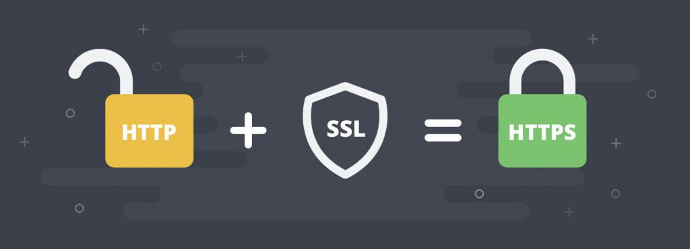

*Ảnh minh hoạ mối quan hệ giữa HTTP, SSL và HTTPS*

Hoạt động

HTTPS hoạt động tương tự như HTTP, tuy nhiên được bổ sung thêm chứng chỉ:

- **SSL (Secure Sockets Layer – tầng ổ bảo mật)** 
  - SSL là một giao thức lớp ứng dụng do Netscape phát triển để quản lý bảo mật cho việc truyền tin nhắn trên internet
  - Nó sử dụng mã hóa bất đối xứng RSA (khóa công khai) để mã hóa dữ liệu được truyền qua các kết nối SSL
- hoặc **TLS (Transport Layer Security – bảo mật tầng truyền tải)**.
  - TLS là một giao thức để *thiết lập kết nối an toàn* giữa máy khách và máy chủ và đảm bảo quyền riêng tư và tính toàn vẹn của thông tin trong quá trình truyền
  - Nó sử dụng *thuật toán RSA* với độ mạnh 1024 và 2048 bit

Cả SSL và TLS đều sử dụng hệ thống PKI (Public Key Infrastructure -hạ tầng khóa công khai) không đối xứng.

**Quá trình bắt tay SSL:**

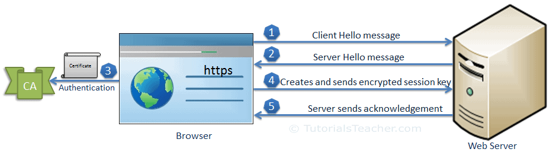

*Ảnh mô tả quá trình bắt tay SSL*

Bước 1:Trình duyệt kết nối với máy chủ sử dụng HTTPS.

Bước 2: Máy chủ trả về một SSL certificate, trong đó có chứa public key dùng để mã hóa.

Bước 3: Trình duyệt kiểm tra certificate (quá trình này chúng ta sẽ tìm hiểu ở phần sau). 

Bước 4: Nếu mọi thứ đều ổn hoặc người dùng cố xử lý tiếp thì trình duyệt sẽ sinh ngẫu nhiên session key và gửi cho server (dữ liệu được mã hóa bằng public key).

Bước 5: Máy chủ sử dụng private key giải mã gói tin lấy session key, gửi phản hồi đã nhận key cho trình duyệt.

Từ đây trở đi, máy chủ và trình duyệt gửi nhận các gói tin được mã hóa bằng session key.

**Quá trình truyền dữ liệu:**

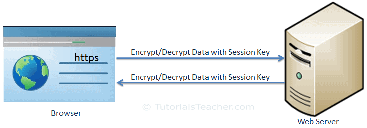

*Ảnh mô tả quá trình truyền dữ liệu sau quá trình bắt tay SSL*

Sau bước "bắt tay SSL", lúc này client và server đã có được session key cần thiết để tiến hành mã hóa/ giải mã các data trao đổi giữa 2 bên sử dụng cơ chế Mã hóa "đối xứng".
## 1.3 SSL certificate
SSL certificate là giấy chứng nhận được dùng khi thiết lập kết nối giữa trình duyệt và máy chủ. SSL certificate về mặt kỹ thuật là những tập tin kích thước tương đối nhỏ trong đó có lưu thông tin về public key cùng với các thông tin khác về tổ chức chủ sở hữu của trang Web.

Một số thông tin được lưu trong SSL certificate:

- Domain, tên server, hostname
- Tên công ty, tổ chức, địa chỉ liên hệ
- Thời hạn sử dụng
- Public key
## 1.4 Sự khác nhau giữa HTTP và HTTPS
Giao thức HTTP sử dụng Port 80, trong khi đó HTTPS sử dụng Port 443

Đối với HTTPS:

- Khi máy khách truy cập một website, giao thức HTTPS sẽ hỗ trợ xác thực tính định danh của website đó thông qua việc kiểm tra xác thực bảo mật (Security Certificate).
- Các xác thực bảo mật này được cung cấp và xác minh bởi Certificate Authority (CA) – các tổ chức phát hành các chứng thực các loại chứng thư số cho người dùng, doanh nghiệp, máy chủ, mã nguồn, phần mềm. Các tổ chức này đóng vai trò là bên thứ ba, được cả hai bên tin tưởng để hỗ trợ quá trình trao đổi thông tin an toàn.

Đối với HTTP:

- Vì dữ liệu không được xác thực bảo mật nên sẽ không có gì đảm bảo được phiên kết nối của bạn có đang bị “nghe lén” hay không, hoặc bạn đang cung cấp thông tin cho website thật hay một website giả mạo.

# 2. Tìm hiểu về Chứng thư số
## 2.1 Chứng thư số là gì?
- Chứng thư số (còn gọi là chứng chỉ số) có thể được xem như là một “chứng minh thư” sử dụng trong môi trường máy tính và internet.  
- Chứng thư số để nhận diện một cá nhân, một máy chủ, hoặc một vài đối tượng khác và gắn định danh của đối tượng đó với một khóa công khai (Public key) được cấp bởi những tổ chức có thẩm quyền xác nhận định danh và cấp các chứng thư số.  
- Chứng thư số được tạo bởi nhà cung cấp dịch vụ chứng thực, trong đó chứa public key của người dùng và các thông tin người dùng theo chuẩn X.509. 
## 2.2 Hệ thống chứng thực
- là một hạ tầng an ninh mạng được xây dựng trên một hạ tầng cơ sở khóa công khai (PKI-Public Key Infrastructure)
- cung cấp các giải pháp đảm bảo an toàn cho các hoạt động (gọi chung là giao dịch) thông qua mạng.

Các dịch vụ cơ bản mà một hệ thống chứng thực cung cấp bao gồm:

- Dịch vụ xác thực: nhằm xác định xem ai đang giao dịch với mình.
- Dịch vụ bảo mật: đảm bảo tính bí mật của thông tin, người không có thẩm quyền không thể đọc được nội dung của thông tin.
- Dịch vụ toàn vẹn: khẳng định thông tin có bị thay đổi hay không.
- Dịch vụ chống chối bỏ: cung cấp các bằng chứng chống lại việc chối bỏ một hành động đã thực hiện hay đã diễn ra

Như vậy sử dụng hệ thống chứng thực sẽ đảm bảo, bí mật, toàn vẹn cho thông tin được truyền qua mạng, xác thực được người dùng và chống chối bỏ các hành động hay sự kiện đã xảy ra.
## 2.3 Cơ quan chứng thực
` `Cơ quan chứng thực(Certification Authority - CA)

- Có thẩm quyền cấp phát, thu hồi, quản lý chứng thư số cho các thực thể thực hiện các giao dịch an toàn. 
- Là một thành phần chính của hệ thống chứng thực.

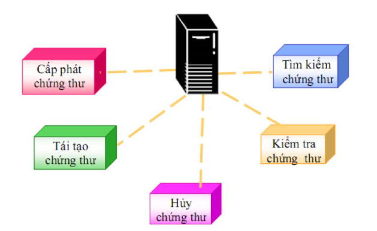

*Ảnh mô tả chức năng Cơ quan chứng thực(CA)*
## 2.4 Cơ quan đăng ký
Cơ quan đăng ký (Registration Authority) 

- Là một thành phần trong hệ thống chứng thực 
- Có nhiệm vụ tiếp nhận và xác minh các yêu cầu về chứng thư số của người sử dụng 
- Đồng thời gửi các yêu cầu đã xác minh cho cơ quan chứng thực (CA) thực hiện yêu cầu đó.
## 2.5 Tại sao cần chứng thư số
Để thực hiện được các giao dịch an toàn qua mạng, các bên tham gia cần phải có “chứng thư số”:

- Chứng thư số là một cấu trúc dữ liệu chứa các thông tin cần thiết để thực hiện các giao dịch an toàn qua mạng. 
- Chứng thư số được lưu giữ trên máy tính dưới dạng một tập tin (file).

Nội dung chứng thư số bao gồm:

- Tên chủ thể chứng thư số.
- Khoá công khai.
- Một số thông tin khác như, tên của CA cấp chứng chỉ số đó, hạn dùng, thuật toán ký...
- Chữ ký số của CA cấp chứng thư số đó.

Mục đích của chứng thư số dùng để nhận diện một đối tượng khi tham gia giao dịch trên mạng
## 2.5 Ứng dụng chứng thư số để làm gì?
Với chứng thư số người dùng có thể:

- Xác định danh tính người dùng khi đăng nhập vào một hệ thống (xác thực).
- Ký số các tài liệu Word, PDF hay một tệp liệu.
- Mã hóa thông tin để đảm bảo bí mật khi gửi và nhận trên mạng.
- **Thực hiện các kênh liên lạc trao đổi thông tin bí mật với các thực thể trên mạng như thực hiện kênh liên lạc mật giữa người dùng với webserver.**

# 3. Triển khai giao thức HTTPS cho dịch vụ Web trong môi trường Linux
## 3.1 Mô hình lab
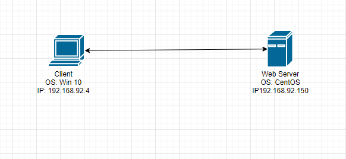

*Ảnh mô hình bài lab*
## 3.2 Triển khai cấu hình
Apache là nền tảng Web server mã nguồn mở:

- là một phần mềm chạy trên server.
- Công việc: thiết lập kết nối giữa server và trình duyệt người dùng (Firefox, Google Chrome, Safari,...) rồi chuyển file tới và lui giữa chúng (cấu trúc 2 chiều dạng client-server).
- là một phần mềm đa nền tảng, nó hoạt động tốt với cả server Unix và Windows.

Hoạt động:

- Khi một khách truy cập tải một trang web trên website của bạn,trình duyệt người dùng sẽ gửi yêu cầu tải trang web đó lên server và Apache sẽ trả kết quả với tất cả đầy đủ các file cấu thành nên trang (hình ảnh, chữ,...). 
- Server và client giao tiếp với nhau qua giao thức HTTP và Apache chịu trách nhiệm cho việc đảm bảo tiến trình này diễn ra mượt mà và bảo mật giữa 2 máy.
### 3.2.1 Cài đặt web trên Linux
Bước 1: Cài đặt Apache

```
yum install httpd -y
```
Bước 2: Khởi động apache

```
systemctl enable httpd
systemctl start httpd
```

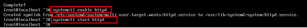

*Ảnh mô tả cmd khởi động Apache*

Bước 3: Cấu hình Firewalld (Nếu có)

```
 firewall-cmd --permanent --zone=public --add-service=http
  firewall-cmd --permanent--zone=public--add-service=https
  firewall-cmd --reload
  ```

Bước 4: Kết quả

*Note: Các file cấu hình trong Apache*

- Tất cả các file cấu hình của Apache đều nằm trong thư mục **/etc/httpd**.
- File cấu hình chính của Apache là **/etc/httpd/conf/httpd.conf**.
- Tất cả các tệp cấu hình đều phải kết thúc bằng **.conf** và nằm trong thư mục **/etc/httpd/conf.d**.
- Các tệp cấu hình chịu trách nhiệm tải các modules Apache được đặt trong thư mục **/etc/httpd/conf.modules.d**.
- Để quản lý tốt hơn, nên tạo một tệp cấu hình riêng (**vhost**) cho mỗi tên miền.
- Các tệp vhost Apache phải kết thúc bằng **.conf** và được lưu trữ trong thư mục **/etc/httpd/conf.d**. Ví dụ: nếu tên miền của bạn là **mydomain.com** thì tệp cấu hình sẽ được đặt tên **/etc/httpd/conf.d/mydomain.com.conf**
- Các file log của Apache (**access\_log** và **error\_log**) nằm trong thư mục **/var/log/httpd/**. Bạn nên có file log riêng cho mỗi vhost.
### 3.2.2 Triển khai giao thức https
**Bước 1: Cài đặt mod\_ssl**

***mod\_ssl*** là một mô-đun Apache cung cấp hỗ trợ cho mã hóa SSL. Bắt buộc phải thiết lập chứng chỉ tự ký.

```
yum install mod\_ssl
```

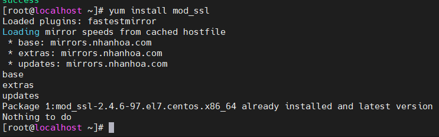

**Bước 2: Tạo chứng chỉ tự ký**

Bây giờ Apache đã sẵn sàng để sử dụng mã hóa, chúng ta có thể chuyển sang tạo chứng chỉ SSL mới. Trong khi tạo chứng chỉ, chứng chỉ sẽ yêu cầu một số thông tin cơ bản về trang web của bạn và kèm theo một tệp khóa cho phép máy chủ xử lý dữ liệu được mã hóa một cách an toàn.

Tạo một thư mục để lưu trữ khóa cá nhân (Tệp chứng chỉ được lưu trữ trong thư mục / etc / ssl / certs)

```
mkdir /etc/ssl/private
```

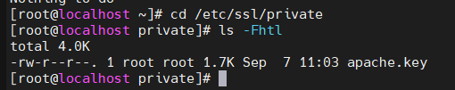


Hãy đặt thư mục này ở chế độ "riêng tư" chỉ người dùng root mới có thể truy cập được vì mục đích bảo mật

```
chmod -R 700 /etc/ssl/private
```

Note: sử dụng chmod -R dùng để áp dụng một nhóm quyền cụ thể cho tất cả các file và mục trong một thư mục cụ thể (nghĩa là một chmod đệ quy), 

Bây giờ hãy tạo chứng chỉ cùng với khóa SSL. Điều này có thể được thực hiện với " ***openssl*** " cùng với những bổ sung:

```
openssl req -x509 -nodes -days 365 -newkey rsa:2048 -keyout /etc/ssl/private/apache.key -out /etc/ssl/certs/apache.crt
```

Trong đó:

- Openssl: *Đây là công cụ dòng lệnh cơ bản để tạo và quản lý chứng chỉ OpenSSL, khóa và các tệp khác.*
- Req -x509:  ***X.509** " là tiêu chuẩn cơ sở hạ tầng khóa công khai mà SSL và TLS tuân thủ để quản lý khóa và chứng chỉ.*
- -node: *Điều này yêu cầu OpenSSL bỏ qua tùy chọn bảo mật chứng chỉ  bằng cụm mật khẩu.*
- -days 365: *Tùy chọn này đặt khoảng thời gian mà chứng chỉ sẽ được coi là hợp lệ*
- Newkey: *chỉ định rằng chúng tôi muốn tạo chứng chỉ mới và khóa mới cùng một lúc*
- Rsa:2048: *yêu cầu nó tạo một khóa RSA dài 2048 bit*
  - *RSA là một hệ thống xác thực và mã hóa Internet sử dụng thuật toán được phát triển bởi Ron Rivest, Adi Shamir, Leonard Adleman.* 
- *-keyout: Dòng này cho OpenSSL biết nơi đặt tệp khóa cá nhân đã tạo mà chúng tôi đang tạo.*
- -out: *Điều này cho OpenSSL biết nơi đặt chứng chỉ mà chúng tôi đang tạo.*


### **Bước 3: Định cấu hình Apache để sử dụng Chứng chỉ SSL**
Thực hiện chỉnh tệp cấu hình SSL
```
vi /etc/httpd/conf.d/ssl.conf
```
Tìm và bỏ ghi chú dòng **DocumentRoot** và **ServerName** và thay thế example.com bằng địa chỉ IP hoặc tên miền máy chủ của bạn.(Dòng 59 và 60)

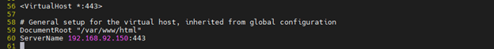

Tiếp theo, tìm các dòng **SSLCertificateFile** và **SSLCertificateKeyFile** và cập nhật chúng với vị trí mới của các chứng chỉ( Dòng 100 và 107)

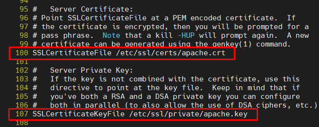

Sau khi thực hiện các thay đổi này, hãy khởi động lại dịch vụ Apache để các thay đổi có hiệu lực.
```
systemctl restart httpd
```

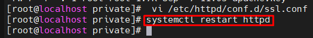

**Bước 4: Kiểm tra máy chủ Apache (HTTPS)**

Để xác minh rằng máy chủ web Apache HTTPS bảo mật đang hoạt động, hãy mở trình duyệt web của bạn và nhập URL [https: //](https://server-ip-address/)[demoserver](https://server-ip-address/)[-ip-address](https://server-ip-address/) . 

Một lỗi sẽ xuất hiện trên trình duyệt của bạn và bạn phải chấp nhận chứng chỉ theo cách thủ công. Thông báo lỗi hiển thị vì chúng tôi đang sử dụng chứng chỉ tự ký thay vì chứng chỉ được tổ chức phát hành chứng chỉ mà trình duyệt tin cậy ký và trình duyệt không thể xác minh danh tính của máy chủ mà bạn đang cố gắng kết nối. 

Khi bạn thêm một ngoại lệ vào xác minh danh tính của trình duyệt, bạn sẽ thấy một trang kiểm tra cho trang web an toàn mới của mình.


**Kết quả:**

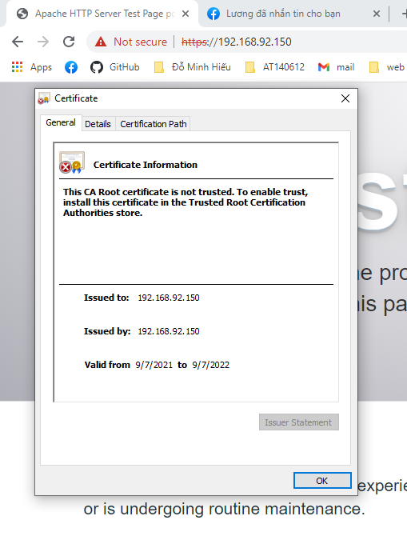

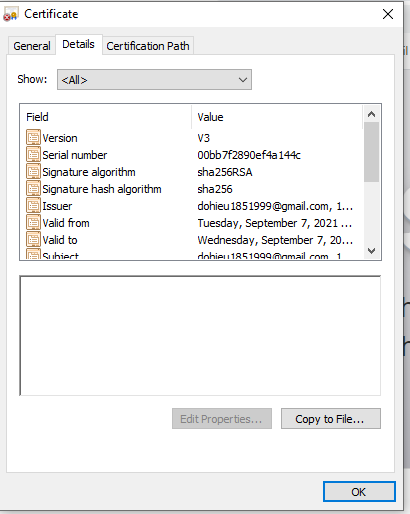

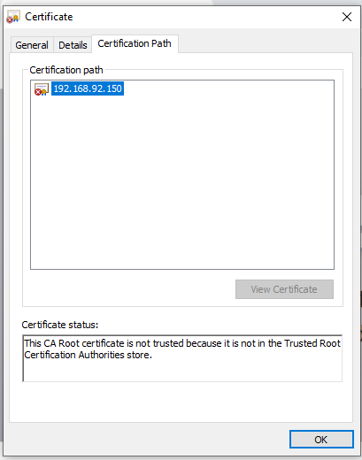