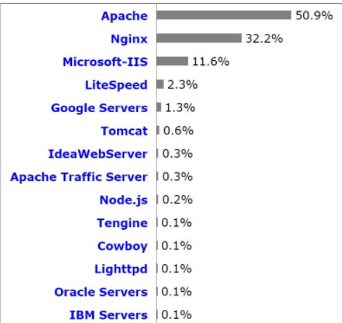
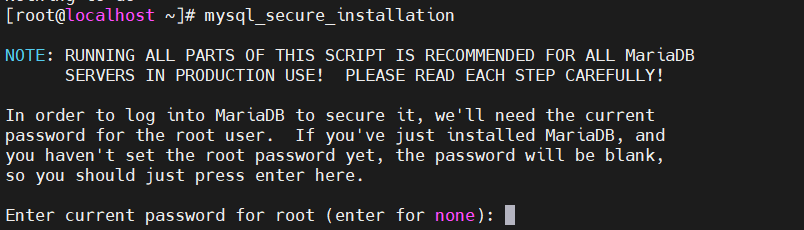
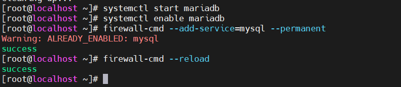

**Hướng dẫn cài đặt Apache trên CentOS 7**
- [**1. Cài đặt Apache**](#1-cài-đặt-apache)
  - [**1.1 Khái niệm Web server**](#11-khái-niệm-web-server)
  - [**1.2 Webserver hoạt động như thế nào?**](#12-webserver-hoạt-động-như-thế-nào)
  - [**1.3 Khái niệm và các bước Apache HTTP server**](#13-khái-niệm-và-các-bước-apache-http-server)
- [2. Tạo trang Web đơn giản](#2-tạo-trang-web-đơn-giản)
  - [**2.1 Tạo trang web PHP**](#21-tạo-trang-web-php)
  - [**2.2 Tạo cơ sở dữ liệu để quản lý trang web**](#22-tạo-cơ-sở-dữ-liệu-để-quản-lý-trang-web)
- [**3. Các file cấu hình Web server Apache**](#3-các-file-cấu-hình-web-server-apache)
- [4.Kiểm tra file log](#4kiểm-tra-file-log)
  - [**4.1 Access\_log**](#41-access_log)
  - [**4.2 Error\_log**](#42-error_log)
  

# **1. Cài đặt Apache**
## **1.1 Khái niệm Web server**
- Web server là máy chủ cài đặt các chương trình phục vụ các ứng dụng web. Webserver có khả năng tiếp nhận request từ các trình duyệt web và gửi phản hồi đến client thông qua giao thức HTTP hoặc các giao thức khác. Có nhiều web server khác nhau như: Apache, Nginx, IIS, … Web server thông dụng nhất hiện nay:


## **1.2 Webserver hoạt động như thế nào?**


- Bất cứ khi nào bạn xem một trang web trên internet, có nghĩa là bạn đang yêu cầu trang đó từ một web server.
- Khi bạn nhập URL trên trình duyệt của mình (ví dụ:Dantri.com) nó sẽ tiến hành các bước sau để gửi lại phản hồi cho bạn.

**Bước 1**: Trình duyệt phân giải tên miền thành địa chỉ IP

Trình duyệt web của bạn trước tiên cần phải xác định địa chỉ IP nào mà tên miền **dantri.com** trỏ về. Trình duyệt sẽ yêu cầu thông tin từ một hoặc nhiều máy chủ DNS (thông qua internet). Máy chủ DNS sẽ cho trình duyệt biết địa chỉ IP nào tên miền sẽ trỏ đến cũng là nơi đặt trang web.

Lúc này trình duyệt web đã biết địa chỉ IP của trang web, nó có thể yêu cầu URL đầy đủ từ webserver.

**Bước 2**: Webserver gửi lại client Trang được yêu cầu

Web server phản hồi bằng cách gửi lại những thông tin client yêu cầu… Nếu trang không tồn tại hoặc có lỗi khác xảy ra, nó sẽ gửi lại thông báo lỗi thích hợp.

**Bước 3**: Trình duyệt hiển thị trang web

Trình duyệt web của bạn nhận lại được các tập tin html css (nhiều file khác)… và render hiển thị trang theo yêu cầu.


## **1.3 Khái niệm và các bước Apache HTTP server**
Apache là web server được sử dụng rộng rãi nhất thế giới. Apache được phát triển và duy trì bởi một cộng đồng mã nguồn mở dưới sự bảo trợ của Apache Software Foundation.


Lệnh cài đặt Apache:

```
# yum install httpd –y
```


Khởi chạy Apache:
```
systemctl start httpd
systemctl enable httpd
```


Kiểm tra trạng thái hoạt động của Apache:

```
systemctl status httpd
```


Mở port trên firewall:

```
firewall-cmd --permanent --zone=public --add-service=http
firewall-cmd --permanent--zone=public--add-service=https
firewall-cmd --reload
```

Dừng Apache:

```
systemctl stop httpd
```

Khởi động lại Apache:
```
systemctl restart httpd
systemctl enable httpd
```

# 2. Tạo trang Web đơn giản
## **2.1 Tạo trang web PHP** 


- Cài đặt PHP

```
yum -y  install php
```

- Tạo file info.php


- Tạo 1 trang html đơn giản


- Truy cập bằng trình duyệt để kiểm tra:


## **2.2 Tạo cơ sở dữ liệu để quản lý trang web**

 Cài đặt CSDL Mariadb-Server
-	Bước 1: Cài đặt:

```yum -y install mariadb-server```


-	Bước 2 :  Đặt mật khẩu mariadb:

```mysql_secure_installation```


Nhấn enter 




•	Bước 3 : Khởi động dịch vụ:



```
systemctl start mariadb
systemctl enable mariadb
```
Bước 4 : Cấu hình tưởng lửa 

```
firewall-cmd --add-service=mysql --permanent
firewall-cmd –reload
```
Tạo cơ sở dữ liệu trên mariadb

- Đăng nhập vào Mariadb:

```
mysql -u root –p 
```


- Tạo cơ sở dữ liệu bằng lệnh:
  

```
CREATE DATABASE tuannguyen;
```


- Tạo user cho CSDL wordpressdb:
  
 
```
CREATE USER userwp@localhost IDENTIFIED BY '123456';
```


- Cấp cho userwp quyền truy cập vào CSDL:

  ``` 
  GRANT ALL PRIVILEGES ON tuannguyen.* TO userwp@localhost IDENTIFIED BY '123456';
  ```
  
- Lưu thay đổi:

    ```
    FLUSH PRIVILEGES;
    ```

- Cuối cùng thoát MySQL:

    ```
    exit
    ```

# **3. Các file cấu hình Web server Apache**
- Tất cả các file cấu hình của Apache đều nằm trong thư mục **/etc/httpd**


- File cấu hình chính của Apache là **/etc/httpd/conf/httpd.conf**


- Tất cả các tệp cấu hình đều phải kết thúc bằng .conf và nằm trong thư mục **/etc/httpd/conf.d**.


- Các tệp cấu hình chịu trách nhiệm tải các modules Apache được đặt trong thư mục **/etc/httpd/conf.modules.d**.


- Để quản lý tốt hơn, nên tạo một tệp cấu hình riêng (vhost) cho mỗi tên miền.
- Các tệp vhost Apache phải kết thúc bằng .conf và được lưu trữ trong thư mục /etc/httpd/conf.d. Ví dụ: nếu tên miền của bạn là mydomain.com thì tệp cấu hình sẽ được đặt tên /etc/httpd/conf.d/mydomain.com.conf
- Các file log của Apache ( access \_ log và error \_ log ) nằm trong thư mục **/var/log/httpd/**. Bạn nên có file log riêng cho mỗi vhost.


# 4.Kiểm tra file log

## **4.1 Access\_log**

kiểm tra file log:
  
```
Tail -f /var/log/httpd/access_log
```
  


## **4.2 Error\_log**
```
```
Tail -f /var/log/httpd/Eror_log
```
```


