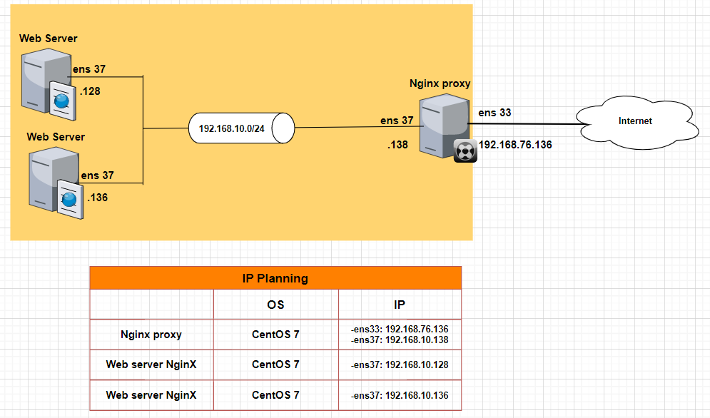
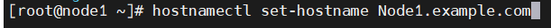
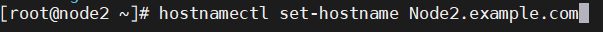
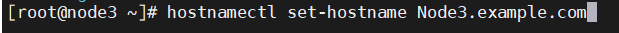
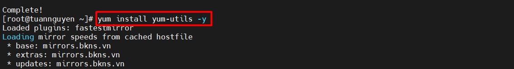
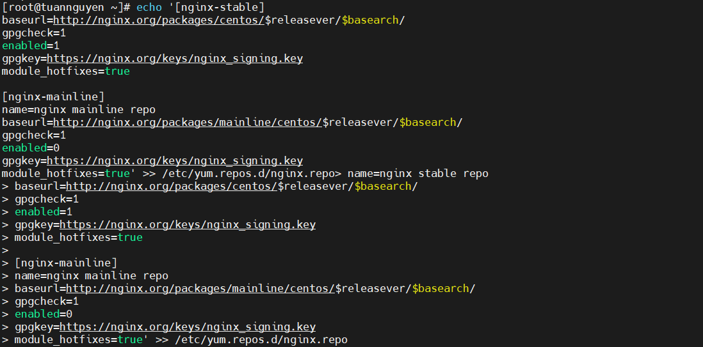
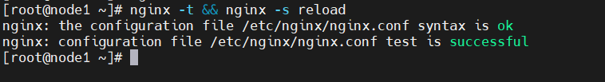
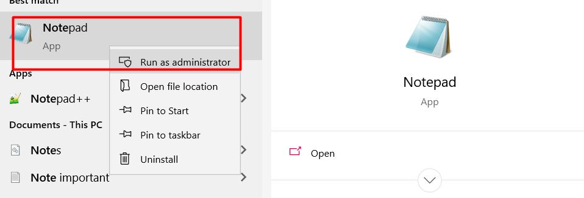

# **Cấu hình Nginx làm Reverse Proxy cho Apache**


- [**Cấu hình Nginx làm Reverse Proxy cho Apache**](#cấu-hình-nginx-làm-reverse-proxy-cho-apache)
  - [**2. Lab Nginx SSL**](#2-lab-nginx-ssl)
    - [1.Mô hình mạng](#1mô-hình-mạng)
    - [2. Cài đặt Web NginX](#2-cài-đặt-web-nginx)
    - [3.Cài đặt Nginx proxy](#3cài-đặt-nginx-proxy)
    - [4 Tạo Chứng chỉ CA SSL](#4-tạo-chứng-chỉ-ca-ssl)
    - [5. Thêm chứng chỉ CA SSL vào file  `/etc/nginx/nginx.conf`](#5-thêm-chứng-chỉ-ca-ssl-vào-file--etcnginxnginxconf)
    - [6 kiểm tra](#6-kiểm-tra)
- [Tài liệu tham khảo](#tài-liệu-tham-khảo)


## **2. Lab Nginx SSL**
### 1.Mô hình mạng




Đặt tên host:
```
hostnamectl set-hostname note1.example.com
```

```
hostnamectl set-hostname note2.example.com
```

```
hostnamectl set-hostname note3.example.com
```


### 2. Cài đặt Web NginX

> Thực hiện trên node 1 và node 2

Install the prerequisites:

```
yum install yum-utils -y
```
Thêm repo:

```
echo '[nginx-stable]
name=nginx stable repo
baseurl=http://nginx.org/packages/centos/$releasever/$basearch/
gpgcheck=1
enabled=1
gpgkey=https://nginx.org/keys/nginx_signing.key
module_hotfixes=true

[nginx-mainline]
name=nginx mainline repo
baseurl=http://nginx.org/packages/mainline/centos/$releasever/$basearch/
gpgcheck=1
enabled=0
gpgkey=https://nginx.org/keys/nginx_signing.key
module_hotfixes=true' >> /etc/yum.repos.d/nginx.repo
```
use mainline nginx packages:
```
yum-config-manager --enable nginx-mainline
```
install nginx:
```
yum install nginx -y
```

Cấu hình firewall:
```
firewall-cmd --zone=public --permanent --add-port=80/tcp
firewall-cmd --zone=public --permanent --add-port=443/tcp
firewall-cmd --reload
```
Khởi động dịch vụ:
```
systemctl start nginx
systemctl enable nginx
```
**Tạo trang web đơn giản trên 2 node**

> Trên node 2:

sửa file cấu hình web NginX:

```
vi /usr/share/ngĩn/html/index.html
```
sửa cấu hình:

```
<!DOCTYPE html>
<html>
<head>
<title>TuanNguyen</title>
<style>
html { color-scheme: light dark; }
body { width: 35em; margin: 0 auto;
font-family: Tahoma, Verdana, Arial, sans-serif; }
</style>
</head>
<body>
<h1>TuanNguyen1</h1>
<p>If you see this page, the nginx web server is successfully installed and
working. Further configuration is required.</p>

<p>For online documentation and support please refer to
<a href="http://nginx.org/">nginx.org</a>.<br/>
Commercial support is available at
<a href="http://nginx.com/">nginx.com</a>.</p>

<p><em>Thank you for using nginx.</em></p>
</body>
</html>
~

```

>Trên node 3

Sửa file cấu hình trên node 3:

```
vi /usr/share/ngĩn/html/index.html
```
Cấu hình:
```
<!DOCTYPE html>
<html>
<head>
<title>TuanNguyen</title>
<style>
html { color-scheme: light dark; }
body { width: 35em; margin: 0 auto;
font-family: Tahoma, Verdana, Arial, sans-serif; }
</style>
</head>
<body>
<h1>TuanNguyen2</h1>
<p>If you see this page, the nginx web server is successfully installed and
working. Further configuration is required.</p>

<p>For online documentation and support please refer to
<a href="http://nginx.org/">nginx.org</a>.<br/>
Commercial support is available at
<a href="http://nginx.com/">nginx.com</a>.</p>

<p><em>Thank you for using nginx.</em></p>
</body>
</html>
~
```

### 3.Cài đặt Nginx proxy

> Trên node 1

Install the prerequisites:

```
yum install yum-utils -y
```



Thêm repo:

```
echo '[nginx-stable]
name=nginx stable repo
baseurl=http://nginx.org/packages/centos/$releasever/$basearch/
gpgcheck=1
enabled=1
gpgkey=https://nginx.org/keys/nginx_signing.key
module_hotfixes=true

[nginx-mainline]
name=nginx mainline repo
baseurl=http://nginx.org/packages/mainline/centos/$releasever/$basearch/
gpgcheck=1
enabled=0
gpgkey=https://nginx.org/keys/nginx_signing.key
module_hotfixes=true' >> /etc/yum.repos.d/nginx.repo
```



use mainline nginx packages:

```
yum-config-manager --enable nginx-mainline
```


install nginx:

```
yum install nginx -y
```


Cấu hình firewall:

```
firewall-cmd --zone=public --permanent --add-port=80/tcp
firewall-cmd --zone=public --permanent --add-port=443/tcp
firewall-cmd --reload
```

Khởi động dịch vụ:

```
systemctl start nginx
systemctl enable nginx
```


Backup file cấu hình `/etc/nginx/nginx.conf`

```
cp /etc/nginx/nginx.conf /etc/nginx/nginx.conf.bak
```

Tạo 1 file test.conf trong thư mục : `/etc/nginx/

**Ở hướng dẫn lab này sử dụng ``tách file cấu hình``,cấu hình server ở file mẹ, và 2 file cấu hình con sử dụng lần lượt cho 2 con web nginx**

**Ở dòng 31 ta thêm ``#`` để xoá lệnh,Ta thêm dòng 32 đến 39**

Truy cập file : ``vi /etc/nginx/nginx.conf``

```
     31      #include /etc/nginx/conf.d/*.conf;
     32 server {
     33         server_name www.host.world host.world;
     34        # listen      [::]:80;
     35        # listen      80;
     36          listen 443 ssl;
     37
     38         include /etc/nginx/conf.d/*.conf;
     39 }
     40 }


```
**Note: xoá file default.conf  để tránh xung đột file phía trên**

```
rm /etc/nginx/conf.d/default.conf
```


> lần lượt tạo 2 file cấu hình cho 2 web nginx

Tạo 1 file `test1.world.conf` trong thư mục : `/etc/nginx/conf.d/` cho trang web thứ 1.
```
echo 'location / {

        proxy_redirect           off;
        proxy_set_header         X-Real-IP $remote_addr;
        proxy_set_header         X-Forwarded-For $proxy_add_x_forwarded_for;
        proxy_set_header         Host $http_host;

        proxy_pass http://192.168.10.128/;

}' >> /etc/nginx/conf.d/test1.world.conf
```

Tạo thêm 1 file `test2.world.conf` trong thư mục : `/etc/nginx/conf.d/` cho trang web thứ 2.
```
echo 'location /tuan {

        proxy_redirect           off;
        proxy_set_header         X-Real-IP $remote_addr;
        proxy_set_header         X-Forwarded-For $proxy_add_x_forwarded_for;
        proxy_set_header         Host $http_host;

        proxy_pass http://192.168.10.136/;

}' >> /etc/nginx/conf.d/test2.world.conf
```
**kiểm tra**
Kiểm tra cú pháp (syntax) cấu hình:
```
nginx -t
```

Kết quả:
```
[root@node1 ~]# nginx -t
nginx: the configuration file /etc/nginx/nginx.conf syntax is ok
nginx: configuration file /etc/nginx/nginx.conf test is successful
```


Khởi động lại dịch vụ:
```
nginx -s reload
```
hoặc
```
systemctl restart nginx
```

Câu lệnh kết hợp:
```
nginx -t && nginx -s reload
```



- Người dùng truy cập `http://192.168.76.136`, request của client sẽ được chuyển đến máy chủ Apache: `http://192.168.10.128/index.html`

- Người dùng truy cập `http://192.168.76.136/tuan/`, request của client sẽ được chuyển đến máy chủ Apache: `http://192.168.10.136/tuan/index.html`

### 4 Tạo Chứng chỉ CA SSL

> Trên nginx proxy(node1)

Di chuyển đến nơi lưu chứng chỉ:
```
cd /etc/pki/tls/certs
```

Tạo khoá bí mật cho nginx:
```
make server.key
```
Out:
```
[root@node1 certs]# make server.key
umask 77 ; \
/usr/bin/openssl genrsa -aes128 2048 > server.key
Generating RSA private key, 2048 bit long modulus
.+++
.............................+++
e is 65537 (0x10001)
Enter pass phrase: #đặt cụm mật khẩu bảo mật cho key
Verifying - Enter pass phrase: #nhập lại
```

Xoá  passphrase vừa nhập khỏi private:
```
openssl rsa -in server.key -out server.key
```

Out:
```
[root@node1 certs]# openssl rsa -in server.key -out server.key
Enter pass phrase for server.key: #nhâp passphrase
writing RSA key
```

Tạo csr:
```
make server.csr
```

Out:
```
[root@node1 certs]# make server.csr
umask 77 ; \
/usr/bin/openssl req -utf8 -new -key server.key -out server.csr
You are about to be asked to enter information that will be incorporated
into your certificate request.
What you are about to enter is what is called a Distinguished Name or a DN.
There are quite a few fields but you can leave some blank
For some fields there will be a default value,
If you enter '.', the field will be left blank.
-----
Country Name (2 letter code) [XX]:VN 
State or Province Name (full name) []:Ha Noi
Locality Name (eg, city) [Default City]:Thanh Tri
Organization Name (eg, company) [Default Company Ltd]:KMA
Organizational Unit Name (eg, section) []:AT14
Common Name (eg, your name or your server's hostname) []:www.host.world
Email Address []:Ngoctuan76999@gmail.com

Please enter the following 'extra' attributes
to be sent with your certificate request
A challenge password []: #Enter
An optional company name []: #Enter
```
Tạo và ký chứng chỉ:
```
openssl x509 -in server.csr -out server.crt -req -signkey server.key -days 3650
```

Out:
```
[root@node3 certs]# openssl x509 -in server.csr -out server.crt -req -signkey server.key -days 3650
Signature ok
subject=/C=VN/ST=Ha Noi/L=Thanh Tri/O=KMA/OU=AT14/CN=www.host.world/emailAddress=ngoctuan76999@gmail.com
Getting Private key
```

Trong đó:
- **openssl** : Đây là câu lệnh lệnh cơ bản để tạo và quản lý chứng chỉ OpenSSL, khóa và các tệp khác.
- **-x509** : Đây là tiêu chuẩn cơ sở hạ tầng khóa công khai mà SSL và TLS tuân thủ để quản lý khóa và chứng chỉ của nó.
- **-days 3650** : Tùy chọn đặt khoảng thời gian mà chứng chỉ sẽ được coi là hợp lệ. Ở đây là 10 năm.
- **rsa** :  yêu cầu nó tạo một khóa **RSA**
- **-keyout** : Nơi đặt tệp khóa riêng private đã tạo.
- **-out** : Nơi đặt chứng chỉ đang tạo.


Khoá riêng và chứng chỉ đã được đặt trong thư mục con của thư mục:`/etc/pki/tls/certs`

### 5. Thêm chứng chỉ CA SSL vào file  `/etc/nginx/nginx.conf`

```
vi /etc/nginx/nginx.conf
```
Sửa Server Block:

**ta tắt lắng nghe cổng 80 bằng lệnh #**
```
    32 server {
     33         server_name www.host.world host.world;
     34        # listen      [::]:80;
     35        # listen      80;
     36          listen 443 ssl;
     37
     38         #config ssl
     39         ssl_certificate      /etc/pki/tls/certs/server.crt;
     40         ssl_certificate_key  /etc/pki/tls/certs/server.key;
     41         ssl_prefer_server_ciphers on;
     42         ssl_protocols           TLSv1 TLSv1.1 TLSv1.2;
     43         ssl_ciphers             HIGH:!aNULL:!MD5;
     44
     45         include /etc/nginx/conf.d/*.conf;
     46 }
     47 }

}
```

Trong đó:
- Nơi lưu trữ của khoá riêng và chứng chỉ:
``` 
ssl_certificate      /etc/pki/tls/certs/server.crt;
ssl_certificate_key  /etc/pki/tls/certs/server.key;
```
- Yêu cầu client sử dụng các phiên bản:TLSv1 TLSv1.1 TLSv1.2 và mật mã của ssl/tls khi thiết lập kết nối
```
ssl_protocols           TLSv1 TLSv1.1 TLSv1.2;
ssl_ciphers             HIGH:!aNULL:!MD5;
```

Kiểm tra và khởi động lại file cấu hình:
```
nginx -t && nginx -s reload
```

Cấu hình Firewalld cho phép dịch vụ HTTPS:
```
firewall-cmd --add-service=https --permanent
firewall-cmd --reload
```
### 6 kiểm tra 
> Trên Windows 10(clinet) :

Thêm tên miền vào /etc/hosts

**Note:sử dụng notepad dưới quyền admin để có thể chỉnh sửa**



tìm đến đường dẫn có chưa file ``hosts``:

```
C:\Windows\System32\drivers\etc\hosts
```

Thêm dòng sau vào cuối file:
```
192.168.76.136 host.world www.host.world
```


lần lượt truy cập :


# Tài liệu tham khảo

1. https://serverfault.com/questions/618889/can-you-define-a-servers-locations-in-multiple-nginx-config-files
2. https://www.server-world.info/en/note?os=CentOS_7&p=nginx&f=6
3. https://docs.nginx.com/nginx/admin-guide/web-server/reverse-proxy/
4. 