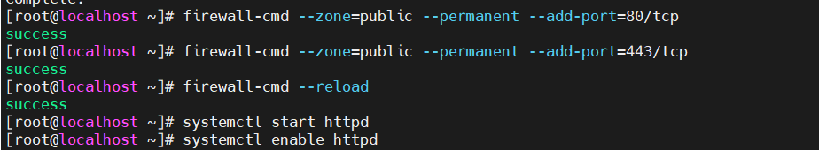

# Cấu hình Nginx làm Reverse Proxy cho Apache

- [Cấu hình Nginx làm Reverse Proxy cho Apache](#cấu-hình-nginx-làm-reverse-proxy-cho-apache)
  - [1. Ưu điểm của Nginx Reverse Proxy](#1-ưu-điểm-của-nginx-reverse-proxy)
  - [2. Lab thiết lập một Nginx Reverse Proxy](#2-lab-thiết-lập-một-nginx-reverse-proxy)
    - [1.Mô hình mạng](#1mô-hình-mạng)
    - [2.Cài đặt Nginx](#2cài-đặt-nginx)
    - [3. Cài đặt Apache Server](#3-cài-đặt-apache-server)
    - [4. Kiểm tra:](#4-kiểm-tra)
- [Tài liệu tham khảo:](#tài-liệu-tham-khảo)

## 1. Ưu điểm của Nginx Reverse Proxy 

- Trong hệ điều hành Linux, Reverse Proxy đóng vai trò làm cầu nối giữa host (máy khách) và server (máy chủ). Nó nhận yêu cầu của máy khách và chuyển lên server và nhận phản hồi từ server để chuyển tới máy khách,nó giống như là một máy chủ.

- Nginx là một trong các web server tốt nhất cải thiện tốc độ load cho nội dung tĩnh. Hơn nữa, nó cũng hữu dụng khi đóng vai trò cache nội dung để thực hiện mã hóa SSL để giảm tải cho web server chính.

- Nginx Reverse proxy giúp tạo cân bằng tải giữa nhiều server hạ tầng và là giải pháp caching cho những server chậm.

- Nó hoạt động như là server reverse proxy cho các giao thức đa dạng: HTTP, HTTPS, TCP, UDP, SMTP, IMAP, và POP3.

## 2. Lab thiết lập một Nginx Reverse Proxy

### 1.Mô hình mạng


### 2.Cài đặt Nginx


**Bước 1 :** 

Install the prerequisites:

```
yum install yum-utils -y
```


**Bước 2 :** 
Thêm repo:

```
echo '[nginx-stable]
name=nginx stable repo
baseurl=http://nginx.org/packages/centos/$releasever/$basearch/
gpgcheck=1
enabled=1
gpgkey=https://nginx.org/keys/nginx_signing.key
module_hotfixes=true

[nginx-mainline]
name=nginx mainline repo
baseurl=http://nginx.org/packages/mainline/centos/$releasever/$basearch/
gpgcheck=1
enabled=0
gpgkey=https://nginx.org/keys/nginx_signing.key
module_hotfixes=true' >> /etc/yum.repos.d/nginx.repo
```


**Bước 3 :** 
use mainline nginx packages:

```
yum-config-manager --enable nginx-mainline
```


**Bước 4 :** 
Install nginx:

```
yum install nginx -y
```


**Bước 5 :** 
Cấu hình firewall va Khởi động dịch vụ:

```
firewall-cmd --zone=public --permanent --add-port=80/tcp
firewall-cmd --zone=public --permanent --add-port=443/tcp
firewall-cmd --reload
```
```
systemctl start nginx
systemctl enable nginx
```


**Bước 6 :** 
Backup file cấu hình `/etc/nginx/nginx.conf`

```
cp /etc/nginx/nginx.conf /etc/nginx/nginx.conf.bak
```
```
echo 'server {
        listen      80 default_server;
        listen      [::]:80 default_server;

        proxy_redirect           off;
        proxy_set_header         X-Real-IP $remote_addr;
        proxy_set_header         X-Forwarded-For $proxy_add_x_forwarded_for;
        proxy_set_header         Host $http_host;

        location / {
            proxy_pass http://192.168.10.134/;
        }
    }' >> /etc/nginx/conf.d/test.conf
```


Trong đó: 
- **Chuyển request tới máy chủ được uỷ quyền:**
```
location /some/path/ {
    proxy_pass http://www.example.com/link/;
}
```

- Cấu hình ví dụ này dẫn đến việc chuyển tất cả các yêu cầu được xử lý ở vị trí này đến máy chủ được ủy quyền tại địa chỉ được chỉ định. Địa chỉ này có thể được chỉ định dưới dạng tên miền hoặc địa chỉ IP. Địa chỉ cũng có thể bao gồm một cổng.
- **Lưu ý** rằng trong ví dụ đầu tiên ở trên, địa chỉ của máy chủ được ủy quyền được theo sau bởi một URI `/link/`,. Nếu URI được chỉ định cùng với địa chỉ, nó sẽ thay thế một phần của URI yêu cầu phù hợp với tham số vị trí. Ví dụ, ở đây yêu cầu với /some/path/page.htmlURI sẽ được ủy quyền http://www.example.com/link/page.html. 

- `proxy_set_header X-Real-IP`: Truyền Real IP của client vào header khi gửi request đến Backend Apache.
- `proxy_set_header X-Forwarded-For`: Mặc định client request thì thông tin sẽ chỉ giao tiếp với reverse proxy, vì vậy mà thông tin log của Backend server (Apache web server) sẽ chỉ nhận được là địa chỉ IP của Nginx proxy. Để ghi nhận địa chỉ IP thực của client vào backend web server, chúng ta sử dụng tham số: “proxy_set_header X-Forwarded-For”
- `proxy_set_header Host $host`: Dùng để định nghĩa lại trường Host request header mà truyền đến backend khi mà cached được enable trên nginx . $host bằng giá trị server_name trong trường Host request header.

**Bước 7 :** 
Khởi động lại dịch vụ:
```
systemctl restart nginx
```


### 3. Cài đặt Apache Server

**Bước 8 :** 
Cài đặt Httpd:
```
yum install -y httpd
```


**Bước 9 :** 
Cấu hình firewall va Khởi động dịch vụ:
```
firewall-cmd --zone=public --permanent --add-port=80/tcp
firewall-cmd --zone=public --permanent --add-port=443/tcp
firewall-cmd --reload
```
```
systemctl start httpd
systemctl enable httpd
```



**Bước 10 :** 
Tạo trang test đơn giản:

```
echo 'Nguyen Ngoc Tuan' >> /var/www/html/index.html
```


### 4. Kiểm tra:
- Truy cập: http://192.168.33.76

- Kết quả:
  


# Tài liệu tham khảo:

1. https://viblo.asia/p/reverse-proxy-server-la-gi-eW65GW4P5DO

2. https://www.server-world.info/en/note?os=CentOS_7&p=nginx&f=6