# Cấu hình Virtual host và Chặn IP

Mục lục
- [Cấu hình Virtual host và Chặn IP](#cấu-hình-virtual-host-và-chặn-ip)
  - [1.Virtual host](#1virtual-host)
  - [2.Chặn IP](#2chặn-ip)
  - [3. Lab Virtual host và Chặn IP:](#3-lab-virtual-host-và-chặn-ip)
    - [1. Mô hình mạng](#1-mô-hình-mạng)
    - [2. Thực hiện lab Virtual host](#2-thực-hiện-lab-virtual-host)
      - [Bước 1: Cài đặt Nginx](#bước-1-cài-đặt-nginx)
      - [Bước 2: Cấu hình tạo ra các Virtual host](#bước-2-cấu-hình-tạo-ra-các-virtual-host)
      - [Bước 3: Kiểm tra](#bước-3-kiểm-tra)
    - [4. Thực hiện Chặn IP](#4-thực-hiện-chặn-ip)
      - [Bước 1: Mở file config](#bước-1-mở-file-config)
      - [Bước 2: Kiểm tra](#bước-2-kiểm-tra)
- [Tài liệu tham khảo](#tài-liệu-tham-khảo)

## 1.Virtual host

+ *Virtual Host* là một kỹ thuật cho phép nhiều website có thể dùng chung một địa chỉ ip. Thuật ngữ này được sử dụng với các website sử dụng Apache server. Trong các website sử dụng Nginx server thì nó được gọi là *Server Block*
+ Đây là kỹ thuật dùng để cấu hình cho web server khi bạn muốn có nhiều nhiều website với các tên miền khác nhau được sử dụng chung trên cùng một máy chủ.

- Block Directive sử dụng để tạo Virtual host là:
```
server_name <danh sách tên miền>;
```
- Block Directive này nằm trong Server Blocks
## 2.Chặn IP

Website bị tấn công DOS, DDOS,… Đó là 1 vấn đề có thể xảy ra khi public website trên Internet.

Vì vậy bài viết này sẽ thực hiện:

1. Chặn / block 1 địa chỉ IP hoặc 1 dải địa chỉ IP trên Nginx Web Server.
2. Giới hạn số request trong một khoảng thời gian

Để chặn / block 1 địa chỉ IP chúng ta cần sửa file Virtual Hosts, các file Virtual Host của Nginx Server trên Linux được đặt ở thư mục:

Chặn 1 địa chỉ IP

```
http{
    . . .
    deny 192.168.92.138;
    . . .
}
```

Chặn 1 dải địa chỉ IP:
```
http{
    . . .
    deny 192.168.92.0/24;
    . . .
}
```
Chặn toàn bộ nhưng chỉ cho phép 1 địa chỉ IP được phép truy cập
```
http{
    . . .
    allow 192.168.92.138;
    deny all;
    . . .
}
```


## 3. Lab Virtual host và Chặn IP:

### 1. Mô hình mạng

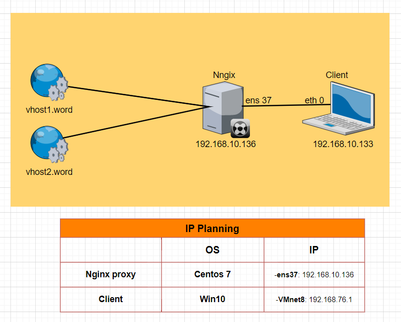

### 2. Thực hiện lab Virtual host

#### Bước 1: Cài đặt Nginx


Install the prerequisites:

```
yum install yum-utils -y
```

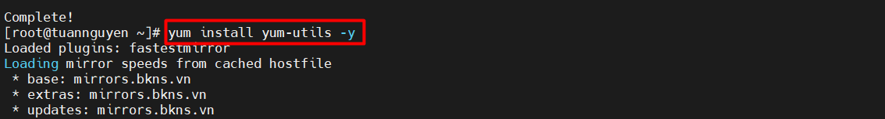

Thêm repo:

```
echo '[nginx-stable]
name=nginx stable repo
baseurl=http://nginx.org/packages/centos/$releasever/$basearch/
gpgcheck=1
enabled=1
gpgkey=https://nginx.org/keys/nginx_signing.key
module_hotfixes=true

[nginx-mainline]
name=nginx mainline repo
baseurl=http://nginx.org/packages/mainline/centos/$releasever/$basearch/
gpgcheck=1
enabled=0
gpgkey=https://nginx.org/keys/nginx_signing.key
module_hotfixes=true' >> /etc/yum.repos.d/nginx.repo
```

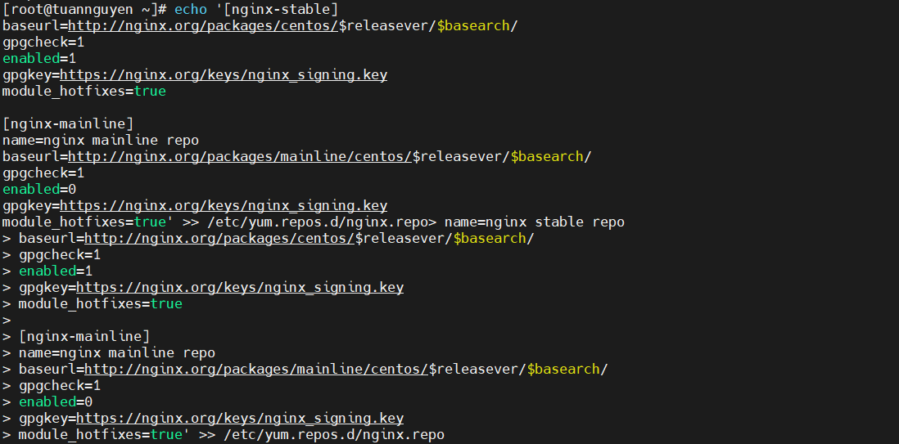

use mainline nginx packages:

```
yum-config-manager --enable nginx-mainline
```

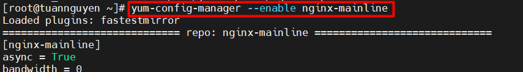

install nginx:

```
yum install nginx -y
```

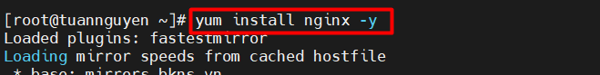

Cấu hình firewall:

```
firewall-cmd --zone=public --permanent --add-port=80/tcp
firewall-cmd --zone=public --permanent --add-port=443/tcp
firewall-cmd --reload
```
Khởi động dịch vụ:

```
systemctl start nginx
systemctl enable nginx
```
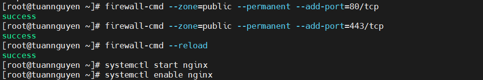

#### Bước 2: Cấu hình tạo ra các Virtual host

> Tạo virtual host vhost1.world

Tạo Server Block cho ``vhost1.world`` :
```
echo '#/etc/nginx/conf.d/vhost1.world.conf
server {
    listen      80;
    server_name     vhost1.world www.vhost1.world;

    access_log      /var/log/nginx/access-vhost1.world.log;
    error_log       /var/log/nginx/error-vhost1.world.log;

    root    /usr/share/nginx/vhost1.world;
    index   index.html;
}' > /etc/nginx/conf.d/vhost1.world.conf
```

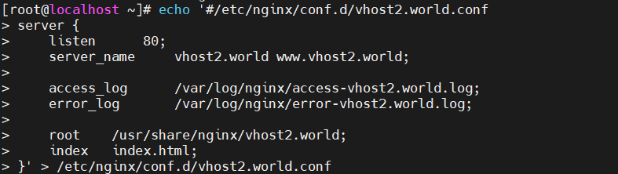

Tạo thư mục chứa website cho virtual host này:
```
mkdir /usr/share/nginx/vhost1.world
chown nginx:nginx -R /usr/share/nginx/vhost1.world
```
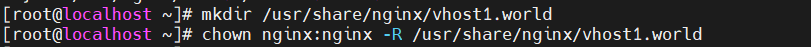

Tạo một file index.html để kiểm tra kết quả:
```
echo '<DOCTYPE html>
<html>
<head>
<title>www.vhost1.world</title>
</head>
<body>
<h1>TuanNguyen</h1>
<h1>Virtual host 1</h1>
</body>
</html>' > /usr/share/nginx/vhost1.world/index.html
```

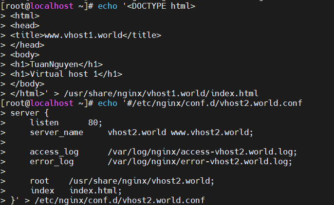


> Tạo virtual host ``vhost2.world``


Tạo Server Block cho ``vhost2.world``:
```
echo '#/etc/nginx/conf.d/vhost2.world.conf
server {
    listen      80;
    server_name     vhost2.world www.vhost2.world;

    access_log      /var/log/nginx/access-vhost2.world.log;
    error_log       /var/log/nginx/error-vhost2.world.log;

    root    /usr/share/nginx/vhost2.world;
    index   index.html;
}' > /etc/nginx/conf.d/vhost2.world.conf
```


Tạo thư mục chứa website cho virtual host này:
```
mkdir /usr/share/nginx/vhost2.world
chown nginx:nginx -R /usr/share/nginx/vhost2.world
```

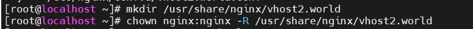

Tạo một file index.html để kiểm tra kết quả:
```
echo '<DOCTYPE html>
<html>
<head>
<title>www.vhost2.world</title>
</head>
<body>
<h1>TuanNguyen</h1>
<h1>Virtual host 2</h1>
</body>
</html>' > /usr/share/nginx/vhost2.world/index.html
```

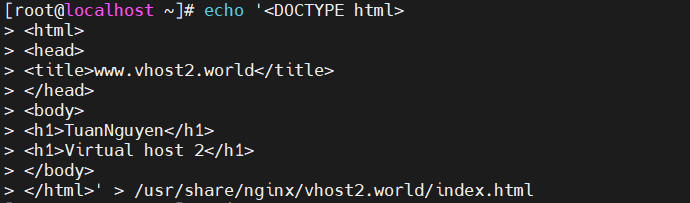

reload lại file cấu hình và kiểm tra có lỗi không 

```
 nginx -s reload && nginx -t
```

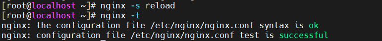

#### Bước 3: Kiểm tra
> Trên Windows 10 :


**Note:sử dụng notepad dưới quyền admin để có thể chỉnh sửa**


tìm đến đường dẫn có chưa file ``hosts``:

```
C:\Windows\System32\drivers\etc\hosts
```

Thêm 2 dòng sau vào cuối file:

```
192.168.10.136 vhost2.world www.vhost2.world
192.168.10.136 vhost1.world www.vhost1.world
```

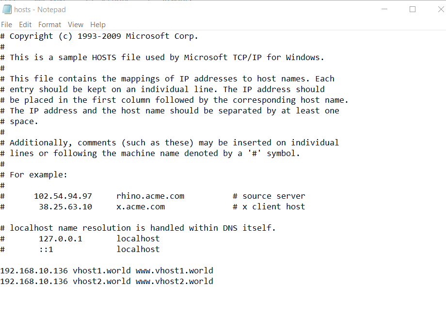

**kiểm tra**

Kiểm tra thử 1 tên miền trên trình duyệt(chorme,firefox,...)

Truy cập: **vhost2.world** hoặc **www.vhost2.world**

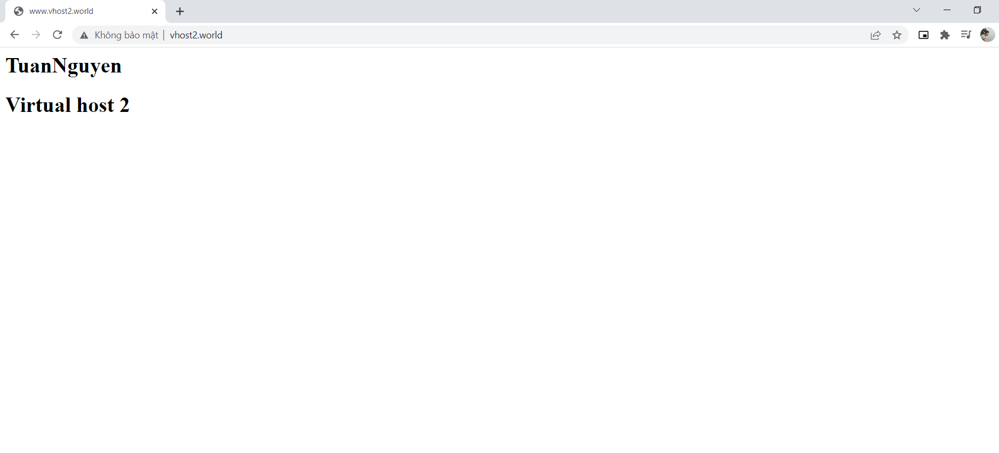


### 4. Thực hiện Chặn IP

#### Bước 1: Mở file config 

```
vi /etc/nginx/conf.d/vhost2.world.conf
```

Cấu hình  như sau:

```
#/etc/nginx/conf.d/vhost2.world.conf

limit_req_zone $binary_remote_addr zone=congvhost1:10m rate=5r/m;

server {
    listen 80;
    server_name     vhost2.world www.congvhost1.world;

    limit_req zone=vhost2 burst=5 nodelay;
    access_log      /var/log/nginx/access-congvhost1.world.log;
    error_log       /var/log/nginx/error-congvhost1.world.log;

    root    /usr/share/nginx/congvhost1.world;
    index   index.html;
}

```
Trong ví dụ này:
- zone là:`vhost1` , bộ nhớ= 10MB, giới hạn tốc độ là 5 request mỗi phút.
- burst là 5, có 5 request có thể vượt so với giới hạn
- nodelay là không có thời gian chờ giữa các truy cập

Kiểm tra và khởi động lại cấu hình:
```
nginx -t && nginx -s reload

```
#### Bước 2: Kiểm tra

Trong ví dụ này F5 5 lần trong 5s thì lần thứ 5 bị lỗi:

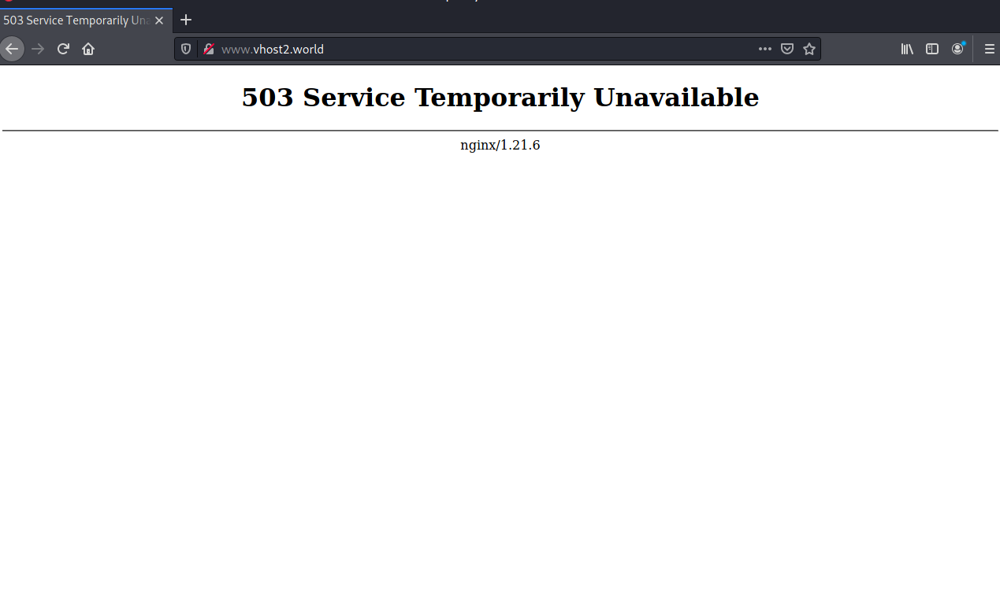

Bỏ burst=5 nodelay thì F5 lần thứ 2 thì bị lỗi.


# Tài liệu tham khảo

1. https://github.com/hocchudong/ghichep-nginx/blob/master/docs/nginx-virtualhost.md