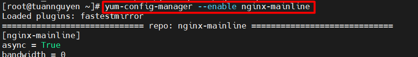

# **Cấu hình Nginx làm Reverse Proxy cho Apache**


- [**Cấu hình Nginx làm Reverse Proxy cho Apache**](#cấu-hình-nginx-làm-reverse-proxy-cho-apache)
  - [**1. Ưu điểm của Nginx Reverse Proxy**](#1-ưu-điểm-của-nginx-reverse-proxy)
  - [**2. Lab Nginx Reverse Proxy**](#2-lab-nginx-reverse-proxy)
    - [1.Mô hình mạng](#1mô-hình-mạng)
    - [2. Cài đặt Apache Server](#2-cài-đặt-apache-server)
    - [3.Cài đặt Nginx](#3cài-đặt-nginx)
    - [4. Cấu hình log Apache Server để hiện địa chỉ IP clinet](#4-cấu-hình-log-apache-server-để-hiện-địa-chỉ-ip-clinet)
    - [5. Kiểm tra:](#5-kiểm-tra)
    - [6.Kiểm chứng cú pháp (syntax) cấu hình:](#6kiểm-chứng-cú-pháp-syntax-cấu-hình)
  - [**3.Tách file cấu hình**](#3tách-file-cấu-hình)
  - [**4.Cấu hình Virtual host**](#4cấu-hình-virtual-host)
  - [**5.Chặn IP**](#5chặn-ip)
- [Tài liệu tham khảo](#tài-liệu-tham-khảo)

## **1. Ưu điểm của Nginx Reverse Proxy** 

- Trong hệ điều hành Linux, Reverse Proxy đóng vai trò làm cầu nối giữa host (máy khách) và server (máy chủ). Nó nhận yêu cầu của máy khách và chuyển lên server và nhận phản hồi từ server để chuyển tới máy khách,nó giống như là một máy chủ.

- Nginx là một trong các web server tốt nhất cải thiện tốc độ load cho nội dung tĩnh. Hơn nữa, nó cũng hữu dụng khi đóng vai trò cache nội dung để thực hiện mã hóa SSL để giảm tải cho web server chính.

- Nginx Reverse proxy giúp tạo cân bằng tải giữa nhiều server hạ tầng và là giải pháp caching cho những server chậm.

- Nó hoạt động như là server reverse proxy cho các giao thức đa dạng: HTTP, HTTPS, TCP, UDP, SMTP, IMAP, và POP3.


## **2. Lab Nginx Reverse Proxy**
### 1.Mô hình mạng


Đặt tên host:
```
hostnamectl set-hostname note1.example.com
```

```
hostnamectl set-hostname note2.example.com
```

```
hostnamectl set-hostname note3.example.com
```


### 2. Cài đặt Apache Server

> Trên node 2

Cài đặt Httpd:
```
yum install -y httpd
```


Cấu hình firewall:

```
firewall-cmd --zone=public --permanent --add-port=443/tcp
firewall-cmd --zone=public --permanent --add-port=80/tcp
firewall-cmd --reload
```

Khởi động dịch vụ:

```
systemctl start httpd
systemctl enable httpd
```


Tạo trang index:
```
echo 'Nguyen Ngoc Tuan
Apache server 192.168.10.129 ' >> /var/www/html/index.html
```


>Trên node 3

Cài đặt Httpd:

```
yum install -y httpd
```


Cấu hình firewall:

```
firewall-cmd --zone=public --permanent --add-port=443/tcp
firewall-cmd --zone=public --permanent --add-port=80/tcp
firewall-cmd --reload
```

Khởi động dịch vụ:

```
systemctl start httpd
systemctl enable httpd
```


Tạo trang test đơn giản:

```
mkdir /var/www/html/tuan

echo 'Nguyen Ngoc Tuan
Apache server 192.168.10.130 ' >> /var/www/html/index.html
```


### 3.Cài đặt Nginx

> Trên node 1

Install the prerequisites:

```
yum install yum-utils -y
```


Thêm repo:

```
echo '[nginx-stable]
name=nginx stable repo
baseurl=http://nginx.org/packages/centos/$releasever/$basearch/
gpgcheck=1
enabled=1
gpgkey=https://nginx.org/keys/nginx_signing.key
module_hotfixes=true

[nginx-mainline]
name=nginx mainline repo
baseurl=http://nginx.org/packages/mainline/centos/$releasever/$basearch/
gpgcheck=1
enabled=0
gpgkey=https://nginx.org/keys/nginx_signing.key
module_hotfixes=true' >> /etc/yum.repos.d/nginx.repo
```


use mainline nginx packages:

```
yum-config-manager --enable nginx-mainline
```



install nginx:

```
yum install nginx -y
```


Cấu hình firewall:

```
firewall-cmd --zone=public --permanent --add-port=80/tcp
firewall-cmd --zone=public --permanent --add-port=443/tcp
firewall-cmd --reload
```

Khởi động dịch vụ:

```
systemctl start nginx
systemctl enable nginx
```


Backup file cấu hình `/etc/nginx/nginx.conf`

```
cp /etc/nginx/nginx.conf /etc/nginx/nginx.conf.bak
```
Tạo 1 file test.conf trong thư mục : `/etc/nginx/conf.d/`


```
echo 'server {
        listen      80 default_server;
        #listen      [::]:80 default_server;

        proxy_redirect           off;
        proxy_set_header         X-Real-IP $remote_addr;
        proxy_set_header         X-Forwarded-For $proxy_add_x_forwarded_for;
        proxy_set_header         Host $http_host;

        location / {
            proxy_pass http://192.168.10.129/;
        }

        location /tuan {
            proxy_pass http://192.168.10.130/tuan/;
        }
    }' >> /etc/nginx/conf.d/test.conf
```


**kiểm tra**
Kiểm tra cú pháp (syntax) cấu hình:
```
nginx -t
```

Kết quả:
```
[root@node1 ~]# nginx -t
nginx: the configuration file /etc/nginx/nginx.conf syntax is ok
nginx: configuration file /etc/nginx/nginx.conf test is successful
```


Khởi động lại dịch vụ:
```
nginx -s reload
```
hoặc
```
systemctl restart nginx
```

Câu lệnh kết hợp:
```
nginx -t && nginx -s reload
```


**Quay lại file cấu hình**


Trong đó: 
```
location / {
    proxy_pass http://192.168.10.128/;
}
```
- Người dùng truy cập `http://192.168.76.128/`, URI sẽ được chuyển đến máy chủ Apache: `http://192.168.10.129/index.html`


```

location /tuan {
    proxy_pass http://192.168.10.130/tuan/;
}
```

- Người dùng truy cập `http://192.168.76.128/tuan/`, request của client sẽ được chuyển đến máy chủ Apache: `http://192.168.10.130/tuan/index.html`


**Giải thích 1 số dòng khác**


```
proxy_set_header         X-Real-IP $remote_addr;
```
- Real IP của client sẽ được gán vào biến `$remote_addr`, sau đó được gửi tới server Apache.

```
proxy_set_header         X-Forwarded-For $proxy_add_x_forwarded_for;
```
- `proxy_set_header X-Forwarded-For`: Để ghi nhận địa chỉ IP thực của client vào backend web server, chúng ta sử dụng tham số: “proxy_set_header X-Forwarded-For”

```
proxy_set_header Host $host
```
- Dùng để định nghĩa lại trường Host request header mà truyền đến backend khi mà cached được enable trên nginx . $host bằng giá trị server_name trong trường Host request header.

- `proxy_redirect off;` : tắt chức năng proxy_redirect. Xem chi tiết tại: http://nginx.org/en/docs/http/ngx_http_proxy_module.html#proxy_redirect


### 4. Cấu hình log Apache Server để hiện địa chỉ IP clinet

> Trên cả node 1 và node 2

```
vi /etc/httpd/conf/httpd.conf
```
- Để hiển thị IP người dùng truy cập qua Nginx Proxy. 
- 

Sửa dòng 196:
```
LogFormat "\"%{X-Forwarded-For}i\" %l %u %t \"%r\" %>s %b \"%{Referer}i\" \"%{User-Agent}i\"" combined
```


- Để che IP người dùng truy cập qua Nginx Proxy. Sửa dòng 196 thành:
```
LogFormat "%h %l %u %t \"%r\" %>s %b \"%{Referer}i\" \"%{User-Agent}i\"" combined
```

### 5. Kiểm tra:
Kiểm tra file log trước thay đổi :

```
Tail -f /var/log/httpd/access_log
```


**Thực hiện truy cập:** http://192.168.76.128

- Sau khi thay đổi file Kết quả `log`:


### 6.Kiểm chứng cú pháp (syntax) cấu hình:

- Cú pháp:
```
nginx -t
```

Demo:
- Lỗi thiếu `}` `,` trong :
  


- Kiểm tra có lỗi syntax không:
```
[root@node3 nginx]# nginx -t
nginx: [emerg] "http" directive is not allowed here in /etc/nginx/nginx.conf:17
nginx: configuration file /etc/nginx/nginx.conf test failed
```


- Sửa lỗi:


- Kiểm tra lại:
```
[root@node3 nginx]# nginx -t && nginx -s reload

nginx: the configuration file /etc/nginx/nginx.conf syntax is ok
nginx: configuration file /etc/nginx/nginx.conf test is successful
```


## **3.Tách file cấu hình**

Thực hiện tách file `/etc/nginx/conf.d/test.conf` thành 2 file cho từng Apache Server

> Thực hiện trên node1 (Nginx Proxy)

Sửa tệp cấu hình:
```
vi /etc/nginx/nginx.conf
```
Bỏ dòng 31:
```
31     #include /etc/nginx/conf.d/*.conf;
```
Thêm dòng sau vào cuối **HTTP Block**:
```
    server {
        #server_name example.com;
        listen      [::]:80 default_server;
        listen      80 default_server;

        include /etc/nginx/conf.d/*.conf;
}
```
Sửa file `/etc/nginx/conf.d/test.conf` sử dụng cho node2
```
echo '#/etc/nginx/conf.d/test.conf
location / {
    proxy_redirect           off;
    proxy_set_header         X-Real-IP $remote_addr;
    proxy_set_header         X-Forwarded-For $proxy_add_x_forwarded_for;
    proxy_set_header         Host $http_host;
    proxy_pass http://192.168.10.129/;
}' > /etc/nginx/conf.d/test.conf
```

Cấu hình file `/etc/nginx/conf.d/test1.conf` sử dụng cho node3
```
echo '#/etc/nginx/conf.d/test1.conf
location /tuan/ {
    proxy_redirect           off;
    proxy_set_header         X-Real-IP $remote_addr;
    proxy_set_header         X-Forwarded-For $proxy_add_x_forwarded_for;
    proxy_set_header         Host $http_host;
    proxy_pass http://192.168.10.130/tuan/;
}' > /etc/nginx/conf.d/test1.conf
```

 **Kiểm tra:**

**Truy cập:** http://192.168.76.128

- Kết quả:


**Truy cập:** http://192.168.76.128/tuan

- Kết quả:


## **4.Cấu hình Virtual host**

https://github.com/TuanNguyen76/TaiLieuCaNhan/blob/T%C3%A0i-li%E1%BB%87u-c%C3%A1-nh%C3%A2n/T%C3%A0i_Li%E1%BB%87u_C%C3%A1_Nh%C3%A2n/LINUX/LinuxBasic/Ghi_ch%C3%A9p_NginX/Nginx-virtualhost-block-IP.md

##  **5.Chặn IP**

https://github.com/TuanNguyen76/TaiLieuCaNhan/blob/T%C3%A0i-li%E1%BB%87u-c%C3%A1-nh%C3%A2n/T%C3%A0i_Li%E1%BB%87u_C%C3%A1_Nh%C3%A2n/LINUX/LinuxBasic/Ghi_ch%C3%A9p_NginX/Nginx-virtualhost-block-IP.md


# Tài liệu tham khảo

1. https://serverfault.com/questions/618889/can-you-define-a-servers-locations-in-multiple-nginx-config-files
2. https://www.server-world.info/en/note?os=CentOS_7&p=nginx&f=6
3. https://docs.nginx.com/nginx/admin-guide/web-server/reverse-proxy/
4. 