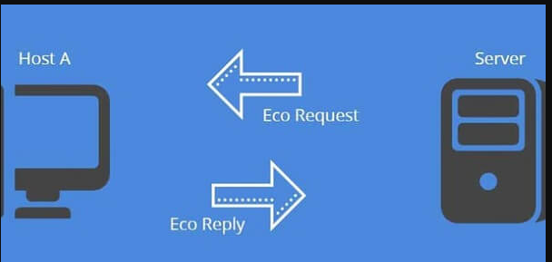
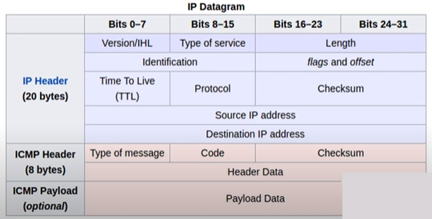
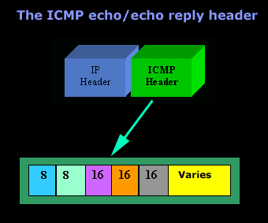
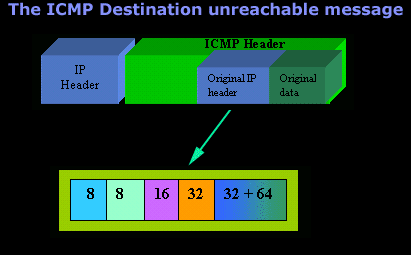
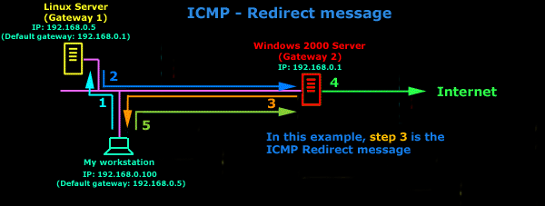

**Tìm hiểu ICMP**

- [1. Giao thức ICMP](#1-giao-thức-icmp)
- [2. Các loại ICMP message thường thấy](#2-các-loại-icmp-message-thường-thấy)
  - [2.1. ICMP echo(lệnh ping)](#21-icmp-echolệnh-ping)
  - [2.2 ICMP Destination Unreachable](#22-icmp-destination-unreachable)
  - [2.3. ICMP Parameter Problem](#23-icmp-parameter-problem)
  - [2.4. ICMP Redirect/Change Request](#24-icmp-redirectchange-request)
  - [2.5. ICMP Timestamp Request](#25-icmp-timestamp-request)
  - [2.6. ICMP Information Request and Reply](#26-icmp-information-request-and-reply)
  - [2.7. ICMP Address Mask Request](#27-icmp-address-mask-request)
  - [2.8. ICMP Router Discover message](#28-icmp-router-discover-message)
  - [2.9. ICMP Router Solicitation message](#29-icmp-router-solicitation-message)
  - [2.10. ICMP Source Quench message](#210-icmp-source-quench-message)

# 1. Giao thức ICMP
\- ICMP ([**Internet Control Message Protocol](https://massageishealthy.com/giao-thuc-icmp.html)**)** là một giao thức 

- kiểm tra các kết nối lớp 3 xem có thông nhau hay không

\- ICMP được dùng để 

- thông báo các lỗi xảy ra trong quá trình truyền đi của các gói dữ liệu trên mạng.
- Thăm dò và quản lý quá trình của mạng(các lệnh ping, trace route)

\- ICMP header xuất hiện sau IPv4 hoặc IPv6 packet header và được xác định là IP protocol số 1. Thông thường, một giao thức ICMP chứa ba trường:

- **TYPE (8 bit)**: là một số nguyên 8 bit để xác định thông điệp.
- **CODE (8bit)**:cung cấp thêm thông tin về kiểu thông điệp.
- **CHECKSUM(16 bit)** : ICMP sử dụng thuật gii checksum như IP, nhưng ICMP checksum chỉ tính đến thông điệp ICMP.

– Dựa theo ba trường là dữ liệu ICMP và IP header ban đầu, chúng ta có thể xác định được các gói nào thực sự không thành công.

# 2. Các loại ICMP message thường thấy
## 2.1. ICMP echo(lệnh ping)
Có hai loại là echo request và echo reply message tương ứng với các trường:

- Type = 0 -> echo request, code = 0
- Type = 8 -> echo reply, code = 0

Ngoài ra còn có 2 trường (size 16 bit/field) là ID và sequence Number dùng để nhận biết giữa các cặp reply/request.
## 2.2 ICMP Destination Unreachable
Không thể ping được đến host đó

Có các cặp giá trị code khác nhau:

**Ví dụ:**

- Type = 3, code = 0 -> Network Unreachable
- Type = 3, code = 1 -> Host Unreachable
- Type = 3, code = 2 -> Protocol Unreachable
- Type = 3, code = 3 -> Port Unreachable
## 2.3. ICMP Parameter Problem
Nếu khi xảy ra lỗi ở dữ liệu và không thể chuyển tiếp nó đi được thì thiết bị trung gian sẽ gửi một thông báo cho Sender trong các trường như sau:

- Type = 12
- Code = 0 – 2
- Thêm một trường Pointer (8 bit) để chỉ vị trí của octet lỗi.
## 2.4. ICMP Redirect/Change Request
Là loại Control Messages, được gửi đi bởi một default gateway, báo cho host nhận biết là có best path(Đường tốt nhất)

Các loại Redirect Require Message ứng với các type và code sau:

- Type = 5 code = 0 -> Redirect datagram for the network
- Type = 5 code = 1 -> Redirect datagram for the host
- Type = 5 code = 2 -> Redirect datagram for the type of service and the network
- Type = 5 code = 3 -> Redirect datagram for the type of service and the host
## 2.5. ICMP Timestamp Request
Là phương thức đồng bộ thời gian giữa nơi truyền và nơi nhận tin có thể thực hiện qua:

- Type = 13, code = 0 -> ICMP Timestamp Request message
- Type = 14, code = 0 -> ICMP Timestamp reply message

Ngoài ra còn có 2 trường có size là 16 bit là ID và sequence Number dùng để nhận biết giữa các cặp reply/request.
## 2.6. ICMP Information Request and Reply
Để xác định số mạng (network) được sử dụng.

- Type = 15, code = 0 -> ICMP Information Request message
- Type = 16, code = 0 -> ICMP Information reply message

Ngoài ra còn có 2 trường có size là 16 bit là ID và sequence Number dùng để nhận biết giữa các cặp reply/request.
## 2.7. ICMP Address Mask Request
Host tìm được subnetmask của mình khi không được cấu hình bằng tay.

- Type = 17, code = 0 -> ICMP Address Mask Request message
- Type = 118, code = 0 -> ICMP Address Mask reply message

Ngoài ra còn có 2 trường có size là 16 bit là ID và sequence Number dùng để nhận biết giữa các cặp reply/request. Và thêm 1 trường 32 bit dành cho Address Mask (với request message thì nó được cho về not use với reply message thì nó là Address Mask correct của host).
## 2.8. ICMP Router Discover message
Để xác định bộ định tuyến khi sender mất default gateway. Được thực hiện:

- Type = 9 Code =0
## 2.9. ICMP Router Solicitation message
- Được áp dụng khi sender mất default gateway. Type = 10 Code = 0
## 2.10. ICMP Source Quench message
Được sử dụng để báo cho người gửi biết là có tắc nghẽn và hỏi người gửi xem có giảm tốc độ gửi gói dữ liệu đi hay không.

- Type = 4 Code = 0

Tham khảo:

\1. <https://www.totolink.vn/article/73-icmp-la-gi-9-loai-icmp-thuong-thay.html>

