# Tìm hiểu VTP

- [Tìm hiểu VTP](#tìm-hiểu-vtp)
  - [1. Tổng quan về NTP](#1-tổng-quan-về-ntp)
    - [1.1 khái niệm tổng quan NTP](#11-khái-niệm-tổng-quan-ntp)
    - [1.2 Phương thức hoạt động](#12-phương-thức-hoạt-động)
    - [1.3 Các cơ chế hoạt động](#13-các-cơ-chế-hoạt-động)
    - [1.4 Sự khác biệt giữa ntpd và chronyd](#14-sự-khác-biệt-giữa-ntpd-và-chronyd)
  - [2. Cài đặt NTP](#2-cài-đặt-ntp)
    - [2.1 Mô hình mạng](#21-mô-hình-mạng)
    - [2.2 Cài đặt](#22-cài-đặt)
  - [3. Cài đặt Chorny](#3-cài-đặt-chorny)
    - [3.1 Mô hình mạng](#31-mô-hình-mạng)
    - [3.2 Các bước thực hiện](#32-các-bước-thực-hiện)
    - [Bước 2: Cài đặt Chrony trên Client](#bước-2-cài-đặt-chrony-trên-client)
  - [4.Phân tích gói tin](#4phân-tích-gói-tin)
- [Tài liệu tham khảo](#tài-liệu-tham-khảo)

## 1. Tổng quan về NTP
   ### 1.1 khái niệm tổng quan NTP
   - NTP là 1 giao thức được thiết kế giúp giữ cho các máy tính có thể đồng bộ hoá thời gian với nhau
  
  - NTP hoạt động bằng cách sử dụng một nguồn thời gian chính duy nhất 
  - NTP là 1 trong những giao thức Internet lâu đời nhất đang được sử dụng hiện nay đã hoạt động từ trước năm 1985.
   ### 1.2 Phương thức hoạt động

   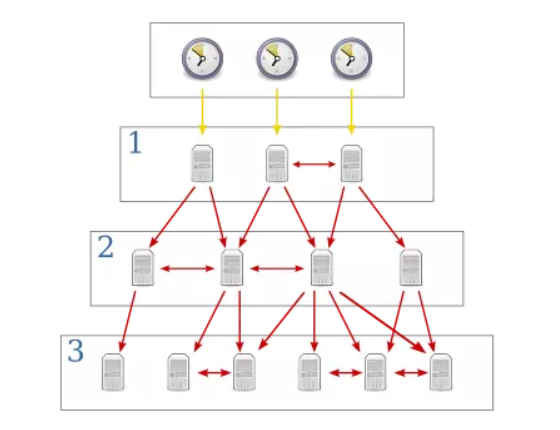

  - NTP clinet gửi một gói tin, trong đó chứa một thẻ thời gian gửi tới cho NTP server.
  - NTP server nhận được gói tin, gửi trả lại NTP clinet 1 gói tin khác, có thẻ thời gian là thời điểm nó gửi gói tin đó đi 
  - NTP clinet nhận được gói tin đó, tính toán độ trễ, dựa vào thẻ thời gian mà nó nhận được cùng với độ trễ đường truyề,NTP clinet sẽ set lại thời gian của nó
   ### 1.3 Các cơ chế hoạt động
 
  NTP sử dụng 2 mode cơ bản:
  - Client/Server mode: Client yêu cầu và Server phản hồi. Server là thiết bị ở higher-stratum so với client. Do đó thời gian client được đồng bộ theo server.
  - Peer-to-peer mode (ở cùng trên 1 tầng):  Cả hai thiết bị đều là người yêu câu và đều là người trả lời lẫn nhau.

   ### 1.4 Sự khác biệt giữa ntpd và chronyd

Các lợi ích của Chrony bao gồm:
1. Đồng bộ hóa nhanh hơn chỉ cần vài phút thay vì hàng giờ để giảm thiểu lỗi thời gian và tần suất, điều này rất hữu ích trên máy tính để bàn hoặc hệ thống không chạy 24 giờ một ngày.
2. Đáp ứng tốt hơn với những thay đổi nhanh chóng của tần số đồng hồ, điều này hữu ích cho các máy ảo có đồng hồ không ổn định hoặc cho các công nghệ tiết kiệm năng lượng không giữ cho tần số đồng hồ không đổi.
3. Sau khi đồng bộ hóa ban đầu, nó không bao giờ bước đồng hồ để không ảnh hưởng đến các ứng dụng cần thời gian hệ thống là đơn điệu.
4. Ổn định tốt hơn khi đối phó với sự chậm trễ không đối xứng tạm thời, ví dụ khi liên kết bị bão hòa bởi một lượt tải xuống lớn.
5. Không yêu cầu thăm dò định kỳ các máy chủ, do đó các hệ thống có kết nối mạng không liên tục vẫn có thể nhanh chóng đồng bộ hóa đồng hồ.


- Khi nào sử dụng chrony
  
Chrony sẽ được coi là ứng dụng phù hợp nhất cho các hệ thống thường xuyên bị treo hoặc bị ngắt kết nối liên tục khỏi mạng (máy chủ di động và ảo, v.v.).

- Khi nào sử dụng NTP
  
Daemon NTP (ntpd) nên được xem xét cho các hệ thống thường được lưu giữ vĩnh viễn. Các hệ thống được yêu cầu sử dụng IP quảng bá hoặc phát đa hướng hoặc để thực hiện xác thực gói tin bằng giao thức Autokey, nên xem xét sử dụng ntpd.

## 2. Cài đặt NTP
   ### 2.1 Mô hình mạng 

   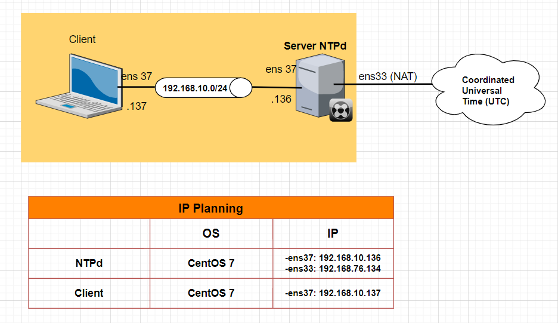

   ### 2.2 Cài đặt

 Các bước thực hiện


**Bước 1:**  Cài đặt NTP Server


   1.Cài đặt NTPd:

```
yum -y install ntp
```

   2.Backup file cấu hình:


```
cp /etc/ntp.conf /etc/ntp.conf.bak
```


3.Xem danh sách máy chủ NTP trên trang : https://www.ntppool.org/

4.Chỉnh sửa file cấu hình:

```
vi etc/ntp.conf

```
- Cho phép IP trong dải: 192.168.10.0 truy xuất vào máy chủ để lấy thời gian.
```
restrict 192.168.92.0 mask 255.255.255.0 nomodify notrap
```

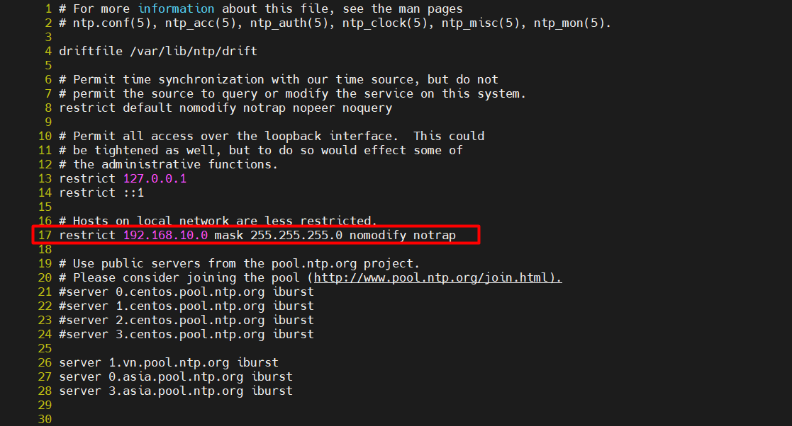

- Thay đổi các server đồng bộ:
  
```
#
#server 0.centos.pool.ntp.org iburst
#server 1.centos.pool.ntp.org iburst
#server 2.centos.pool.ntp.org iburst
#server 3.centos.pool.ntp.org iburst

server 1.vn.pool.ntp.org iburst
server 0.asia.pool.ntp.org iburst
server 3.asia.pool.ntp.org iburst
```
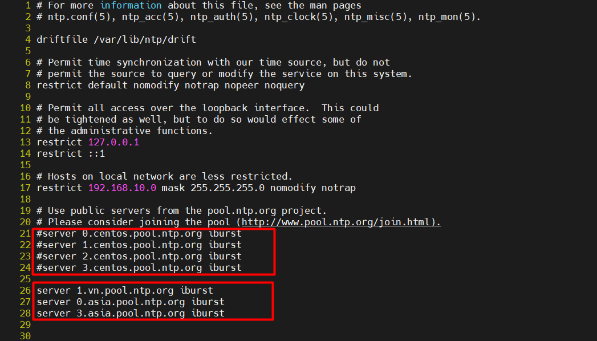


5.Khởi động dịch vụ:
```
systemctl start ntpd
systemctl enable ntpd
```

6.Cấu hình Firewalld cho phép dịch vụ NTP:
```
firewall-cmd --add-service=ntp --permanent
firewall-cmd --reload
```


7.Kiểm tra hoạt động:

```
[root@localhost etc]# ntpq -p
     remote           refid      st t when poll reach   delay   offset  jitter
==============================================================================
+time.cloudflare 10.177.8.4       3 u   66   64  377    3.689    6.279   2.042
*210.23.25.77    .GPS.            1 u   62   64  377   37.529   13.763   2.243
```

**Bước 2: Cài đặt NTP trên Client**

1.Cài đặt NTPd:

```
yum -y install ntp
```

2.Backup file cấu hình:
```
cp /etc/ntp.conf /etc/ntp.conf.bak
```
3.Chỉnh sửa file cấu hình:

```
sed -i 's|server 0.centos.pool.ntp.org iburst|server 192.168.10.136 iburst|g' /etc/ntp.conf
sed -i 's|server 1.centos.pool.ntp.org iburst|#|g' /etc/ntp.conf
sed -i 's|server 2.centos.pool.ntp.org iburst|#|g' /etc/ntp.conf
sed -i 's|server 3.centos.pool.ntp.org iburst|#|g' /etc/ntp.conf
```

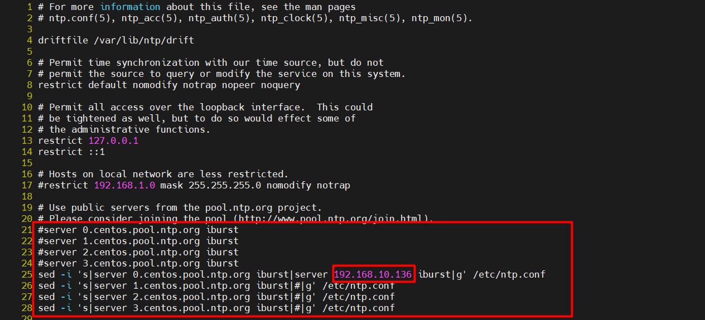

4.Khởi động dịch vụ:

```
systemctl start ntpd
systemctl enable ntpd
```

Cấu hình Firewalld cho phép dịch vụ NTP:

```
firewall-cmd --add-service=ntp --permanent
firewall-cmd --reload
```

5.Kiểm tra hoạt động:
```
[root@localhost ~]# ntpq -p
     remote           refid      st t when poll reach   delay   offset  jitter
==============================================================================
 192.168.10.136   210.23.25.77     2 u   41   64    1    0.391  12715.4   0.000
```

**kiểm tra lại thời gian trên máy chủ** 

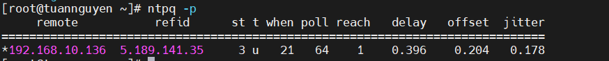


## 3. Cài đặt Chorny
  

### 3.1 Mô hình mạng

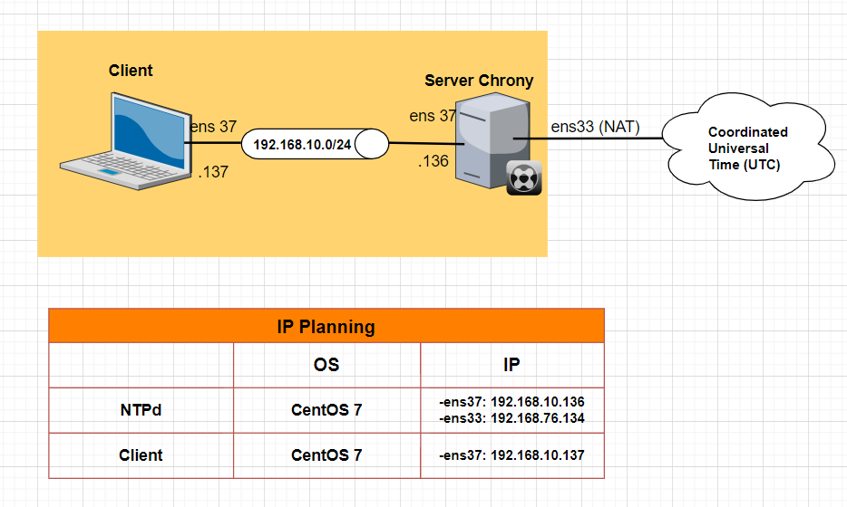

### 3.2 Các bước thực hiện

**Bước 1 : Cài đặt NTP Serve**


   1.Tăng thêm thời gian hệ thốg để kiểm tra sau khi đồng bộ ;

```
date -s '+10 minutes'
```


2.Cài đặt Chrony

```
yum -y install chrony
```

3.Backup file cấu hình

```
cp /etc/chrony.conf /etc/chrony.conf.bak
```

4.Chỉnh sửa file cấu hình

  ```
  vi /etc/chorony.conf
  ```

- Cho phép IP trong dải: 192.168.10.0 truy xuất vào máy chủ để lấy thời gian. 
```
echo 'allow 192.168.10.0/24' >> /etc/chrony.conf
```

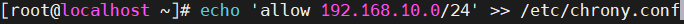


- Thay đổi các server đồng bộ:
  
```
#
#server 0.centos.pool.ntp.org iburst
#server 1.centos.pool.ntp.org iburst
#server 2.centos.pool.ntp.org iburst
#server 3.centos.pool.ntp.org iburst

server 1.vn.pool.ntp.org iburst
server 0.asia.pool.ntp.org iburst
server 3.asia.pool.ntp.org iburst
```
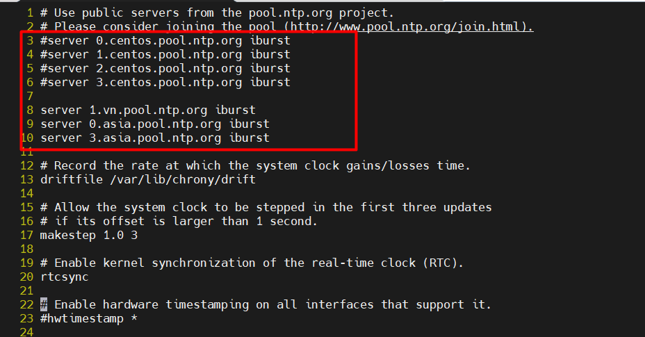


5.Khởi động dịch vụ:

```
systemctl start chronyd
systemctl enable chronyd
```

6.Cấu hình Firewalld cho phép dịch vụ NTP:
```
firewall-cmd --add-service=ntp --permanent
firewall-cmd --reload
```


7.Kiểm tra hoạt động:
```
[root@localhost ~]# chronyc sources
210 Number of sources = 3
MS Name/IP address         Stratum Poll Reach LastRx Last sample
===============================================================================
^* time.cloudflare.com           3   8   377    25    +17ms[  +17ms] +/-   58ms
^+ ntp.gnc.am                    2   8   377    22  +7876us[+7876us] +/-  159ms
^+ time4.unima.ac.id             2   7   377    91    -49ms[  -49ms] +/-  149ms
```
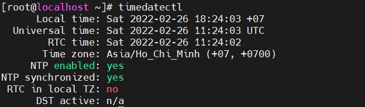

### Bước 2: Cài đặt Chrony trên Client

1. Cài đặt NTPd:

```
yum -y install chrony
```

2. Backup file cấu hình:

```
cp /etc/chrony.conf /etc/chrony.conf.bak
```

3. Chỉnh sửa file cấu hình:

```
sed -i 's|server 0.centos.pool.ntp.org iburst|server 192.168.10.136 iburst|g' /etc/chrony.conf
sed -i 's|server 1.centos.pool.ntp.org iburst|#|g' /etc/chrony.conf
sed -i 's|server 2.centos.pool.ntp.org iburst|#|g' /etc/chrony.conf
sed -i 's|server 3.centos.pool.ntp.org iburst|#|g' /etc/chrony.conf
```
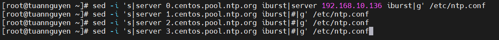

4. Khởi động dịch vụ:
```
systemctl start chronyd
systemctl enable chronyd
```
5. Cấu hình Firewalld cho phép dịch vụ NTP:

```
firewall-cmd --add-service=ntp --permanent
firewall-cmd --reload
```

6. Kiểm tra hoạt động:
```
[root@tuannguyen ~]# chronyc sources
210 Number of sources = 1
MS Name/IP address         Stratum Poll Reach LastRx Last sample
===============================================================================
^* 192.168.10.136                4   6    17    17  +5901ns[+3264ns] +/-   58ms


```
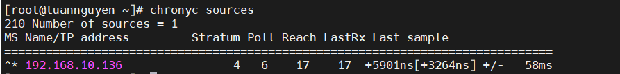


## 4.Phân tích gói tin
 Bắt gói tin trên cổng VMnet8

 Mô hình mạng:

 

 
 

Trên máy chủ NTPd:

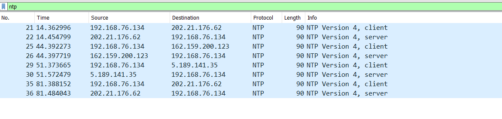

Trên Clinet VTPd:

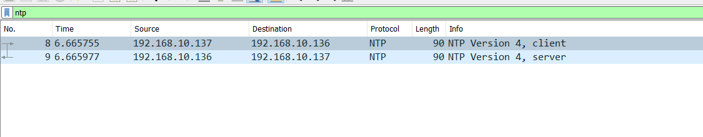

Phân tích gói tin request :


Phân tích gói tin rely:

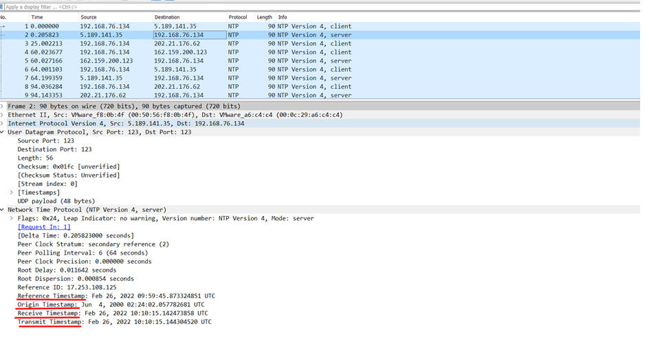

# Tài liệu tham khảo

1. https://www.server-world.info/en/note?os=CentOS_7&p=ntp&f=1
2. https://www.liquidweb.com/kb/how-to-install-and-configuring-ntp-on-centos-and-ubuntu/