**ARP Protocol**

- [**1.Khái niệm ARP**](#1khái-niệm-arp)
- [**2.Cơ chế hoạt động**](#2cơ-chế-hoạt-động)
- [**3. Paket structure**](#3-paket-structure)
- [**4.ARP Caching**](#4arp-caching)
- [**5. Phân tích gói tin bằng Wireshark**](#5-phân-tích-gói-tin-bằng-wireshark)
- [**6.An toàn trong giao thức ARP**](#6an-toàn-trong-giao-thức-arp)

# **1.Khái niệm ARP**
ARP là phương thức phân giải địa chỉ động giữa địa chỉ lớp network và địa chỉ lớp datalink. Quá trình thực hiện bằng cách: một thiết bị IP trong mạng gửi một gói tin local broadcast đến toàn mạng yêu cầu thiết bị khác gửi trả lại địa chỉ phần cứng ( địa chỉ lớp datalink ) hay còn gọi là Mac Address của mình.

ARP là giao thức lớp 2 - Data link layer trong mô hình OSI và là giao thức lớp Link layer trong mô hình TCP/IP.

Địa chỉ MAC có độ dài 48 bit

# **2.Cơ chế hoạt động**
\- Khi một network device muốn biết MAC address của một network device nào đó mà nó đã biết địa chỉ ở tầng network (IPv4) , nó sẽ gửi một “ARP request” bao gồm địa chỉ MAC address của nó và IP address của network device mà nó cần biết MAC address trên toàn bộ miền broadcast .
\- Mỗi network device nhận được request này sẽ so sánh địa chỉ IP trong request với IP address của mình . Nếu trùng IP address thì sẽ gửi ngược lại cho network device kia một packet “ARP request” ( trong đó có MAC address của mình ) .

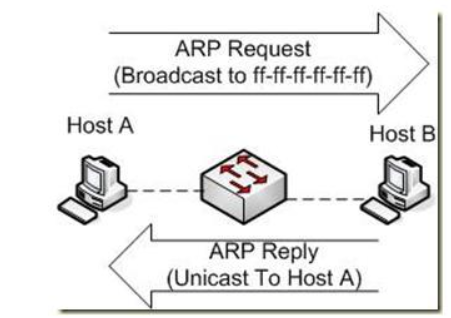
Có 4 loại địa chỉ trong một bản tin ARP :

\1. Sender Hardware Address : địa chỉ lớp hai của thiết bị gửi bản tin
\2. Sender Protocol Address : Địa chỉ lớp ba ( hay địa chỉ logic ) của thiết bị gửi bản tin
\3. Target Hardware Address : Địa chỉ lớp hai ( địa chỉ phần cứng ) của thiết bị đích của bản tin
\4. Target Protocol Address : Địa chỉ lớp ba ( hay địa chỉ logic ) của thiết bị đích của bản tin

Có 4 dạng bản tin trong ARP : 

- ` `ARP probe: Đây là loại bản tin ARP dùng để máy thăm dò xem địa chỉ mà máy được cấp phát (cấu hình manual hoặc DHCP, ...) có bị trùng với địa chỉ IP của máy nào trong cùng mạng hay không.
- ARP announcements: ARP cũng sử dụng một cách đơn giản để thông báo tới các máy trong mạng khi địa chỉ IP hoặc địa chỉ MAC của nó thay đổi.
- ARP Request : Khởi tạo quá trình, gói tin được gửi từ thiết bị nguồn tới thiết bị đích.
- Reply : Là quá trình đáp trả gói tin ARP request, được gửi từ máy đích đến máy nguồn.

**2.1 Truyền tin giữa các PC trong cùng mạng LAN**

\- Mô hình :

PC A và PC B ở trong cùng một mạng LAN có địa chỉ network 192.168.1.0/24 . IP address và MAC address của PC A và PC B như hình bên dưới .

PC A muốn gửi packet cho PC B .

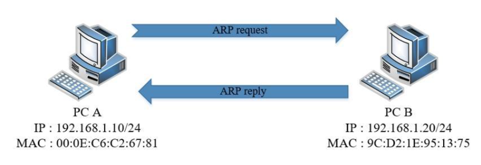
\- Nguyên tắc hoạt động

Bước 1: PC A sẽ kiểm tra cache của mình . Nếu đã có MAC address của IP 192.168.1.10 thì PC A sẽ gửi packet cho PC B.

Bước 2: Bắt đầu khởi tạo gói tin ARP Request. Nó sẽ gửi một gói tin broadcast đến toàn bộ các máy khác trong mạng với MAC address và IP máy gửi là địa chỉ của chính nó, địa chỉ IP máy nhận là 192.168.1.20, và MAC address máy nhận là ff:ff:ff:ff:ff:ff.

Bước 3: PC A phân phát gói tin ARP Request trên toàn mạng. Khi switch nhận được gói tin broadcast nó sẽ chuyển gói tin này tới tất cả các máy trong mạng LAN đó.

Bước 4: Các PC trong mạng đều nhận được gói tin ARP Request. PC kiểm tra trường địa chỉ Target Protocol Address. Nếu trùng với địa chỉ của mình thì tiếp tục xử lý, nếu không thì hủy gói tin.

Bước 5: PC B có IP trùng với IP trong trường Target Protocol Address sẽ bắt đầu quá trình khởi tạo gói tin ARP Reply bằng cách:

lấy các trường Sender Hardware Address và Sender Protocol Address trong gói tin ARP nhận được đưa vào làm Target trong gói tin gửi đi.

Đồng thời thiết bị sẽ lấy địa chỉ MAC của mình để đưa vào trường Sender Hardware Address

Bước 6: PC B đồng thời cập nhật bảng ánh xạ IP address và MAC address của thiết bị nguồn vào bảng ARP cache của mình để giảm bớt thời gian xử lý cho các lần sau .

Bước 7: PC B bắt đầu gửi gói tin Reply đã được khởi tạo đến PC A.

Bước 8: PC A nhận được gói tin reply và xử lý bằng cách lưu trường Sender Hardware Address trong gói reply vào bảng ARP cache làm MAC address tương ứng với IP address của PC B. Lần sau sẽ không còn cần tới request.

**2.2. Truyền tin ngoài mạng lan** 

\- Mô hình :
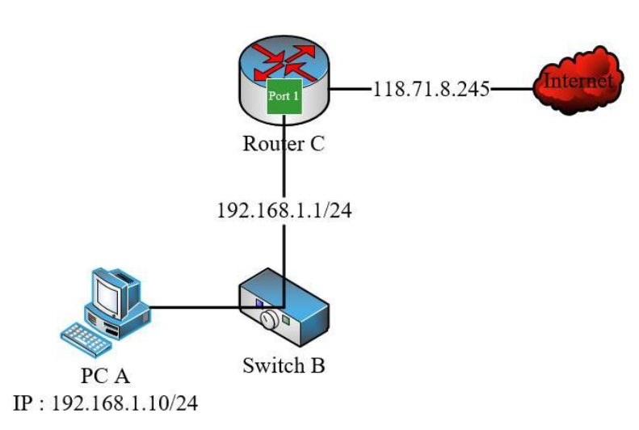

\- Giả sử PC A muốn gửi packet ra ngoài Internet . Do broadcast không thể truyền qua Router C nên PC A sẽ xem Router C như một cầu nối trung gian để truyền dữ liệu . Trước đó PC A sẽ biết IP address của Router C ( địa chỉ gateway ) và biết được rằng để truyền packet ra ngoài Internet thì phải đi qua Router C.
\- Quá trình truyền packet theo từng bước sau :

PC A gửi một “ARP request” để tìm MAC address của “Port 1” của Router C .

Router C gửi lại cho PC A một “ARP reply” , cung cấp cho PC A MAC address của Port 1 .

PC A truyền packet đến Port 1 của Router .

- Router nhận được packet từ PC A và chuyển packet tra “Port WAN” và truyền ra Internet. Máy B sẽ trả lời router C địa chỉ MAC của mình, sau đó router sẽ gửi gói tin của A tới B.

# **3. Paket structure**
Kích thước bản tin ARP là 28 byte, được đóng gói trong frame Ethernet II nên trong mô hình OSI, ARP được coi như là giao thức lớp 3 cấp thấp.

**3.1 Cấu trúc của ARP Packet**

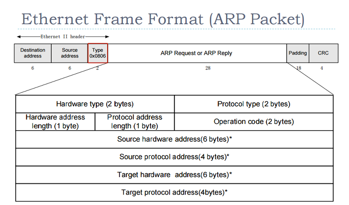

- **Hardware type:**
  - Xác định kiểu bộ giao tiếp phần cứng cần biết.
  - Xác định với kiểu Ethernet giá trị 1.
- **Protocol type:**
  - Xác định kiểu giao thức cấp cao (layer 3) máy gửi sử dụng để giao tiếp.
  - Giao thức dành cho IP có giá trị 0x0800.
- **Hardware address length:** Xác định độ dài địa chỉ vật lý (tính theo đơn vị byte). Địa chỉ MAC nên giá trị của nó sẽ là 6.
- **Protocol address length:** Xác định độ dài địa chỉ logic được sử dụng ở tầng trên (layer 3). Tùy thuộc vào IP sử dụng mà có giá trị khác nhau, hiện tại IPv4 được sử dụng rộng rãi nên trường này sẽ có giá trị là 4 (byte).
- **Operation code:** Xác định loại bản tin ARP mà máy gửi gửi. Có một số giá trị phổ biến:
  - 1 : bản tin ARP request.
  - 2 : bản tin ARP rely.
  - 3 : bản tin RARP request.
  - 4 : bản tin RARP reply.
- **Sender hardware address (SHA):** Xác định địa chỉ MAC máy gửi.
  - Trong bản tin ARP request: trường này xác định địa chỉ MAC của host gửi request.
  - Trong bản tin ARP reply: trường này xác định địa chỉ MAC của máy host mà máy gửi bên trên muốn tìm kiếm.
- **Sender protocol address (SPA):** Xác định địa chỉ IP máy gửi.
- **Target hardware address (THA):** Xác định địa chỉ MAC máy nhận mà máy gửi cần tìm.
  - Trong bản tin ARP request: Trường này chưa được xác định (nên sẽ để giá trị là: 00:00:00:00:00:00)
  - Trong bản tin ARP reply: Trường này sẽ điền địa chỉ của máy gửi bản tin ARP request.
- **Target protocol address (PTA):** Xác định địa chỉ IP máy gửi (máy cần tìm)

**3.2 Cấu trúc của ARP message(bao gồm ARP,ARPP relay và request)**

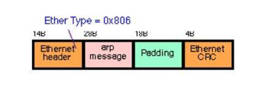

Ta nhìn thấy “ARP message” được bọc bởi Ethernet header (ARP Packet)

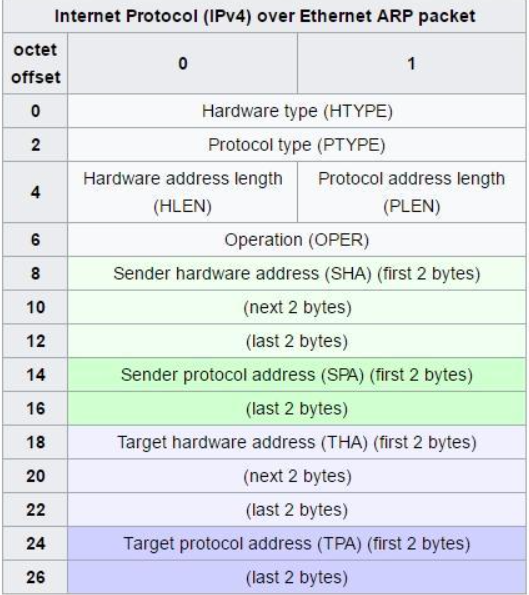

\- Giải thích các trường trong “ARP message”

Hardware type (HTYPE) : Trường này cho biết network protocol . Example : Ethernet là “1” .

Protocol type ( PTYPE ) : Trường này cho biết internetwork protocol . Example : IPv4 là “0x0800”

Hardware length ( HLEN ) : Độ dài ( octets) của hardware address . Ethernet address có độ dài là 6 octets .

Protocol length ( PLEN ) : Độ dài của internetwork address được sử dụng . IPv4 address có độ dài là 4 octets .

Operation : Cho biết packet là “ARP request” hay “ARP reply” . “ARP request” là “1” và “ARP reply” là “2” .

Sender hardware address (SHA) : MAC address của sender .

Sender protocol address (SPA) : Internetwork address (IP) của sender .

Target hardware address (THA) : MAC address của receiver .

Target protocol address (TPA) : Internetwork address (IP) của receiver .
# **4.ARP Caching**
\- ARP Cache là bảng chứa tập hợp các IP address và MAC address tương ứng . Mỗi network device quản lý bảng ARP cache của nó .
\- Có 2 cách khác theo để ghi vào bảng ARP cache :

Static ARP Cache Entries : Đây là cặp hardware/IP address được thêm vào manual . Nó được lưu trữ vĩnh viễn trong bảng ARP cache .

Dynamic ARP cache Entries : Đây là cặp hardware/IP address được thêm vào cache bởi phần mềm ( tự động ) , là kết quả của ARP resolution . Chúng được lưu trữ trong bảng ARP cache chỉ một khoảng thời gian ngắn rồi bị xóa đi .

\- Bảng ARP cache có thể lưu trữ cả static và dynamic , nhưng thực tế người ta thường dùng dynamic do tính tiện lợi mà nó mang lại 

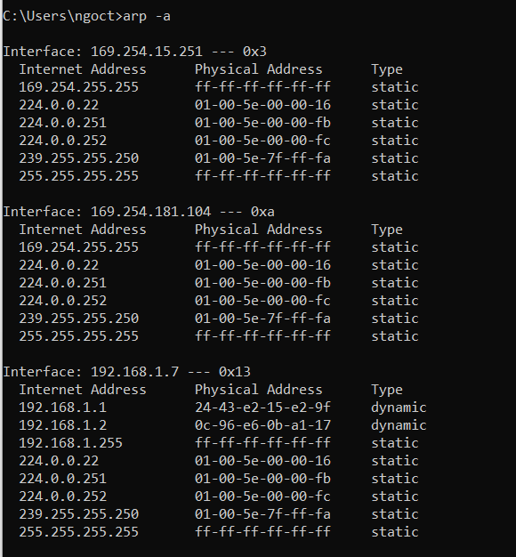

\- Chúng ta có thể dùng câu lệnh : arp -a để show ra bảng ARP cache .

\- Note : Khi truyền packet , PC sẽ kiểm tra bảng ARP cache trước , nếu không có IP address cần tìm thì mới gửi “ARP request” .
# **5. Phân tích gói tin bằng Wireshark**
Thực hiện câu lệnh để reset bảng tin cache  để phục vụ phân tích gói tin khi device thực hiện việc trao đổi địa chỉ MAC.

Lệnh:

|Arp –d \*|
| :- |
` `Hoặc disable card mạng 

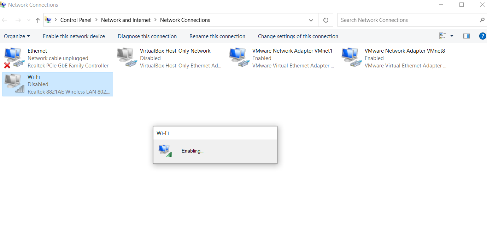

- Thực hiện lọc những gói tin ARP:
- 
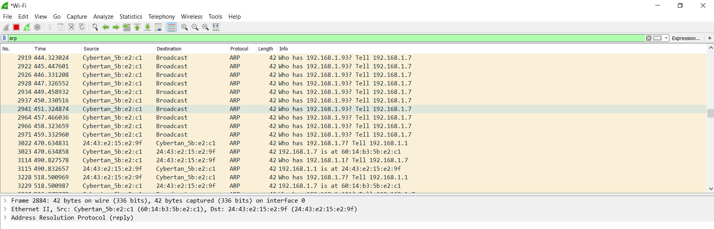

- Gói tin số 6 là gói tin ARP request mà máy gửi (192.168.1.7) hỏi để tìm MAC của Gateway

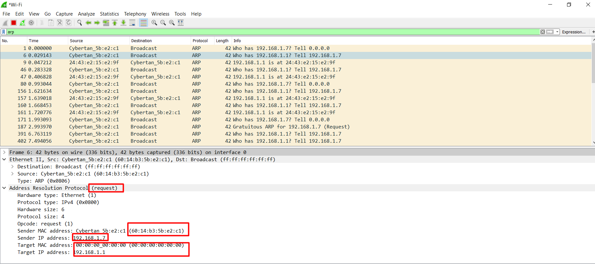

- Gói tin số 9 là gói tin ARP reply mà gateway trả về.
- 
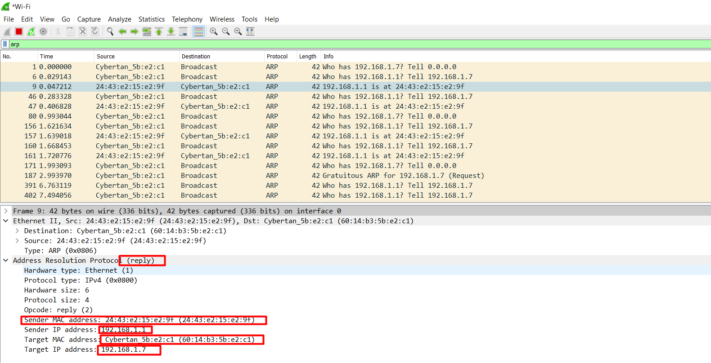

# **6.An toàn trong giao thức ARP**
**6.1 Tấn công bằng Arp spoofing**

Giả sử ta có mạng Lan như mô hình trên gồm các host

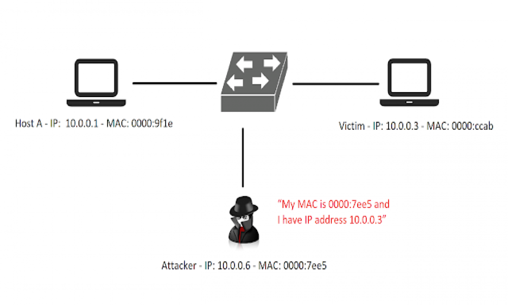

**Attacker**: là máy hacker dùng để tấn công ARP attack
IP: 10.0.0.6
Mac: 0000:0000:0111

**HostA**
IP: 10.0.0.1
MAC: 0000:0000:0109

**Victim**: là máy bị tấn công ARP attack
IP: 10.0.0.3
MAC: 0000:0000:0110

Attacker muốn thực hiện ARP attack đối với máy Victim. Attacker muốn mọi gói tin HostA truyền tới máy Victim đều có thể chụp lại được để xem trộm. Làm thế nào để Attacker có thể hiện được điều đó?

Đầu tiên, HostA muốn gửi dữ liệu cho Victim. HostA cần phải biết địa chỉ MAC của Victim để liên lạc. HostA sẽ gửi broadcast ARP Request tới tất cả các máy trong cùng mạng Lan để hỏi xem IP 10.0.0.10 (IP của Victim) có địa chỉ MAC là bao nhiêu.

HostB, Attacker, Victim đều nhận được gói tin ARP Request, nhưng chỉ có Victim là gửi lại gói tin ARP Reply lại cho HostA. ARP Reply chứa thông tin về IP của Victim, MAC Victim, MAC HostA

Sau khi nhận được gói tin ARP Reply từ Victim, HostA đã biết được địa chỉ MAC của Victim. HostA bắt đầu thực hiện liên lạc, truyền dữ liệu tới Victim. HostB, Attacker không thể xem nội dung dữ liệu được truyền giữa 2 máy HostA và Victim

Attacker muốn xem dữ liệu truyền giữa HostA và Victim. Attacker sử dụng kiểu tấn công ARP Spoof. Attacker thực hiện gửi liên tục ARP Reply chứa thông tin về IP Victim, MAC Attacker, MAC HostA. Ở đây, thay vì là MAC Victim, Attacker đã đổi thành địa chỉ MAC của mình.

HostA nhận được ARP Reply và nghĩ là IP Victim 10.0.0.10 sẽ có địa chỉ MAC là 0000:0000:0111 ( MAC của Attacker). HostA lưu thông tin này vào bảng ARP Cache.

Bây giờ mọi thông tin, dữ liệu HostA gửi tới 10.0.0.10 (Victim), Attacker đều có thể nhận được, Attacker có thể xem toàn bộ nội dung HostA gửi cho Victim

Attacker còn có thể kiểm soát toàn bộ quá trình liên lạc giữa Host A và Victim thông qua ARP Attack

Attacker thường xuyên gửi các gói tin ARP Reply chứa địa chỉ IP của HostA và Victim nhưng có địa chỉ MAC là của Attacker.

HostA nhận được gói tin này thì cứ nghĩ Victim sẽ có địa chỉ MAC là 0000:0000:0111 (MAC của Attacker)

Victim nhận đươc gói tin này thì cứ nghĩ HostA sẽ có địa chỉ MAC là 0000:0000:0111 (MAC của Attacker)

Mọi thông tin trao đổi giữa HostA và Victim, Attacker đều có thể nhận được. Như vậy là Attacker có thể biết được nội dung trao đổi giữa HostA và Victim

Sau khi bị tấn công ARP attack, sẽ rất nguy hiểm cho người dùng vì mọi thông tin trao đổi của họ đều bị lộ, nhất là những thông tin đó là quan trọng, cần phải giữ bí mật

**4. Giới hạn và điểm yếu của kiểu tấn công ARP Spoof:**

- Chỉ có những máy nằm trong cùng đường mạng với máy Attacker mới bị tấn công. Các máy nằm khác mạng sẽ không thể bị tấn công bằng hình thức này vì
- Trong cùng một đường mạng LAN, các máy sẽ thực hiện trao đổi dữ liệu với nhau dựa vào địa chỉ MAC . HostA muốn trao đổi dữ liệu với HostB. HostA sẽ dò tìm trong bảng ARP cache xem IP của HostB sẽ có địa chỉ MAC tương ứng là gì. HostA đóng gói dữ liệu cần truyền với MAC nguồn là MAC HostA, MAC đích là MAC HostB. Sau đó HostA sẽ truyền dữ liệu tới HostB dựa vào MAC đích của gói tin
- Trong trường hợp HostA, HostB khác đường mạng muốn liên lạc với nhau, ta phải dựa vào địa chỉ IP để truyền dữ liệu và phải thông qua một thiết bị định tuyến, đó là router. HostA sẽ đóng gói dữ liệu cần truyền với MAC nguồn là HostA, MAC đích là router. Gói tin đó sẽ được truyền đến router, router sẽ dựa vào địa chỉ IP đích (IP HostB)và dò tìm trong bảng định tuyến nhằm xác định con đường đi đến HostB. Router có khả năng ngăn chặn các gói tin broadcast
- Hình thức tấn công này không thể thực hiện được trong mạng WAN, trên Internet mà chỉ thực hiện được trên cùng mạng LAN

**5. Cách phát hiện và phòng chống:**

**Dùng lệnh**:

- **ipconfig /all** xem MAC của mình
- **arp -a** xem bảng ARP trên máy mình, kiểm tra MAC của B có phải đúng là MAC B hay không.
- **arp -d \*** xóa toàn bộ ARP table trên máy mình, như vậy các địa chỉ MAC bị tấn công cũng mất, và máy tính sẽ bắt đầu học lại. Nhưng nếu máy tấn công vẫn tiếp tục bơm các gói tin ARP đầu độc thì việc xóa ARP table này cũng vô ích
- **arp -s** gắn cố định IP đích vào MAC thật của nó, như vậy kẻ tấn công không đầu độc được IP này nữa. Nhưng việc này không khả thi cho mạng lớn, nhiều máy tính, và có sự thay đổi IP (ví dụ dùng DHCP).

