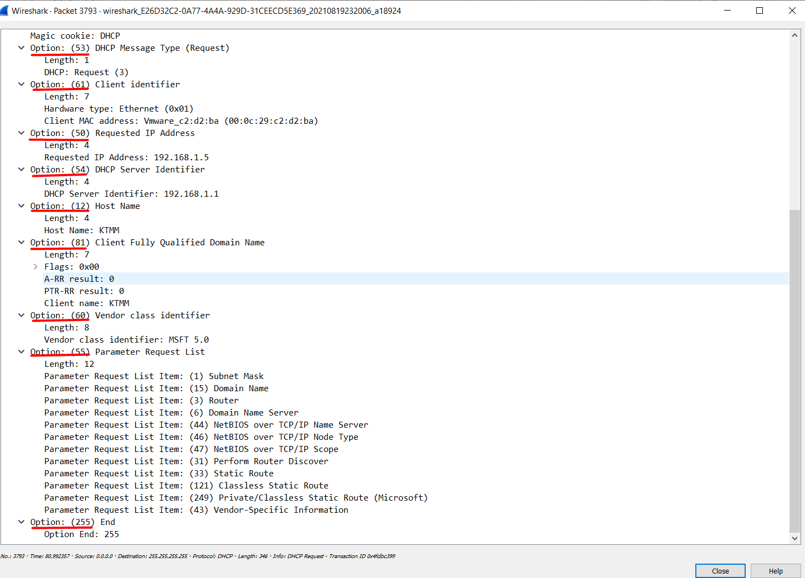

**TÌM HIỂU GIAO THỨC DHCP**

- [1. Giới thiệu DHCP](#1-giới-thiệu-dhcp)
  - [1.1. Khái niệm](#11-khái-niệm)
  - [1.2. Đặc điểm DHCP](#12-đặc-điểm-dhcp)
  - [1.3. Cơ chế phân giải bổ địa chỉ của DHCP server](#13-cơ-chế-phân-giải-bổ-địa-chỉ-của-dhcp-server)
  - [1.4. Vòng đời và thời gian "thuê" địa chỉ IP của client](#14-vòng-đời-và-thời-gian-thuê-địa-chỉ-ip-của-client)
- [2. Các loại bản tin DHCP](#2-các-loại-bản-tin-dhcp)
  - [2.1. Các loại bản tin DHCP](#21-các-loại-bản-tin-dhcp)
  - [2.2. Các tiến trình hoạt động của DHCP](#22-các-tiến-trình-hoạt-động-của-dhcp)
    - [2.2.1. Quá trình cấp phát địa chỉ IP](#221-quá-trình-cấp-phát-địa-chỉ-ip)
    - [2.2.2. Quá trình xin cấp phát lại địa chỉ IP](#222-quá-trình-xin-cấp-phát-lại-địa-chỉ-ip)
    - [2.2.3. Quá trình Renew và Rebind](#223-quá-trình-renew-và-rebind)
- [3. Cấu trúc bản tin DHCP](#3-cấu-trúc-bản-tin-dhcp)
- [4. Dựng hệ thống DHCP](#4-dựng-hệ-thống-dhcp)
- [4.1 Mô hình lab](#41-mô-hình-lab)
- [4.2 Các bước cấu hình DHCP Server](#42-các-bước-cấu-hình-dhcp-server)
  - [1, Lệnh cài đặt dịch vụ DHCP](#1-lệnh-cài-đặt-dịch-vụ-dhcp)
  - [2, Cấu hình dịch vụ dhcp](#2-cấu-hình-dịch-vụ-dhcp)
  - [3. Khởi động dịch vụ dhcp và kích hoạt tự khởi động:](#3-khởi-động-dịch-vụ-dhcp-và-kích-hoạt-tự-khởi-động)
  - [4. Cấu hình Firewall cho dịch vụ dhcp:](#4-cấu-hình-firewall-cho-dịch-vụ-dhcp)
  - [5. Kiểm tra trạng thái dịch vụ:](#5-kiểm-tra-trạng-thái-dịch-vụ)
  - [6. Bật dịch vụ DHCP](#6-bật-dịch-vụ-dhcp)
- [4.3 Cấu hình DHCP Server bằng Dnsmasq](#43-cấu-hình-dhcp-server-bằng-dnsmasq)
- [4.4 Cấu hình DHCP Reservation](#44-cấu-hình-dhcp-reservation)
- [4.5 Cấu hình DHCP relay](#45-cấu-hình-dhcp-relay)
  - [5.2. Phân tích gói tin](#52-phân-tích-gói-tin)

# 1. Giới thiệu DHCP
## 1.1. Khái niệm 
- DHCP là giao thức phân giải địa chỉ động, lịch sử phát triển của nó phát triển ban đầu từ giao thức RARP, phát triển lên BOOTP và cuối cùng được cải tiến lên DHCP do nhu cầu cải tiến kỹ thuật mạng.
- **RARP** là một giao thức mạng sơ khai được dùng bởi các máy client để yêu cầu có một địa chỉ Ipv4 để sử dụng cho mục đích liên lạc với các máy khác trong trạm. 
- **BOOTP**:
  - BOOTP được tạo ra để giải quyết các hạn chế của RARP là không đủ sức cấu hình thông tin TCP/IP.
  - Nó vẫn còn dựa vào quan hệ client/server, nhưng nó được triển khai ở tầng cao hơn, dùng UDP cho việc vận chuyển.
  - Sử dụng IP/UDP (port 67 cho địa chỉ đích của server, và port 68 cho địa máy client) và do đó, có thể di chuyển qua router. Đây là một lợi thế vì có thể dùng giao thức phân giải địa chỉ qua môi trường liên mạng LAN.
  - Nó vẫn còn một số hạn chế là không cấp được địa chỉ IP động ***=>*** Cải tiến BOOTP thành DHCP.
- **DHCP (Dynamic Host Configuration Protocol)** được tạo nên từ phần mở rộng của giao thức Boot Protocol (BOOTP). Từ cái tên DHCP đã mô tả một khả năng quan trọng mới được thêm vào BOOTP: khả năng gán địa chỉ IP một cách ***dynamically***. Chuyển từ cấp phát địa chỉ IP tĩnh sang cấp phát địa chỉ IP động là cách mà DHCP làm.
  - DHCP là giao thức cấu hình host động được thiết kế làm giảm thời gian cấu hình cho mạng TCP/IP bằng cách tự động gán các địa chỉ IP cho client khi họ vào mạng.
  - DHCP ngày nay là giao thức cấu hình host được sử dụng ở hầu khắp mọi nơi trong mô hình mạng gia đình tới mạng doanh nghiệp.
## 1.2. Đặc điểm DHCP
Do là giao thức được tạo nên từ phần mở rộng trong phần tùy chọn của BOOTP, nên DHCP gần giống với BOOTP.

- Cũng làm việc theo mô hình Client/Server.
- Sử dụng cổng đặc biệt cho DHCP server là cổng 67. Các DHCP server lắng nghe trên cổng 67 cho các bản tin broadcast request được gửi bởi client. Sau khi xử lý bản tin request, server gửi một bản tin reply lại cho client.
- Các DHCP client lắng nghe bản tin reply lại từ DHCP server trên cổng 68.
- **Chức năng**:
  - Mỗi thiết bị trên mạng cơ sở TCP/IP phải có một địa chỉ IP duy nhất để truy cập mạng các các tài nguyên của nó. Không có DHCP, cấu hình IP phải được thực hiện một các thủ công cho các máy tính mớ, các máy tính di chuyển từ mạng con này sang mạng con khác, và các máy tính đợc lại bỏ khỏi mạng.
  - Bằng việc phát triển DHCP trên mạng, toàn bộ tiến trình này được quản lý tự động và tập trung. DHCP server bảo quản vùng của các địa chỉ IP và giải phóng một địa chri với bất cứ DHCP client có theer khi nó có thể ghi lên mạng. bởi vì các địa chri IP là động hơn tĩnh, các địa chri không còn được trả lại một cách tự động trong sử dụng đối với các vùng cấp phát lại.
- **Ưu điểm**:
  - Tập trung quản trị thông tin cấu hình IP.
  - Cấu hình động các máy
  - Cấu hình IP cho các máy một cách liền mạch.
  - Sự linh hoạt
  - Khả năng mở rộng.
  - Đơn giản hóa vai trò quản trị của việc cấu hình địa chỉ IP của client.
## 1.3. Cơ chế phân giải bổ địa chỉ của DHCP server
2 chức năng chính của DHCP là cung cấp một cơ chế gán địa chỉ cho các máy host và phương thức mà client có thể yêu cầu một địa chỉ IP và các thông tin cấu hình cho nó từ server.

DHCP gồm 3 cơ chế phân bổ địa chỉ khác nhau:

- **Manual Allocation:** Một địa chỉ IP cụ thể được cấp phát trước cho một thiết bị duy nhất bởi người quản trị. DHCP chỉ truyền IP tới các thiết bị đó (hiểu như là server, router, gateway, ... ). Nó cũng thích hợp cho các thiết bị khác mà vì lý do gì phải có một địa chỉ IP cố định ổn định.
- **Automatic Allocation:** DHCP tự động gán một địa chỉ IP vĩnh viễn với một thiết bị, chọn từ một pool IP có sẵn. Sử dụng trong trường hợp có đủ địa chỉ IP cho mỗi thiết bị có thể kết nối vào mạng, nhưng mà thiết bị không thực sự cần quan tâm đến địa chỉ mà nó sử dụng. Khi một địa chỉ được gán cho một client, thiết bị sẽ tiếp tục sử dụng nó. Automatic Allocation được coi là một trường hợp đặc biệt của Dynamic Allocation – dùng trong trường hợp các giới hạn thời gian sử dụng các địa chỉ IP của một client gần như là “mãi mãi”.
- **Dynamic Allocation:** DHCP gán một địa chỉ IP từ một pool các địa chỉ trong một khoảng thời gian hạn chế được lựa chọn bởi server, hoặc cho đến khi client nói với DHCP server là nó không cần địa chỉ này nữa.
  - Server sẽ quyết định số lượng thừi gian mà hợp đồng cho thuê IP sẽ kéo dài. Khi hết thời gian, client hoặc phải xin phép tiếp tục sử dụng các địa chỉ (đổi mới thuê) hoặc phải có được một cấu hình mới.
  - Phương pháp này cung cấp nhiều lợi ích như:
    - *Automation*: mỗi client có thể được tự động gán IP khi nó cần mà không cần tới sự can thiệp của người quản trị viên để quyết định địa chỉ cho client đó.
    - *Quản lý tập trung*: tất cả các IP được quản lý bởi DHCP server. Người quản trị có thể dễ dàng tìm thấy những thiết bị đang sử dụng mà giải quyết và thực hiện nhiệm vụ bảo trì mạng.
    - *Tái sử dụng và chia sẻ địa chỉ IP*: bằng cách giới hạn thời gian mà mỗi client được phép thuê IP, DHCP server có thể đảm bảo rằng các pool IP chỉ được sử dụng bởi các thiết bị đang hoạt động. Sau một khoảng thời gian, IP nào không được sử dụng nữa sẽ được trở về lại pool để cho phép các client khác sử dụng chúng. Điều này cho phép một liên mạng để hỗ trợ một số lượng thiết bị lớn hơn số địa chỉ IP sẵn có, miễn là tất cả các thiết bị kết nối mạng cùng lúc.
    - *Khả năng di chuyển giữa các mạng*: với việc dynamic allocation, không có sự phân bổ địa chỉ IP nào được xác định trước, do đó bất kỳ client nào đều có thể yêu cầu một IP. Điều này làm cho nó trở thành một lựa chọn lý tưởng cho việc hỗ trợ các thiết bị di động và di chuyển giữa các mạng.
    - *Tránh các vấn đề xung đột*: Vì địa chỉ IP đều được xác định từ một pool và quản lý bởi máy chủ DHCP nên việc xung đột IP là có thể tránh được.
    - Đây là cơ chế được sử dụng nhiều nhất trong các mô hình mạng hiện nay.
## 1.4. Vòng đời và thời gian "thuê" địa chỉ IP của client
Khi một client được thiết lập để sử dụng DHCP, nó sẽ không bao giờ có quyền hạn sở hữu IP đó lâu dài. Mỗi lần có quyền hạn sử dụng, nó phải thỏa thuận liên kết với một DHCP server để bắt đầu hoặc xác nhận thuê một IP. Nó cũng phải thực hiện các hoạt động khác theo thời gian để quản lý việc thuê địa chỉ này và có thể chấm dứt nó.

Vòng đời thuê IP của DHCP gồm các bước sau:

- **Allocation:** Một client bắt đầu khi chưa từng thuê IP và do đó chưa có địa chỉ được cấp từ DHCP server. Nó yêu cầu thuê thông qua một quá trình phân bổ Allocation.
- **Reallocation**: Nếu client đã có sẵn địa chỉ IP lần thuê hiện tại, và sau đó khi nó khởi động lại sau khi tắt, nó sẽ liên lạc với DHCP server để xác nhận việc thuê và dùng lại các thông số vận hành. Điều này được gọi là Reallocation, nó tương tự như Allocation nhưng ngắn hơn.
- **Normal Operation:** Khi một hợp đồng cho thuê đang hoạt động, client được gán vào một địa chỉ mà DHCP server cấp phát, cho thuê.
- **Renewal**: Sau một phần thời gian nhất định của thời gian cho thuê, client sẽ cố gắng liên lạc với máy chủ cho thuê ban đầu, gia hạn thêm hợp đồng để nó có thể tiếp tục sử dụng IP đó sau khi thời gian cho thuê kết thúc (thường sau nửa thời gian được phép sử dụng IP, client sẽ liên lạc với DHCP server để gia hạn thêm hợp đồng)
- **Rebind:** Nếu việc renewal không thành (giả sử máy server bị tắt), sau đó client sẽ cố gắng kết nối lại với bất kì máy chủ DHCP nào đang hoạt động, cố gắng mở rộng thời gian cho thuê hiện tại.
- **Release:** client có thể quyết định ở bất kì thời điểm nào đó nó không còn muốn sử dụng địa chỉ IP được cấp từ DHCP nữa, và có thể chấm dứt hợp đồng cho thuê, giải phóng địa chỉ IP.
# 2. Các loại bản tin DHCP
## 2.1. Các loại bản tin DHCP
- **DHCP DISCOVER**: Ban đầu, một máy tính DHCP Client muốn gia nhập mạng, nó yêu cầu thông tin địa chỉ IP từ DHCP Server bằng cách gửi broadcast một gói DHCP Discover. Địa chỉ IP nguồn trong gói là 0.0.0.0 bởi vì client chưa có địa chỉ IP.
- **DHCP OFFER**: Mỗi DHCP server nhận được gói DHCP Discover từ client đáp ứng với gói DHCP Offer chứa địa chỉ IP cho thuê và thông tin định cấu hình TCP/IP bổ sung(thêm vào), chẳng hạn như subnet mask và gateway mặc định. Nhiều hơn một DHCP server có thể đáp ứng với gói DHCP Offer. Client sẽ chấp nhận gói DHCP Offer đầu tiên nó nhận được.
- **DHCP REQUEST:** Khi DHCP client nhận được một gói DHCP Offer, nó đáp ứng lại bằng việc broadcast gói DHCP Request mà chứa yêu cầu địa chỉ IP mà server cung cấp trong bản tin offer - thể hiện sự chấp nhận của địa chỉ IP được yêu cầu từ một server xác định.
- **DHCP ACK:** DHCP server được chọn lựa chấp nhận DHCP Request từ Client cho địa chỉ IP bởi việc gửi một gói DHCP Acknowledge (ACK). Tại thời điểm này, Server cũng định hướng bất cứ các tham số định cấu hình tuỳ chọn. Sự chấp nhận trên của DHCP Acknowledge, Client có thể tham gia trên mạng TCP/IP và hoàn thành hệ thống khởi động. (Bản tin này gần như giống nội dung bản tin OFFER)
- **DHCP NAK:** Nếu địa chỉ IP không thể được sữ dụng bởi client bởi vì nó không còn giá trị nữa hoặc được sử dụng hiện tại bởi một máy tính khác, DHCP Server đáp ứng với gói DHCP Nak, và Client phải bắt đầu tiến trình thuê bao lại. Bất cứ khi nào DHCP Server nhận được yêu cầu từ một địa chỉ IP mà không có giá trị theo các Scope mà nó được định cấu hình với, nó gửi thông điệp DHCP Nak đối với Client.
- **DHCP DECLINE:** Khi client nhận được thông tin cấu hình từ DHCP server, nhưng có thể xảy ra vấn đề là IP mà DHCP server cấp đã bị sử dụng bởi một thiết bị khác thì nó gửi gói DHCP Decline đến các Server và Client phải bắt đầu tiến trình thuê bao lại từ đầu.
- **DHCP RELEASE:** Một DHCP Client khi không còn nhu cầu sử dụng IP hiện tại nữa nó sẽ gửi một gói DHCP Release đến server quản lý để giải phóng địa chỉ IP và xóa bất cứ hợp đồng thuê bao nào đang tồn tại.
- **DHCP INFORM:** Các thiết bị không sử dụng DHCP để lấy địa chỉ IP vẫn có thể sử dụng khả năng cấu hình khác của nó. Một client có thể gửi một bản tin DHCP INFORM để yêu cầu bất kì máy chủ có sẵn nào gửi cho nó các thông số để mạng hoạt động. DHCP server đáp ứng với các thông số yêu cầu – được điền trong phần tùy chọn của DHCP trong bản tin DHCP ACK.
## 2.2. Các tiến trình hoạt động của DHCP
3 tiến trình của DHCP là: Lease Allocation Process (Quá trình cấp phát địa chỉ IP), Lease Reallocation Process (Quá trình xin cấp phát lại IP đã xác định trước) và quá trình Renew and Rebind (Quá trình gia hạn thêm thời gian được phép sử dụng IP)
### 2.2.1. Quá trình cấp phát địa chỉ IP
Quá trình xử lý quan trọng nhất trong DHCP là quá trình Lease Allocation, được sử dụng bởi client để yêu cầu một hợp đồng thuê IP. Client gửi broadcast một request tới DHCP server. Mỗi DHCP server sẵn sàng cung cấp cho client một hợp đồng thuê và gửi lại cho nó một bản tin Offer. Client chọn bản hợp đồng mà nó nhận được và gửi lại tới tất cả các server về sự lựa chọn của nó. Server được chọn sẽ gửi lại cho client thông tin và hợp đồng thuê. Các bước được thực hiện như sau:


**Bước 1**: Client tạo bản tin DHCPDISCOVER

Ban đầu, Client chưa có địa chỉ IP và nó có thể biết hoặc không biết vị trí của DHCP server trong mạng. Để tìm DHCP server, nó tạo bản tin DHCP DISCOVER, bao gồm các thông tin như sau:

- Điền địa chỉ MAC để xác nhận nó.
- Sinh ra một số định danh transaction ngẫu nhiên và điền vào trường XID.
- Client có thể yêu cầu một địa chỉ IP xác định sử dụng trường tùy chọn Request IP Address trong phần DHCP option.

**Bước 2**: Client gửi bản tin DHCP DISCOVER

Client gửi broadcast bản tin DHCP DISCOVER trên mạng nội bộ. (Broadcast lớp 2 và lớp 3)

**Bước 3**: Server nhận và xử lý bản tin DHCP DISCOVER

Mỗi DHCP server trên mạng LAN nhận được bản tin DHCP DISCOVER của client và kiểm tra nó. Server tìm kiếm phần địa chỉ MAC của client trong database và chọn cho nó một IP phù hợp đồng thời các thông số liên quan. Nếu client yêu cầu một IP xác định thì server sẽ xử lý yêu cầu nó. Server có thể quyết định việc nó dùng địa chỉ IP chỉ định kia là hợp lệ hay không để gửi reply về.

**Bước 4**: Server tạo bản tin DHCP OFFER

Mỗi server được chọn trả lời lại cho client tạo bản tin DHCP OFFER bao gồm các thông tin sau:

- Địa chỉ IP cấp phát cho client trong trường YIAddr. Nếu trước đó, client đã "thuê" một địa chỉ IP và thời hạn dùng của nó vẫn còn thì sẽ sử dụng địa chỉ cũ đó cho client. Nếu không thì nó sẽ chọn một IP có sẵn bất kì cho client.
- Thời hạn được sử dụng IP.
- Các thông số cấu hình khác mà client yêu cầu.
- Định danh của DHCP server trong phần tùy chọn DHCP Server Identifier option.
- Cùng số XID được sử dụng trong bản tin DHCP DISCOVER.

**Bước 5**: Server dò tìm xem địa chỉ IP mà cấp phát cho client đã được một thiết bị nào khác sử dụng hay chưa.

Trước khi gửi bản tin DHCP OFFER cho client, server nên kiểm tra lại xem địa chỉ IP cấp cho client đã được sử dụng hay chưa bằng cách gửi bản tin ICMP.

Nếu IP đó đã được sử dụng thì nó sẽ chọn lại địa chỉ IP khác cho client.

Nếu IP chưa được sử dụng, server sẽ cấp phát IP cho client.

**Bước 6**: Các Server gửi bản tin DHCPOFFER

Mỗi server gửi bản tin DHCP OFFER của nó. Chúng có thể được gửi unicast hoặc broadcast tùy thuộc vào client (Nếu client cho phép nhận bản tin unicast khi chưa được cấu hình IP thì nó sẽ set bit B trong bản tin DHCP DISCOVER là 0, còn nếu không thì nó sẽ set bit B là 1 để biểu thị nhận bản tin broadcast)

**Bước 7**: Client nhận và xử lý bản tin DHCPOFFER

Client nhận bản tin DHCP OFFER và nó sẽ chọn lựa server nào mà nó nhận được bản tin DHCP OFFER đầu tiên. Nếu không nhận được bản tin DHCP OFFER nào sau một thời gian, client sẽ tạo lại bản tin DHCP DISCOVER và gửi lại từ đầu.

**Bước 8**: Client tạo bản tin DHCP REQUEST

Client tạo bản tin DHCP REQUEST cho server mà nó chọn nhận bản tin OFFER. Bản tin này sẽ gồm 2 mục đích chính là nói với server mà cho phép cấp phát IP cho nó là nó đồng ý dùng IP đó trong trường hợp IP đó vẫn còn dành cho nó và cũng thông báo với các DHCP server còn lại là bản tin OFFER của chúng không được nhận.

Trong bản tin này bao gồm các thông tin:

- Định danh của server được chọn trong phần SEerver Identifier option.
- Địa chỉ IP mà DHCP server cho phép client trong bản tin DHCP OFFER, client để vào phần Request IP Address DHCP option.
- Và một số thông tin cấu hình mà nó muốn trong phần Parameter Request List option.

**Bước 9:** Client gửi bản tin DHCP REQUEST

Client gửi broadcast bản tin DHCP REQUEST. Sau đó chờ reply từ server.

**Bước 10**: Các server nhận và xử lý bản tin DHCP REQUEST

Mỗi server nhận được bản tin REQUEST của client. Các server không được chọn sẽ bỏ qua bản tin này.

**Bước 11:** Server gửi bản tin DHCPACK hoặc DHCPNAK.

Server được chọn sẽ kiểm tra xem địa chỉ IP nó OFFER cho còn sử dụng được hay không. Nếu không còn, nó sẽ gửi lại DHCPNAK (negative acknowledgment). Thông thường, server sẽ vẫn dành địa chỉ IP đó cho client, server sẽ gửi lại bản tin DHCPACK để xác nhận và cấp các thông số mà client yêu cầu.

**Bước 12**: Client nhận bản tin DHCPACK hoặc DHCPACK

Client sẽ nhận lại bản tin DHCPACK hoặc DHCPNAK từ server.

- Nếu là DHCPNAK, client sẽ bắt đầu gửi lại DISCOVER từ bước 1.
- Nếu là DHCPACK, client đọc địa chỉ IP trong trường YIAddr, ghi lại các thông số khác trong phần DHCP option.

Nếu không nhận được bản tin nào, client sẽ gửi lại DHCP REQUEST một hoặc vài lần nữa. Sau một khoảng thời gian vẫn không nhận được gì, nó sẽ bắt đầu lại từ Bước 1.

**Bước 13**: Client kiểm tra xem IP được sử dụng hay chưa.

Client sẽ kiểm tra lần cuối trước khi xác định chắc chắn IP chưa được thiết bị khác sử dụng trước khi sử dụng nó. Bước này sẽ được thực hiện bởi giao thức ARP trên mạng LAN.

- Nếu có bất kì thiết bị nào phản hồi lại ARP, client sẽ gửi bản tin DHCP DECLINE lại server để thông báo với server rằng IP đó đã được máy khác sử dụng. Và client trở lại Bước 1.
- Nếu không có phản hồi, client sẽ sử dụng IP. Kết thúc quá trình Lease Allocation.
### 2.2.2. Quá trình xin cấp phát lại địa chỉ IP
Có 2 trường hợp mà client thực hiện quá trình Reallocation :

- Power on with Existing Lease.
- Reboot

Nếu client khởi động lại và nó đã có sẵn một hợp đồng thuê, nó không cần phải thực hiện lại quá trình full lease allocation, thay vào đó, nó có thể sử dụng quá trình ngắn hơn là Reallocation. Client broadcast một request để tìm server hiện tại đang quản lý thông tin về hợp đồng mà nó đang thuê. Server đó gửi lại để xác nhận xem hợp đồng của client còn hiệu lực hay không.

### 2.2.3. Quá trình Renew và Rebind
Do thời hạn của mỗi client khi thuê IP thường đều là có hạn (trừ trường hợp Automatication Allocation) nên cần có quá trình gia hạn (renewal) lại với DHCP server quản lý và nếu quá trình renewal không thành công thì sẽ rebind lại (gửi request) tới bất kì DHCP server khác đang hoạt động để gia hạn hợp đồng.
# 3. Cấu trúc bản tin DHCP
- Một client tạo ra một bản tin sử dựa trên chuẩn định dạng của DHCP, cũng gần giống nhau BOOTP. Khi server reply lại client thì nó không hoàn toàn tạo ra bản tin mới mà chỉ đơn giản là copy lại bản tin request và thay đổi một số field và gửi lại cho client. Một mã đặc biệt là transaction identifier (XID) được thay thế được đặt trong request và duy trì trong reply, cái mà cho phép client biết reply đi với một request xác định.


# 4. Dựng hệ thống DHCP 
# 4.1 Mô hình lab 

# 4.2 Các bước cấu hình DHCP Server
## 1, Lệnh cài đặt dịch vụ DHCP

```
yum install dhcp -y
```


## 2, Cấu hình dịch vụ dhcp
–Cấu trúc các file/thư mục của dịch vụ DHCP Server mà bạn cần biết:

- **/etc/dhcp/dhcpd.conf** : file cấu hình dịch vụ DHCP.
- **/var/lib/dhcpd/dhcpd.leases** : file chứa thông tin các IP động đang cấp qua DHCP.
- **/var/log/message** : log mặc định chứa quá trình DHCP 4 bước.

Lệnh:
Back Up file cấu hình: 
```
cp /usr/share/doc/dhcp-4.2.5/dhcpd.conf.example /etc/dhcp/dhcpd.conf
cp: overwrite ‘/etc/dhcp/dhcpd.conf’? y
```


File cấu hình DHCP gồm 2 phần:

- Cấu hình toàn cục (Global): Quy định những thông tin giá trị mặc định cho các lớp khai báo mạng (subnet) cấp phát  IP động DHCP
- Cấu hình lớp mạng cấp phát IP động (scope) : Quy định những giá trị thông tin cho việc cấp phát IP động thông qua DHCP
- 
Cấu hình global

Sửa cấu hình trong global
```
vi /etc/dhcp/dhcpd.conf:
```

```
option domain-name "Tuan.org.";
option domain-name-servers ns1.tuan.org, ns2.tuan.org;default-lease-time 600;
max-lease-time 7200;
```


**File log của DCHP được lưu ở  /var/log/boot.log**

Sửa file ` /var/log/boot.log `

```
vi /var/log/boot.log
```
Cấu Hình SCOPE:


Ý nghĩa

- **range <ip\_1> <ip\_2>** : ***ip\_1*** là điểm bắt đầu và ***ip\_2*** là điểm kết thúc.
- **option domain-name-server** : khai báo Name Server của domain bạn đã cung cấp ở trên.
- **option domain-name** : khai báo tên miền lớp mạng chung.
- **option routers** : cung cấp thông tin địa chỉ IP của router gateway mà client sẽ sử dụng khi nhận IP DHCP.
- **option broadcast-address** : cung cấp thông tin broadcast của lớp mạng mà client sẽ nhận IP sử dụng.
- **option domain-name-servers** : cung cấp thông tin DNS Server cho client.
- **default-lease-time** : thời gian mặc định một **IP DHCP** tồn tại được cấp phát cho người dùng.
- **max-lease-time** : thời gian tối đa một IP DHCP tồn tại được cấp phát cho người dùng.
- 
## 3. Khởi động dịch vụ dhcp và kích hoạt tự khởi động:
Lệnh:

```
systemctl start dhcpd
systemctl enable dhcpd
```

## 4. Cấu hình Firewall cho dịch vụ dhcp:
Lệnh :

```
firewall-cmd --add-service=dhcp --permanent
firewall-cmd --reload
```
## 5. Kiểm tra trạng thái dịch vụ:
Lệnh:
```
 systemctl status dhcpd
```

## 6. Bật dịch vụ DHCP 
DHCP Client trên Centos 7


DHCP Client trên Windows


# 4.3 Cấu hình DHCP Server bằng Dnsmasq
4.3.1 Mô hình lab 


4.3.1 Cài đặt

1, Cài gói Dnsmasq 

Lệnh 

```
 yum install dnsmasq -y
```


2, Khởi động dịch vụ dnsmasq

Lệnh :

```
systemctl start dnsmasq</p><p># systemctl enable dnsmasq
```


3, Kiểm tra trạng thái dịch vụ

Lệnh:
```
systemctl status dnsmasq
```


4, Cấu hình firewalld cho phép chạy dịch vụ DHCP


Lệnh: 

```
 firewall-cmd --add-service=dhcp --permanent
  firewall-cmd --reload
```

5, Cấu hình DHCP Server

Chỉnh sửa file config:

Lệnh
```
vi /etc/dnsmasq.conf
```
- Chỉnh sửa địa chỉ IP phạm vi cấp địa chỉ cho thuê và thời gian thuê


- Chỉnh sửa địa chỉ  default gateway


- Tùy chọn xác định DHCP server sẽ giữ cơ sở dữ liệu cho thuê của nó, điều này sẽ giúp bạn dễ dàng kiểm tra địa chỉ IP mà nó đã gán.


- File log ghi lại các giao dịch DHCP


- Để làm cho DHCP server ở chế độ có thẩm quyền, hãy bỏ dấu # trước tùy chọn sau:


6, Lưu tệp và khởi động lại dịch vụ dnsmasq để áp dụng các thay đổi gần đây.

```
 systemctl restart dnsmasq
```

# 4.4 Cấu hình DHCP Reservation
Địa chỉ đặt trước dành riêng cho máy tính hoặc thiết bị chạy các dịch vụ 

4.4.1. Kiểm tra địa chỉ MAC Client


2. Cấu hình DHCP Reservation

Sửa file cấu hình dhcp trên DHCP server:

Lệnh:

```
vi /etc/dhcp/dhcpd.conf
```

Cấu hình host:

```
host Client1
hardware ethernet 00:0c:29:29:5b:c6;
fixed-address 192.168.100.133;
```

Cấu hình trong phần subnet của file cấu hình:


3. Khởi động lại dịch vụ DHCP

Trên Server, khởi động lại dịch vụ DHCP:


Trên Client, Khởi động lại dịch vụ network:


# 4.5 Cấu hình DHCP relay
DHCP relay agent là một cấu hình được đặt cho máy tính hoặc một Router tiếp nhận các thông tin yêu cầu cấp phát IP của clients và chuyển các thông tin này đến DHCP server

Khi giữa client và DHCP server có nhiều mạng khác tương ứng với nhiều router khác thì cần phải cấu hình DHCP relay agent vì clients sử dụng địa chỉ broadcast để quảng bá yêu cầu cấp phát IP, khi gói tin gửi bằng broadcast đến Router thì sẽ bị loại bỏ, do vậy phải có cách để cho các router trung gian chấp nhận những gói tin broadcast này và gửi đến DHCP server, cách này chính là DHCP relay agent


## 5.2. Phân tích gói tin
- **DHCP DISCOVER:**

Thời gian đầu tiên một máy tính DHCP Client nỗ lực để gia nhập mạng, nó yêu cầu thông tin địa chỉ IP từ DHCP Server bởi việc broadcast một gói DHCP Discover. Địa chỉ IP nguồn trong gói là 0.0.0.0 bởi vì client chưa có địa chỉ IP.


Thông tin phần giao thức DHCP:


- **DHCP OFFER**:

Mỗi DHCP server nhận được gói DHCP Discover từ client đáp ứng với gói DHCP Offer chứa địa chỉ IP không thuê bao và thông tin định cấu hình TCP/IP bổ sung(thêm vào), chẳng hạn như subnet mask và gateway mặc định. Nhiều hơn một DHCP server có thể đáp ứng với gói DHCP Offer. Client sẽ chấp nhận gói DHCP Offer đầu tiên nó nhận được. 


- **DHCP REQUEST**:

Khi DHCP client nhận được một gói DHCP Offer, nó đáp ứng lại bằng việc broadcast gói DHCP Request mà chứa yêu cầu địa chỉ IP, và thể hiện sự chấp nhận của địa chỉ IP được yêu cầu

` `Client gửi request yêu cầu được cấp IP 192.168.1.5 lại cho server và yêu cầu cung cấp thêm một số thông tin trong phần Options:





- **DHCP ACK**: Server gửi ACK về cho client chấp nhận việc client đã được sử dụng IP 192.168.1.5 và các thông số mà client yêu cầu:


