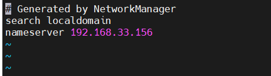
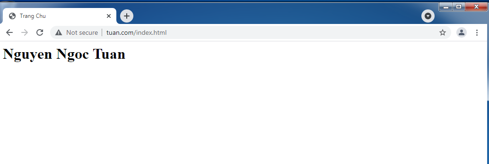

`      	`**Tìm hiểu DNS và Cấu hình lab**

- [**1.Các khái niệm về DNS?**](#1các-khái-niệm-về-dns)
  - [1.1 DNS là gì?](#11-dns-là-gì)
  - [1.2 Tại sao lại cần DNS Server? Tại sao không tập trung DNS?](#12-tại-sao-lại-cần-dns-server-tại-sao-không-tập-trung-dns)
  - [1.3 Vai trò, chức năng của DNS](#13-vai-trò-chức-năng-của-dns)
  - [1.4 Quá trình phân giải tên miền](#14-quá-trình-phân-giải-tên-miền)
  - [1.4.1 Hoạt động theo truy vấn  lặp lại](#141-hoạt-động-theo-truy-vấn--lặp-lại)
  - [1.4.2 Hoạt động theo truy vấn đệ quy ?](#142-hoạt-động-theo-truy-vấn-đệ-quy-)
  - [DNS Caching](#dns-caching)
  - [1.5 Thế nào là DNS Record, một số loại record phổ biến?](#15-thế-nào-là-dns-record-một-số-loại-record-phổ-biến)
  - [1.6 DNS Messages](#16-dns-messages)
  - [1.7 cấu trúc gói tin DNS](#17-cấu-trúc-gói-tin-dns)
- [**2 Cấu hình bài lab DNS**](#2-cấu-hình-bài-lab-dns)
  - [2.1 Cấu hình bài lab DNS](#21-cấu-hình-bài-lab-dns)
- [**3. Cấu hình DNS Server**](#3-cấu-hình-dns-server)
  - [3.1. Tạo zone forward](#31-tạo-zone-forward)
- [**Ý Nghĩa:**](#ý-nghĩa)
  - [3.2. Tạo zone reverse](#32-tạo-zone-reverse)
  - [3.3. Phân quyền truy cập cho nhóm **named**](#33-phân-quyền-truy-cập-cho-nhóm-named)
  - [3.4 Cấu hình file name.conf](#34-cấu-hình-file-nameconf)
- [**4. Cấu hình trên Web Server**](#4-cấu-hình-trên-web-server)
- [5. Kiểm tra trên Client](#5-kiểm-tra-trên-client)
  - [2.2 Cấu hình bài lab DNS Master - Slave](#22-cấu-hình-bài-lab-dns-master---slave)
    - [**2.2.2 Lab DNS Master - Slave**](#222-lab-dns-master---slave)
    - [**2.2.3. Kiểm tra kết quả cấu hình DNS từ client**](#223-kiểm-tra-kết-quả-cấu-hình-dns-từ-client)


# **1.Các khái niệm về DNS?**
## 1.1 DNS là gì?
DNS (Domain Name System – hệ thống phân giải tên miền) là một hệ thống giúp con người và máy tính giao tiếp dễ dàng hơn. Con người sử dụng tên, còn máy tính sử dụng số, DNS chính là một hệ thống giúp biên dịch tên hostname ([tên miền](https://www.hostinger.vn/huong-dan/ten-mien-la-gi-toan-bo-khai-niem-ve-domain-name/)) thành số để máy tính có thể hiểu được.

- Sử dụng cổng 53 để truyền tải thông tin
- Sử dụng giao thức TCP và UDP
  - Sử dụng TCP khi cập nhật thông tin với các server khác
  - Sử dụng UDP khi trả lời truy vấn của client
- Hoạt động theo mô hình Client-Server
- Khi bạn truy cập web mà trên máy tính thiết lập DNS server là 8.8.8.8 chẳng hạn, thì bạn sẽ truy vấn DNS trên DNS server 8.8.8.8. 
- Nếu bạn không thiết lập DNS trên máy tính có nghĩa là bạn đang sử dụng DNS được thiết lập trên Modem và thường mặc định nó sẽ là địa chỉ DNS server của nhà mạng bạn đang sử dụng.
- Mỗi trang web sẽ là địa chỉ ip tĩnh và không bao giờ thay đổi để DNS có thể dễ dàng quản lý 
## 1.2 Tại sao lại cần DNS Server? Tại sao không tập trung DNS?
- Các doanh nghiệp lớn sử dụng domain để dễ dàng quản lý các máy trạm của nhân viên trong doanh nghiệp. DNS server được dựng lên để phân giải những domain đó. Các doanh nghiệp cũng có thể tự mình tạo ra những domain nội bộ dành cho các trang web chỉ hoạt động trong nội bộ của mình trên DNS server nội bộ của riêng họCác DNS server trên thế giới được phân chia thành từng thứ bậc
- Trong đó thứ bậc cao nhất là 13 DNS server Root. 13 DNS server này chứa đầy đủ Domain và IP của các website public trên toàn thế giới.
- Dưới 13 DNS server root là các Local Name Server và các DNS server nhỏ hơn.

Tại sao không tập trung DNS?

- Một điểm lỗi ở máy chủ DNS là toàn bộ internet ngừng hoạt động
- Quá tải công việc 
- Cơ sở dữ liệu ở xa dẫn đến việc truy vấn mất nhiều thời gian
- Khó khăn trong việc bảo trì 
- Dễ dàng cho việc truy vấn lặp đi lặp lại

## 1.3 Vai trò, chức năng của DNS
- Chức năng của DNS về căn bản là một hệ thống giúp cho việc chuyển đổi các tên miền mà con người dễ ghi nhớ (dạng ký tự, ví dụ [www.google.com](http://www.google.com/)) sang địa chỉ IP vật lý (dạng số, ví dụ 123.11.5.19) tương ứng của tên miền đó. 

- Khi mở một trình duyệt Web và nhập tên website, trình duyệt sẽ đến thẳng website mà không cần phải thông qua việc nhập địa chỉ IP của trang web. Quá trình "dịch" tên miền thành địa chỉ IP để cho trình duyệt hiểu và truy cập được vào website là công việc của một DNS server. Các DNS trợ giúp qua lại với nhau để dịch địa chỉ "IP" thành "tên" và ngược lại. Người sử dụng chỉ cần nhớ "tên", không cần phải nhớ địa chỉ IP (địa chỉ IP là những con số rất khó nhớ).

- Đặt thêm 1 bí danh cho 1 tên miền.ví dụ là 1 tên miền chính và 1 tên miền phụ 

## 1.4 Quá trình phân giải tên miền
Tổng cộng có khoảng 4 loại server tham gia vào trong hệ thống phân giải tên miền

- DNS Recursor

Server này chứa thông tin và tìm kiếm tên miền lưu trữ thấp. Nó thường được duy trì bởi các doanh nghiệp, các nhà cung cấp dịch vụ Internet (ISPs) ví dụ như: Viettel,VNPT,FPT.

- Root Nameserver

Máy chủ tên miền ở mức cao nhất (ROOT name server) là máy chủ tên miền chứa các thông tin để tìm kiếm các máy chủ tên miền lưu trữ (authority) cho các tên miền thuộc mức cao nhất (top-level-domain).

- TLD Nameserver

Là nhóm máy chủ DNS thấp hơn một bước so với máy chủ gốc trong hệ thống phân cấp DNS.

Máy chủ TLD (Top-level Domain Servers) cung cấp địa chỉ IP cho các máy chủ DNS có thẩm quyền(Authoritative DNS Servers).

Máy TLDs được chia dựa trên các khu vực địa lý(quốc gia) hoặc các lĩnh vực liên quan.

Dựa trên các quốc gia:

|**Tên miền**|**Mô tả**|
| - | - |
|.vn|Việt Nam|
|.cn|Trung Quốc|
|.us|Mỹ|
|….|….|
Dựa trên các lĩnh vực:

|**Tên miền**|**Mô tả**|
| - | - |
|.com|Các tổ chức, công ty thương mại |
|.org|Các tổ chức phi lợi nhuận|
|.net|Các trung tâm hỗ trợ về mạng|
|.edu|Các tổ chức giáo dục|
|.gov|Các tổ chức thuộc chính phủ |
|.mil|` `Các tổ chức quân sự|
|.int|Các tổ chức được thành lập bởi các hiệp ước quốc tế|


- Authoritative Nameserver

Là nameserver luôn lưu dữ bản ghi DNS cho phép xác định địa chỉ IP của máy tính đó từ tên 


## 1.4.1 Hoạt động theo truy vấn  lặp lại 


- Đầu tiên các trình duyệt như chrome hay cốc cốc sẽ tìm kiếm trên file cache trên máy tính nếu có thì sẽ xuất ra ngay địa chỉ ip đấy và sẽ truy cập vào internet luôn.
- Nếu như máy tính không lưu hoặc không có thì ngay lập tức máy tính sẽ gửi 1 tín hiệu đến recursive server , server này sẽ là server của nhà cung cấp có thể là VNPT,Viettel,…Những server này sẽ kiểm tra trong file cache này có hay không.
- Nếu vẫn không có thì nó lại truy cập đến root Server.DNS root server sẽ không tìm kiếm cho client vì đơn giản là ví dụ root là tổng giám đốc thì sẽ tìm cho trường phòng ví dụ nó là trưởng phòng .vn thì  lập tức yêu cầu ông recursive server sẽ tìm đến TLD server.
- Với server này sẽ bao gồm tất cả tên miền có gì liên quan đến .vn xong rồi server đấy sẽ chuyển sang nhánh nhỏ và sẽ truy cập đến authoritative name là nơi lưu tên miền.
- Sau đó, Recuser sẽ gửi trả cho client.
## 1.4.2 Hoạt động theo truy vấn đệ quy ?

	


## DNS Caching
- Bộ nhớ đệm DNS, một tính năng quan trọng của hệ thống DNS
- Các phản hồi DNS được lưu vào bộ nhớ đệm
- DNS servers sẽ loại bỏ thông tin được lưu trong bộ nhớ cache sau một khoảng thời gian (thường được đặt thành hai ngày).
- Lợi ích :
  - Cải thiện hiệu suất độ trễ
  - Giảm số lượng thông báo DNS (DNS messages)


*Hình ảnh bộ nhớ đệm của host*

## 1.5 Thế nào là DNS Record, một số loại record phổ biến?
Có hai loại bản ghi được sử dụng trong DNS. Các bản ghi question được sử dụng trong phần question của truy vấn và response message. Các bản ghi tài nguyên được sử dụng trong phần response, có thẩm quyền, và bổ sung thông tin của response message.

1.5.1 Bản ghi loại A

Address Mapping records: Sử dụng để chuyển đổi một domain name thành một địa chỉ IPv4.

1.5.2 Bản ghi loại AAAA

IP Version 6 Address records: Sử dụng để chuyển đổi một domain name thành một địa chỉ IPv6.

1.5.3 Bản ghi loại NS

Name Server records: Lưu thông tin về Name Server. Nó định danh cho một máy chủ có thẩm quyền về một zone nào đó.

1.5.4 Bản ghi loại CNAME

Canonical Name records: Bản ghi CNAME chỉ định một tên miền cần phải được truy vấn để giải quyết truy vấn DNS ban đầu. Vì vậy các bản ghi CNAME được sử dụng để tạo các bí danh tên miền. Bản ghi CNAME thực sự hữu ích khi chúng ta muốn bí danh tên miền của chúng ta tới miền bên ngoài. Trong các trường hợp khác, chúng ta có thể xóa các bản ghi CNAME và thay thế chúng bằng các bản ghi A.

1.4.5 Bản ghi loại HINFO

Host Information records: Hồ sơ HINFO được sử dụng để thu thập thông tin tổng quát về máy chủ. Hồ sơ ghi rõ loại CPU và hệ điều hành. Dữ liệu bản ghi HINFO cung cấp khả năng sử dụng các giao thức cụ thể của hệ điều hành khi hai máy chủ muốn liên lạc. Vì lý do an toàn, hồ sơ HINFO thường không được sử dụng trên các máy chủ công cộng.

1.4.6 Bản ghi loại SOA

Start of Authority records: Hồ sơ ghi rõ thông tin cốt lõi về vùng DNS, bao gồm name server chính, email của quản trị viên tên miền, số sê-ri miền và một số bộ đếm hiện thời liên quan đến refresh lại zone.

1.4.7 Bản ghi loại PTR

Reverse-lookup Pointer records: bản ghi PTR được sử dụng để tra cứu tên miền dựa trên địa chỉ IP.

1.4.8 Bản ghi loại MX

Mail exchanger record: MX chỉ định một máy chủ trao đổi thư cho một tên miền DNS. Thông tin được sử dụng bởi Giao thức truyền thư đơn giản (SMTP) để định tuyến email đến máy chủ thích hợp. Thông thường, có nhiều hơn một máy chủ trao đổi thư cho một miền DNS và mỗi DNS trong số chúng đã đặt ưu tiên.
## 1.6 DNS Messages
Thông điệp truy vấn DNS bao gồm một header và question record; thông báo phản hồi DNS bao gồm một header, question record, answer records, các bản ghi có thẩm quyền và các bản ghi bổ sung.


khi ta filter DNS packet, ta sẽ nhận chung được các gói tin có cấu trúc như sau:


## 1.7 cấu trúc gói tin DNS


Cấu trúc gói tin DNS.

ID: Là một trường 16 bits, chứa mã nhận dạng, nó được tạo ra bởi một chương trình để thay cho truy vấn. Gói tin hồi đáp sẽ dựa vào mã nhận dạng này để hồi đáp lại. Chính vì vậy mà truy vấn và hồi đáp có thể phù hợp với nhau.

QR: Là một trường 1 bit. Bít này sẽ được thiết lập là 0 nếu là gói tin truy vấn, được thiết lập là một nếu là gói tin hồi đáp.

AA: Là trường 1 bit, nếu gói tin hồi đáp được thiết lập là 1, sau đó nó sẽ đi đến một server có thẩm quyền giải quyết truy vấn.

TC: Là trường 1 bit, trường này sẽ cho biết là gói tin có bị cắt khúc ra do kích thước gói tin vượt quá băng thông cho phép hay không.\

RD: Là trường 1 bit, trường này sẽ cho biết là truy vấn muốn server tiếp tục truy vấn một cách đệ quy.

RA: Trường 1 bit này sẽ cho biết truy vấn đệ quy có được thực thi trên server không.

Z: Là trường 1 bit. Đây là một trường dự trữ, và được thiết lập là 0.

Rcode: Là trường 4 bits, gói tin hồi đáp sẽ có thể nhận các giá trị sau:

0: Cho biết là không có lỗi trong quá trình truy vấn.

1: Cho biết định dạng gói tin bị lỗi, server không hiểu được truy vấn.

2: Server bị trục trặc, không thực hiện hồi đáp được.

3: Tên bị lỗi. Chỉ có server có đủ thẩm quyền mới có thể thiết lập giá trị náy.

4: Không thi hành. Server không thể thực hiện chức năng này.

5: Server từ chối thực thi truy vấn.

\- QDcount: Số lần truy vấn của gói tin trong một vấn đề. - ANcount: Số lượng tài nguyên tham gia trong phần trả lời. - NScount: Chỉ ra số lượng tài nguyên được ghi lại trong các phần có thẩm quyền của gói tin. - ARcount: Chỉ ra số lượng tài nguyên ghi lại trong phần thêm vào của gói tin.
# **2 Cấu hình bài lab DNS**
## 2.1 Cấu hình bài lab DNS
\1. Mô hình mạng

!
\2. Cài đặt Bind 9

- Cài đặt Bind:

```#yum -y install bind bind-utils|```


- Bật dịch vụ và cho phép cổng DNS trên firewall

```
systemctl start named 
systemctl enable named
firewall-cmd --add-service=dns --permanent 
firewall-cmd --reload
```


- Kiểm tra phiên bản:


- Tắt Selinux

```
vi /etc/sysconfig/selinux|
```


# **3. Cấu hình DNS Server**
## 3.1. Tạo zone forward

```
vi /var/named/tuan.com.fwd|
```


- Cấu hình file /var/named/tuan.com.fwd


# **Ý Nghĩa:** 
- TTL: là viết tắt của Time-To-Live là khoảng thời gian(hoặc hops) mà gói tin tồn tại trên mạng trước khi bị router loại bỏ.
- IN: là Internet.
- SOA: là viết tắt của Start of Authority.nó xác định name server có thẩm quyền
- NS: là viết tắt của Name Server.
- A: là bản ghi A. Nó trỏ 1 domain/subdomain tới địa chỉ IP.
- Serial: áp dụng cho mọi dữ liệu trong zone và có định dạng YYYYMMDD với YYYY là năm, MM là tháng, DD là ngày, NN là số lần sửa đổi dữ liệu zone trong ngày. Luôn luôn phải tăng số này lên mỗi lần sửa đổi dữ liệu zone. Khi Slave DNS Server liên lạc với Master DNS Server, trước tiên nó sẽ hỏi số serial. Nếu số serial của Slave nhỏ hơn số serial của máy Master tức là dữ liệu zone trên Slave đã cũ và sau đó Slave sẽ sao chép dữ liệu mới từ Master thay cho dữ liệu đang có.
- Refresh: chỉ ra khoảng thời gian Slave DNS Server kiểm tra dữ liệu zone trên Master để cập nhật nếu cần. Giá trị này thay đổi tùy theo tần suất thay đổi dữ liệu trong zone.
- Retry: nếu Slave DNS Server không kết nối được với Master DNS Server theo thời hạn mô tả trong refresh (ví dụ Master DNS Server bị shutdown vào lúc đó thì Slave DNS Server phải tìm cách kết nối lại với Master DNS Server theo một chu kỳ thời gian mô tả trong retry. Thông thường, giá trị này nhỏ hơn giá trị refresh).
- Expire: nếu sau khoảng thời gian này mà Slave DNS Server không kết nối được với Master DNS Server thì dữ liệu zone trên Slave sẽ bị quá hạn. Khi dữ liệu trên Slave bị quá hạn thì máy chủ này sẽ không trả lời mỗi truy vấn về zone này nữa. Giá trị expire này phải lớn hơn giá trị refresh và giá trị retry.
- Minimum TTL: chịu trách nhiệm thiết lập TTL tối thiểu cho 1 zone
- MX: đây là bản ghi Mail exchange. Nó chỉ định server nhận và gửi mail
- CNAME: Là viết tắt của Canonical Name - tên miền chính. Nó sẽ map alias domain(tên miền phụ) tới tên miền khác.
- PTR: là viết tắt của Pointer. Thuộc tính này phân giải địa chỉ IP thành domain.
#
## 3.2. Tạo zone reverse

- Tạo file ``/var/named/tuan.com.rev.zone``

```
vi /var/named/tuan.com.rev.zone
```


- Cấu hình file  ``/var/named/tuan.com.rev.zone``
- 


## 3.3. Phân quyền truy cập cho nhóm **named**

```
#chmod 770 /var/named/tuan.com.fwd
#chmod 770 /var/named/tuan.com.rev.zone
#chgrp named /var/named/tuan.com.fwd
#chgrp named /var/named/tuan.com.rev.zone
```


## 3.4 Cấu hình file name.conf
- File cấu hình mặc định của bind là: /etc/named.conf
- Backup file cấu hình:


```
cp /etc/named.conf /etc/named.conf.bak|
```


- Mở tệp cấu hình:


```vi /etc/named.conf```

trong block options, ta tìm đến allow-query { localhost; }; và sửa lại thành:

`  `allow-query  { localhost; 192.268.33.0/24; };

- Cấu hình


- Thêm zone vào cuối file cấu hình


Trong đó:

- type: Quy định vai trò của server cho một zone(khu vực) cụ thể.Thuộc tính master cho biết đây là 1 server có thẩm quyền.
- file: chứa thông tin về file forward / reverse zone của domain. Có thể để đường dẫn tương đối hoặc tuyệt đối.
- allow-update: Thuộc tính này xác định các host system có được phép chuyển tiếp cập nhật DNS động. Trong trường hợp này không.

như vậy, ta đã thực hiện thêm liên kết tới 2 zone files là : forward.tuan và reverse.tuan

33.168.192.in-addr.arpa là phần viết ngược lại của dải mạng.

- Khởi động lại dịch vụ:

```
systemctl restart named
```


# **4. Cấu hình trên Web Server**
- Mở file:  ``/etc/resolv.conf``


```
vi /etc/resolv.conf
```

- Thêm địa chỉ IP của DNS Server


# 5. Kiểm tra trên Client
- Cấu hình như như hình.Trỏ địa chỉ đến máy chủ DNS server 192.168.33.156


- Kết quả:


## 2.2 Cấu hình bài lab DNS Master - Slave

### **2.2.2 Lab DNS Master - Slave**

- DNS master-slave mục tiêu sử dụng 2 server dùng để backup dữ liệu cũng như cân bằng tải cho máy master.
- Master là máy chủ chính lưu trữ cũng như thiết lập những file cấu hình, tuy nhiên khi số lượng file zone cũng như truy vấn nhiều đến mức nhất định mà master không thể tải nổi nữa thì slave sẽ được lựa chọn dùng để đỡ bớt một phần cho master.
- Slave là máy chủ không cần lưu trữ các file cấu hình, nhưng nó có thể ánh xạ tất cả các file cấu hình từ server master để phân giải.

Mô hình DNS:


2.2.1 Cấu hình chung cho 2 Server DNS

**1. Thực hiện trên Master DNS**

Cấu hình public DNS Service trên bất kỳ Network Interfaces:

Lệnh:

```vi /etc/named.conf```

trong block options, ta tìm đến ``listen-on port 53 { 127.0.0.1; };`` và sửa lại thành:


```listen-on port 53 { any; };```


Cấu hình thiết lập máy chủ nội bộ:

Lệnh 

```
vi /etc/named.conf
```
trong block options, ta tìm đến allow-query { localhost; }; và sửa lại thành:

```allow-query  { localhost; 192.268.33.0/24; };```


trong đó: 192.168.33.0/24 là 

(DNS Cluster):Lệnh: một dải mạng.


Cấu hình thiết lập DNS Slave ``vi /etc/named.conf``


trong block options, ta thêm vào một nội dung sau:

```
allow-transfer{ localhost; 192.168.33.154; };
```


trong đó: 192.168.33.152 là địa chỉ IP của Slave DNS.

Cấu hình liên kết zone files: Việc cấu hình này nhằm mục đích tạo ra liên kết tới một zone để khai báo cho các tên miền cho phép DNS Server phân giải tên miền từ các địa chỉ IP

``vi /etc/named.conf``


sau đó thêm nội dung sau ở bên ngoài block options:


**1.2 Tạo các zone files**

**Tạo zone files forward.tuan**

File lưu trữ thông tin mối quan hệ giữa địa chỉ IP và host name. Khi được truy vấn, nó cung cấp địa chỉ IP của host system bằng host name

Các zone file được lưu trữ mặc định trong /var/named

Trong bước này, ta sẽ thực hiện tạo ra forward và reverse zone files đã khai báo ở bước trên.

```
vi /var/named/forward.tuan
```


Sau đó thêm nội dung như sau:


**tiếp theo, ta sẽ tạo reverse.tuan:**

File trả về tên miền đủ điều kiện(Fully Qualified Domain Name (FQDN)) của máy chủ liên quan tới địa chỉ IP của nó.

```vi /var/named/reverse.tuan```


sau đó thêm nội dung như sau:


**2.Cấu hình trên máy chủ Slave DNS như sau:**

Cấu hình public DNS Service trên bất kỳ Network Interfaces:

```
vi /etc/named.conf
```


trong block options, ta tìm đến listen-on port 53 { 127.0.0.1; }; và sửa lại thành:

```
listen-on port 53 { 127.0.0.1;192.168.33.154 };
```


Cấu hình thiết lập máy chủ nội bộ:

```vi /etc/named.conf```


trong block options, ta tìm đến allow-query { localhost; }; và sửa lại thành:

```allow-query  { localhost; 192.168.33.0/24; };
```


trong đó: 192.168.33.0 /24 là một dải mạng.

Cấu hình liên kết đối với Master DNS:

```
vi /etc/named.conf|
```

sau đó, thêm nội dung sau nằm ngoài block options:


2.2.3 Khởi động DNS Service

Kiểm tra cấu hình đã ok chưa


Cấu hình SELinux, Permissions, Ownership :

Chạy từng dòng lệnh theo thứ tự :


Để khởi động DNS Service, ta thực hiện sử dụng câu lệnh sau:

```
systemctl enable named
systemctl start named
```

Public port DNS:

```
firewall-cmd --add-service=dns --permanent
firewall-cmd --reload
```

### **2.2.3. Kiểm tra kết quả cấu hình DNS từ client**
Truy vấn bản ghi từ client#

Sử dụng DNS server đã setup ở trên để phân giải bằng cách sửa file /etc/resolv.conf 


Sử dụng công cụ dig để truy vấn.

``Dig tuan.com``


Truy vấn bản ghi phân giải ngược PTR

```
Dig –x 192.168.33.154
```


