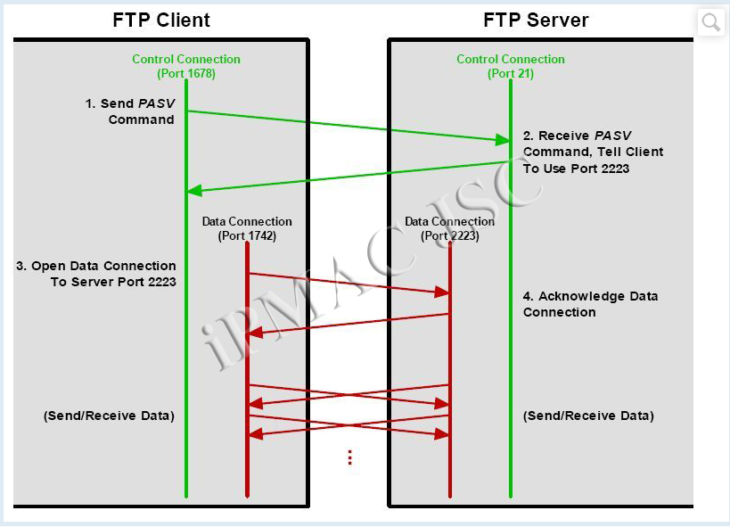

**Giao thức FTP**

- [**1.Khái niệm**](#1khái-niệm)
- [**2.Cơ chế**](#2cơ-chế)
  - [**2.1 Mô hình hoạt động**](#21-mô-hình-hoạt-động)
  - [**2.1 Các tiến trình FTP**](#21-các-tiến-trình-ftp)
  - [**2.3 Kênh điều khiển**](#23-kênh-điều-khiển)
  - [**2.4.Kênh dữ liệu**](#24kênh-dữ-liệu)
  - [**2.5 Phương thức truyền dữ liệu**](#25-phương-thức-truyền-dữ-liệu)
- [**3. Cài đặt và cấu hình**](#3-cài-đặt-và-cấu-hình)
  - [**3.1 Cài đặt trên centos 7**](#31-cài-đặt-trên-centos-7)
  - [**3.2 Cấu hình vsftpd**](#32-cấu-hình-vsftpd)
  - [**3.3, Truy cập vào FTP server**](#33-truy-cập-vào-ftp-server)
  - [**3.4 Truy cập FTP server trên client**](#34-truy-cập-ftp-server-trên-client)
  - [**3. 5 Tạo site kết nối**](#3-5-tạo-site-kết-nối)
  - [**3.6 Sử dụng FileZilla để truyền file**](#36-sử-dụng-filezilla-để-truyền-file)
- [**4.Phân tích gói tin bằng wireshark**](#4phân-tích-gói-tin-bằng-wireshark)

# **1.Khái niệm**
File Transfer Protocol ( FTP ) là một chuẩn giao thức mạng sử dụng để chuyển các tập tin máy tính giữa một máy khách và máy chủ trên một mạng máy tính.

Được sử dụng để trao đổi tập tin qua mạng lưới truyền thông sử dụng TCP/IP (internet, mạng nội bộ, …)

Sử dụng để tải xuống máy tính các file từ máy chủ hoặc ngược lại

Tại sao nên dùng FTP: Mặc dù việc truyền file từ hệ thống này sang hệ thống khác rất đơn giản và dễ hiểu, nhưng đôi khi xảy ra những vấn đề khác nhau. 

Ví dụ, 2 hệ thống có thể có:

- các quy ước tập tin khác nhau
- thể hiện văn bản và dữ liệu khác nhau
- có cấu trúc thư mục khác nhau, … 

Giao thức FTP khắc phục những vấn đề này bằng cách: 

- Thiết lập 2 kết nối giữa các máy chủ. Một kết nối để sử dụng truyền dữ liệu, 1 kết nối còn lại được sử dụng để điều khiển kết nối
- Sử dụng port 21 để thiết lập các kết nối
- Sử dụng port 20 để truyền file dữ liệu

Giao thức FTP đều sử dụng giao thức TCP để giao tiếp
# **2.Cơ chế**
## **2.1 Mô hình hoạt động**


- FTP là một giao thức dạng client/server truyền thống.
- Giống như hầu hết các giao thức TCP/IP, FTP dựa trên mô hình Client – Server. Tuy nhiên, khác với các ứng dụng khác chạy trên nền TCP/IP, FTP cần tới 2 kết nối TCP:
- Control connection : luôn được mở ở mọi thời điểm khi dữ liệu hoặc lệnh được gửi. Control connection (sử dụng port 21 – trên server): Đây là kết nối TCP logic chính được tạo ra khi phiên làm việc được thiết lập. Nó được thực hiện giữa các quá trình điều khiển. Nó được duy trì trong suốt phiên làm việc và chỉ cho các thông tin điều khiển đi qua như lệnh hay response (phản hồi)
- Data connection : chỉ được mở khi có trao đổi dữ liệu thực. Data connection (sử dụng port 20 – trên server): Kết nối này sử dụng các quy tắc rất phức tạp vì các loại dữ liệu có thể khác nhau. Nó được thực hiện giữa các quá trình truyền dữ liệu. Kết nối này mở khi có lệnh chuyển tệp và đóng khi tệp truyền xong.

- Phần mềm FTP được cài đặt trên máy Server được gọi là tiến trình Server-FTP, và phần trên máy client được gọi là tiến trình User-FTP.
## **2.1 Các tiến trình FTP**
Sơ đồ minh họa:


Các tiến trình phía server:

**Server Protocol Interpreter (Server-PI):** chịu trách nhiệm quản lý kênh điều khiển trên server. Nó lắng nghe yêu cầu kết nối hướng tới từ users trên cổng dành riêng. Khi kết nối đã được thiết lập, nó sẽ nhận lệnh từ phía User-PI, trả lời lại, và quản lý tiến trình truyền dữ liệu trên server.

**Server Data Transfer Process (Server-DTP)**: làm nhiệm vụ gửi hoặc nhận file từ bộ phận User-DTP. Server-DTP vừa làm nhiệm thiết lập kết nối kênh dữ liệu và lắng nghe một kết nối kênh dữ liệu từ user. Nó tương tác với server file trên hệ thống cục bộ để đọc và chép file.

Các tiến trình phía client:

**User Protocol Interpreter (User-PI)**: chịu trách nhiệm quản lý kênh điều khiển phía client. Nó khởi tạo phiên kết nối FTP bằng việc phát ra yêu cầu tới phía Server-PI. Khi kết nối đã được thiết lập, nó xử lý các lệnh nhận được trên giao diện người dùng, gửi chúng tới Server-PI, và nhận phản hồi trở lại. Nó cũng quản lý tiến trình User-DTP.

**User Data Transfer Process (User-DTP)**: là bộ phận DTP nằm ở phía người dùng, làm nhiệm vụ gửi hoặc nhận dữ liệu từ Server-DTP. User-DTP có thể thiết lập hoặc lắng nghe yêu cầu kết nối kênh dữ liệu trên server. Nó tương tác với thiết bị lưu trữ file phía client.

**User Interface**: cung cấp giao diện xử lý cho người dùng. Nó cho phép sử dụng các lệnh đơn giản hướng người dùng, và cho phép người điều khiển phiên FTP theo dõi được các thông tin và kết quả xảy ra trong tiến trình.
## **2.3 Kênh điều khiển**
**2.3.1 Thiết lập kênh điều khiển**

- Server-PI sẽ lắng nghe cổng TCP dành riêng cho kết nối FTP là cổng 21.
- User-PI sẽ tạo kết nối bằng việc sử dụng một cổng bất kỳ làm cổng nguồn trong phiên kết nối TCP mở một kết nối TCP từ thiết bị người dùng tới server trên cổng đó.
- Khi TCP đã cài đặt xong, kênh điều khiển sẽ được thiết lập, cho phép các lệnh từ User-PI tới Server-PI, và Server-PI sẽ đáp trả kết quả là các mã thông báo.
- Bước đầu tiên sau khi kênh đã đi vào hoạt động là bước đăng nhập của người dùng (login sequence).

Bước này có hai mục đích:

Điều khiển truy cập: quá trình chứng thực cho phép hạn chế truy cập tới server với những người dùng nhất định. Nó cũng cho phép server điều khiển loại truy cập như thế nào đối với từng người dùng.

Chọn nguồn cung cấp: Bằng việc nhận dạng người dùng tạo kết nối, FTP server có thể đưa ra quyết định sẽ cung cấp những nguồn nào cho người dùng đã được nhận dạng đó.

**2.3.2 Chứng thực trong FTP**

Chứng thực trong FTP khá đơn giản, chỉ là cung cấp username/password.

Trình tự:

Người dùng gửi một username từ User-PI tới Server-PI bằng lệnh USER. Sau đó password của người dùng được gửi đi bằng lệnh PASS.

Server kiểm tra tên người dùng và password trong database người dùng của nó. Nếu người dùng hợp lệ, server sẽ gửi trả một thông báo tới người dùng rằng phiên kết nối đã được mở. Nếu người dùng không hợp lệ, server yêu cầu người dùng thực hiện lại việc chứng thực. Sau một số lần chứng thực sai nhất định, server sẽ ngắt kết nối.
## **2.4.Kênh dữ liệu**
2.4.1 Active FTP (Kết nối kênh dữ liệu dạng chủ động)

Cơ chế:

User-PI thiết lập một kết nối điều khiển từ cổng bất kỳ của nó là 1678 tới cổng điều khiển trên server là cổng 21.

Server-PI sẽ báo cho Server-DTP khởi tạo một kênh kết nối TCP từ cổng 20 tới cổng 1678 của client.

Khi client chấp nhận kênh được khởi tạo, dữ liệu sẽ được truyền đi.

Thực tế, việc sử dụng cùng một cổng cho cả kênh dữ liệu và kênh điều khiển không phải là một ý hay, nó làm cho hoạt động của FTP trở nên phức tạp. Do đó, client nên chỉ định sử dụng một cổng khác bằng việc sử dụng lệnh PORT trước khi truyền dữ liệu.

Ví dụ: Client chỉ định cổng 1742 với lệnh PORT. Server-DTP sau đó sẽ tạo ra một kết nối từ cổng 20 của nó tới cổng 1742 Client thay vì cổng 1678 như mặc định. Quá trình này được mô tả trong hình dưới đây.


2.4.2 Passive FTP (Kết nối kênh dữ liệu dạng bị động)

Client sẽ nhận server là phía bị động, làm nhiệm vụ chấp nhận một yêu cầu kết nối kênh dữ liệu được khởi tạo từ Client.

Server trả lời lại Client với địa chỉ IP cũng như địa chỉ cổng mà nó sẽ sử dụng.

Server-DTP sau đó sẽ lắng nghe một kết nối TCP từ User-DTP trên cổng này.



Client sẽ sử dụng lệnh PASV để yêu cầu Server rằng nó muốn dùng phương thức điều khiển dữ liệu bị động. Server-PI sẽ trả lời lại Client với một giá trị cổng mà Client sẽ sử dụng, từ cổng 2223 trên nó. Sau đó Server PI sẽ hướng cho Server-DTP lắng nghe trên cổng 2223. User-PI cũng sẽ hướng cho User-DTP tạo một phiên kết nối từ cổng 1742 Client tới cổng 2223 Server. Sau khi Server chấp nhận kết nối này, dữ liệu bắt đầu được truyền đi.
## **2.5 Phương thức truyền dữ liệu**
2.5.1 Stream mode

Đây là phương thức được sử dụng nhiều nhất trong triển khai FTP thực tế. Với một số lý do sau:

Là phương thức mặc định và đơn giản nhất, do đó việc triển khai là dễ dàng nhất.

Nó xử lý với các file đều đơn thuần như là xử lý dòng byte, mà không để ý tới nội dung của các file.

Là phương thức hiệu quả nhất vì nó không tốn một lượng byte “overload” để thông báo header.

2.5.2 Block mode

Đây là phương thức truyền dữ liệu mang tính quy chuẩn hơn, với việc dữ liệu được chia thành nhiều khối nhỏ và được đóng gói thành các FTP blocks.

Mỗi block này có một trường header 3 byte báo hiệu độ dài, và chứa thông tin về các khối dữ liệu đang được gửi.

Một thuật toán đặc biệt được sử dụng để kiểm tra các dữ liệu đã được truyền đi và để phát hiện, khởi tạo lại đối với một phiên truyền dữ liệu đã bị ngắt.

2.5.3 Compressed mode

Đây là một phương thức truyền sử dụng một kỹ thuật nén khá đơn giản, là “run-length encoding” – có tác dụng phát hiện và xử lý các đoạn lặp trong dữ liệu được truyền đi để giảm chiều dài của toàn bộ thông điệp.

Thông tin khi đã được nén, sẽ được xử lý như trong block mode, với trường header.

Trong thực tế, việc nén dữ liệu thường được sử dụng ở những chỗ khác, làm cho phương thức truyền kiểu compressed mode trở nên không cần thiết nữa.

Ví dụ: nếu bạn đang truyền đi một file qua internet với modem tương tự, modem của bạn thông thường sẽ thực hiện việc nén ở lớp 1; các file lớn trên FTP server cũng thường được nén sẵn với một số định dạng như ZIP, làm cho việc nén tiếp tục khi truyền dữ liệu trở nên không cần thiết.
# **3. Cài đặt và cấu hình**
Chuẩn bị:

1 máy CentOS 7 làm máy chủ-Server
1 máy Win 7 làm máy trạm-CLient 

Mô hình lab: 


## **3.1 Cài đặt trên centos 7**


Cài đặt trên Centos 7:

install gói vsftpd

```
#yum install vsftpd -y
```


Version: 3.0.2

Backup file cấu hình:

Lệnh: 
```
cp /etc/vsftpd/vsftpd.conf /etc/vsftpd/vsftpd.conf.bak|
```


## **3.2 Cấu hình vsftpd**
Truy cập file cấu hình
```
vi /etc/vsftpd.conf

```
Một số thông số cần chú ý:

Tắt truy cập ẩn danh:
```
anonymous\_anable=NO
```


Cho phép người dùng truy cập và ghi vào thư mục

```
local\_enable=YES<br>write\_enable=YES
```

Tất cả các user sẽ hoạt động trong chroot của họ và sẽ không được quyền truy cập vào các phần khác của server:

```
chroot\_local\_user=YES
```

Các thông số khác:

listen=YES/NO : Chế độ standalone, với các vsftpd đơn lẻ phải để YES, nếu không sẽ không thể khởi động được


anon\_upload\_enable=YES/NO : kết hợp với write\_enable=YES thì anonymous được phép upload tập tin trong thư mục cha có quyền ghi


``anon\_mkdir\_write\_enable=YES/NO`` : kết hợp với ``write\_enable=YES`` thì anonymous được phép tạo thư mục mới trong thư mục cha có quyền ghi


``dirmessage\_enable=YES/NO`` : hiển thị ra 1 thông điệp khi người dùng di chuyển vào thư mục


Cài firewall cho phép cổng FTP

```
firewall-cmd --permanent --add-port=21/tcp
firewall-cmd --permanent --add-service=ftp 
firewall-cmd --reload
```


Restart và bật khởi động  cho vsftpd:

```
systemctl restart vsftpd
 systemctl enable vsftpd
```


## **3.3, Truy cập vào FTP server**
3.3.1 Tạo user local

Tạo tài khoản Local:


3.3.2, Thêm user vào danh sách được truy nhập FTP server tại /etc/vsftpd/user\_list

Lệnh:
```
Vi /etc/vsftpd/user\_list
```
Sửa file cấu hình và thêm User của bạn :


3.3.3 Thêm user vào danh sách được truy cập FTP server tại /etc/vstfpd/Chorôt\_list

Lệnh: 
```
vi /etc/vsftpd/chroot\_list
```


Thêm User vào file cấu hình :


**NOTE:**

Ta restart lại file cấu hình : 

Lệnh :
```
Systemctl restart vsftpd
```

## **3.4 Truy cập FTP server trên client**

Có nhiều cách để có thể truy cập FTP server như :

- lftp trên CentOS-7
- cmd trên Window
- FileZilla trên Window

Ở đây, ta sử dụng FileZilla để truy cập tới FTP server. Ta nhập địa chỉ IP của Server, username, password

Ta dùng win 7 để truy cập 


Ý nghĩa:

- Host: Địa chỉ cả FTP server
- Username: Tài khoản đăng nhập vào FTP server
- Password: Mật khẩu tài khoản
- Port: Cổng kết nối FTP server (mặc định là 21)


Đăng nhập thành công
## **3. 5 Tạo site kết nối**
Để có thể tạo site kết nối nhằm thuận tiện cho sử dụng sau này. Ta thực hiện như sau:

Bước1: File -> Site Manager… để vào phần quản lí Site. (hoặc nhấn tổ hợp phím Ctrl+S)


Bước 2: Chọn New site rồi đặt tên để dễ quản lí. Ở đây ta đặt là “cloud365.com“. Sau đó thiết lập các thông số cơ bản cho kết nối FTP này:


Protocol: Chọn giao thức FTP

Host: Địa chỉ của FTP server (ở đây mình để là 192.168.37.25)

Port: Cổng kết nối tới FTP server (mặc định là 21)

Encryption: Mã hóa, ta sẽ để Only use plain FTP

Logon Type: Kiểu đăng nhập, ta chọn Ask for password

User: Tên đăng nhập, ta có thể nhập hoặc không nhập.

Nhập tài khoản: Khi sử dụng Site thì chỉ cần nhập mật khẩu nhưng muốn đăng nhập một tài khoản khác thì phải tạo 1 site khác. Ở đây, ta sẽ sử dụng cách này với user là “cloud365“

Không nhập tài khoản: Khi sử dụng Site ta có thể đăng nhập các tài khoản khác nhau.

Chọn OK rồi thoát Site Manager.

Bước 3: Khi đã tạo xong, ta vào lại Site Manager. Sau đó chọn chọn Site cloud365.com vừa tạo rồi nhấn Connect.


Sau khi đăng nhập thành công ta sẽ thấy dòng thông báo như hình dưới đây:


## **3.6 Sử dụng FileZilla để truyền file**
3.6.1. Upload file lên FTP server

Để có thể upload file lên FTP server, user phải được cấp quyền trên Server . Ở đây, mình đã cấp quyền upload cho user TuanNguyen2.

Bên phía Remote site(FTP server), ta sẽ chọn thư mục để upload file từ Local lên. Ở đây ta chọn thư mục của user : /var/ftp/home

Ở bên phía Local site, ta chọn file cần upload, chuột phải -> chọn Upload


Khi hoàn tất quá trình upload, ta sẽ thấy file hiển thị trên FTP server. Cùng các thông báo truyền file thành công như hình dưới đây:


3.6.2 Download file từ FTP server

Tương tự như việc upload file. Trên Local site sẽ chọn thư mục nơi tải file từ FTP server về. Bên FTP server sẽ chọn file cần download, chuột phải chọn Download


Khi quá trình download hoàn tất, ta sẽ thấy file trên Local site và thông báo quá trình tải thành công.


# **4.Phân tích gói tin bằng wireshark**
1.Bắt gói tin FTP

Sau khi khởi tạo phiên kết nối . Lệnh tìm kiếm FTP

Chúng ta sẽ nhận được 4 gói tin :
`	`Gói tin 1: baner của server

`	`Gói tin số 2: gói tin request bên phía client dùng giao thức xác thực TLS

`	`Gói tin số 3: Bên phía server repose yêu cầu user và pass


Bên phía client filezilla đưa 1 **cảnh báo người dùng** mật khẩu và tập tin sẽ được truyền dưới dạng rõ.


**2. FTP data**

nhập lệnh:

```
FTP-data
```

**	Bắt được gói tin dưới dạng rõ :

