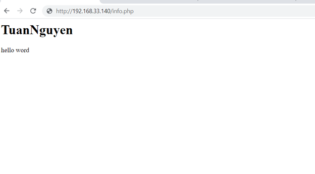
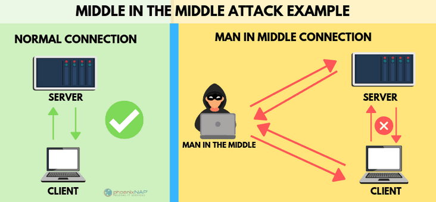

 **Tìm hiểu về giao thức HTTP**

- [**1. HTTP là gì?**](#1-http-là-gì)
- [**2.Nhược điểm giao thức HTTP**](#2nhược-điểm-giao-thức-http)
- [**3. Giao thức HTTP hoạt động như thế nào?**](#3-giao-thức-http-hoạt-động-như-thế-nào)

## **1. HTTP là gì?**
- HTTP là viết tắt của cụm từ HyperText Transfer Protocol – đây là một giao thức truyền tải siêu văn bản được sử dụng trong WWW (World Wide Web).
- HTTP là một giao thức chuẩn về mạng Internet, được phát triển từ những năm 1990. Nó được dùng để liên hệ thông tin giữa MÁY CUNG CẤP DỊCH VỤ (Web SERVER) và MÁY SỬ DỤNG DỊCH VỤ (Web Client). Chính vì vậy, việc truy cập vào một website được tiến hành dựa trên các giao tiếp giữa 2 đối tượng trên.
- Ngoài ra thì HTTP cũng là một giao thức ứng dụng của bộ giao thức TCP/IP (đây là các giao thức nền tảng cho Internet). Và thường thì giao thức HTTP sử dụng cổng 80 (Port 80) là chủ yếu.
- HTTP được sử dụng để truyền tải dữ liệu giữa web server đến các trình duyệt web mà bạn đang sử dụng, chẳng hạn như Microsoft Edge, Google Chrome, Safari, Cốc Cốc hay là FireFox…

Ví dụ như khi bạn truy cập vào địa chỉ web như blogchiasekienthuc.com, giao thức HTTP:// sẽ được tự động thêm vào.

## **2.Nhược điểm giao thức HTTP**
- Giao thức HTTP sẽ truyền dữ liệu đi dưới dạng văn bản thô (không được mã hóa) nên rất dễ bị lấy cắp (sniff) bởi các tin tặc, bằng việc sử dụng các công cụ Free như: Wireshark, TCPDump hay fiddler (nhất là người ở trong cùng mạng LAN/Wi-Fi của bạn).

- Vậy nên bạn hãy bỏ ngay thói quen dùng các mạng Wifi công cộng không đặt pass để truy cập vào các tài khoản nhạy cảm nhé (ví dụ như tài khoản ngân hàng, hay các giao dịch, hoặc đăng nhập facebook… chẳng hạn).Bởi rất có khả năng, đó là một hotspot mà hacker tạo ra để nhử mồi đấy, điều đáng sợ là họ có thể làm được với các smartphone cực kỳ nhỏ gọn, và rất khó bị phát hiện.
- Nếu bạn chỉ xem tin tức trên các trang web thông thường và không nhập bất cứ dữ liệu nhạy cảm (thông tin cá nhân, mật khẩu, thẻ ngân hàng,…) nào thì không vấn đề gì.
- Thế nhưng, nếu bạn nhập các dữ liệu “nhạy cảm” thì sẽ rất dễ bị đánh cắp đấy. Bởi những dữ liệu nhạy cảm này sẽ đi từ máy tính của bạn => đến mạng LAN Ethernet/Wi-Fi/ Router công cộng => để đến máy chủ web.
- Trên đường đi, các tin tặc ở đâu đó trên Internet có thể “sniff” và lấy cắp những thông tin này.
- Như vậy: tên, địa chỉ, số điện thoại, số thẻ ngân hàng… của bạn đã nằm trong tay hacker và họ có thể sử dụng với mục đích xấu: chạy quảng cáo, làm hồ sơ vay tiền, mua đồ trái phép,…
## **3. Giao thức HTTP hoạt động như thế nào?**
**Bước 1**: Khi bạn truy cập vào một trang web sử dụng giao thức HTTP => thì lúc này trình duyệt web sẽ thực hiện các phiên kết nối đến SERVER của trang web đó (thông qua 1 địa chỉ IP, do hệ thống phân giải tên miền DNS cấp).

**Bước 2**: SERVER sau khi nhận lệnh => sẽ trả về các lệnh tương ứng giúp website có thể hiển thị đầy đủ các nội dung (video, hình ảnh…)

- Trong quá trình kết nối và trao đổi thông tin giữa máy tính và máy SERVER, trình duyệt web sẽ mặc định thừa nhận địa chỉ IP đó đến từ SERVER của chính website mà bạn muốn truy cập, mà nó không hề có biện pháp xác thực nào cả.
- Và tất cả các thông tin được gửi đi qua giao thức HTTP (trong đó có địa chỉ IP, hay các thông tin mà bạn nhập vào website…) cũng không hề được mã hóa và bảo mật.
- Vậy nên người dùng rất có thể sẽ bị tấn công sniffing. Hacker có thể dễ dàng “chen ngang” vào kết nối giữa máy tính của bạn và máy chủ (SERVER) để đánh cắp các dữ liệu mà người dùng đã gửi đi (ví dụ như mật khẩu, thông tin của thẻ tín dụng, tài khoản ngân hàng…). Thậm chí, mọi thao tác của người dùng trên website đó đều có thể bị ghi lại mà họ không hề hay biết.

