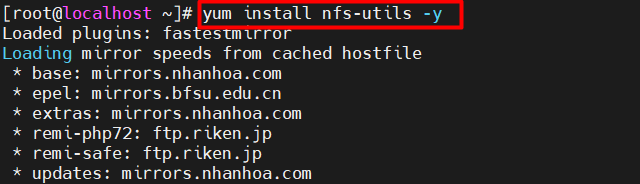

- [1 Tìm hiểu NFS](#1-tìm-hiểu-nfs)
  - [1.1 Khái niệm?](#11-khái-niệm)
  - [1.2 Cách hoạt động NFS](#12-cách-hoạt-động-nfs)
  - [1.3 Các phiên bản](#13-các-phiên-bản)
  - [1.4. Ưu, nhược điểm](#14-ưu-nhược-điểm)
  - [1.5 Các layers NFS](#15-các-layers-nfs)
- [2. Lab NFS](#2-lab-nfs)
  - [2.1 Mô hình](#21-mô-hình)
  - [2.2 Triển Khai](#22-triển-khai)
    - [2.2.1: Cấu hình  NFS Server](#221-cấu-hình--nfs-server)
    - [2.2.2 Cấu hình NFS Client Centos](#222-cấu-hình-nfs-client-centos)
- [Tài liệu tham khảo](#tài-liệu-tham-khảo)
  
## 1 Tìm hiểu NFS
Mô hình 


### 1.1 Khái niệm?
NFS là một trong những phương pháp được sử dụng để chia sẻ dữ liệu trên các mạng cục bộ.

- Được phát triển bởi SunMicrosystems vào năm 1984

- NFS hoạt động ở tầng Application

- Cho phép người dùng xem, tùy chọn lưu trữ và cập nhật trên máy tính từ xa.

- Sử dụng TCP và UDP để truy cập và phân phối dữ liệu tùy thuộc vào phiên bản được sử dụng.

- Nhanh hơn so với Samba và ít tài nguyên hơn so với các hệ thống tệp từ xa với dữ liệu mã hóa - SSHFS, SFTP, v.v.

- Do sử dụng RPC để định tuyến nên NFS sử dụng các port 2049 và 111 trên cả clinet và server.

-NFS là tập hợp các cuộc gọi thủ tục RPC

- RPC là gì?

RPC – viết tắt của Remote Procedure Call, là một mô hình kỹ thuật mạng hay còn được biết đến là cơ chế giao tiếp giữa hai tiến trình.

Thuật ngữ RPC ra đời vào năm 1981 .
- 2 Cách thức thoạt động của RPC


Bên Clinet

- Client Functions là một quá trình người dùng, nơi khởi tạo một lời gọi thủ tục từ xa. Mỗi lời gọi thủ tục ở xa trên phần Client sẽ kích hoạt một thủ tục cục bộ tương ứng nằm trong phần Stub của Client.

- Client Stub cung cấp một bộ các hàm cục bộ mà phần Client có thể gọi. Mỗi một hàm của Client Stub đại diện cho một hàm ở xa được cài đặt và thực thi trên server.

- RPC Runtime quản lý việc truyền thông điệp thông qua mạng giữa máy Client và máy Server. Nó đảm nhận việc truyền lại, báo nhận, chọn đường gói tin và mã hóa thông tin.

 Bên phía server:

- Server Stub mở thông điệp ra xem, xác định hàm ở xa mà Client muốn thực hiện cùng với các tham số của nó. Server Stub gọi một lệnh tương ứng nằm trên phần Server. Khi nhận được yêu cầu của Server Stub, Server cho thực thi lệnh được yêu cầu và gửi kết quả thực thi được cho Server Stub.

- Server Stub đưa kết quả thực vào một gói tin trả lời, chuyển cho phần RPC Runtime cục bộ để nó gửi sang RPC Runtime của Client

### 1.2 Cách hoạt động NFS


Phía client:

- Client truy cập file system bằng các cuộc gọi hệ thống (system call)

- Giao diện hệ thống UNIX được thay thế bằng giao diện cho hệ thống tệp ảo (VFS) (các hệ điều hành hiện đại đều cung cấp VFS)

- Các hoạt động trên giao diện VFS được chuyển đến hệ thống tệp cục bộ (Local file) hoặc được chuyển đến 1 thành phần riêng biệt gọi là NFS Client

- NFS client đảm nhiệm việc xử lý quyền truy cập vào các tệp được lưu trữ tại máy chủ từ xa

- Trong NFS, tất cả giao tiếp giữa máy khách và máy chủ được thực hiện thông qua RPC (cuộc gọi thủ tục)


Phía Server:

- NFS server xử lý các yêu cầu từ client
Từ RPC stub unmarshals request (yêu cầu sơ khai), Server chuyển chúng thành các hoạt động tệp VFS
VFS chịu trách nhiệm triển khai 1 hệ thống tệp cục bộ.

### 1.3 Các phiên bản
- NFSv2: Tháng 3 năm 1989
Có thể sử dụng cả TCP và UDP qua mạng IP ( cổng 2049 )
Ban đầu chỉ hoạt động trên UDP

- NFSv3: Tháng 6 năm 1995
An toàn và mạnh mẽ hơn khi xử lý lỗi so với v2
Sử dụng cả TCP và UDP qua cổng 2049
Vẫn là phiên bản được sử dụng rộng rãi nhất

- NFSv4: Tháng 4 năm 2003
Hoạt động thông qua tường lửa và trên internet
Hỗ trợ ACL ( Danh sách các câu lệnh chỉ ra loại packet nào được chấp nhận, hủy bỏ dựa vào địa chỉ nguồn, đích hoặc số port)
Sử dụng giao thức TCP là bắt buộc
- NFSv4.1: Tháng 1 năm 2010
khả năng cung cấp quyền truy cập song song có thể mở rộng vào các tệp được phân phối giữa nhiều máy chủ
- NFSv4.2: Tháng 11 năm 2016
Sao chép và sao chép phía máy chủ

- Một lợi thế lớn của NFSv4 so với các phiên bản trước đó là chỉ có một cổng IP được sử dụng để chạy dịch vụ, giúp đơn giản hóa việc sử dụng giao thức trên tường lửa.

Statefull Server:
- Duy trì thông tin về quyền truy cập của máy client
- Rút ngắn request messages

### 1.4. Ưu, nhược điểm
Ưu điểm :

- NFS là 1 giải pháp chi phí thấp để chia sẻ tệp mạng.
- Dễ cài đặt vì nó sử dụng cơ sở hạ tầng IP hiện có.
- Cho phép quản lý trung tâm, giảm nhu cầu thêm phần mềm cũ và dụng lượng đĩa trên các hệ thống người dùng cá nhân.

Nhược điểm :

- NFS vốn không an toàn, chỉ nên sử dụng trên 1 mạng đáng tin cậy sau Firewall.
- NFS bị chậm trong khi lưu lượng mạng lớn.
- Client và server tin tưởng lần nhau vô điều kiện.
- Tên máy chủ có thể là giả mạo (tự xưng là máy khác).

### 1.5 Các layers NFS

- RPC leyer: RPC là một dịch vụ lớp phiên chung được sử dụng để triển khai chức năng kết nối mạng máy khách / máy chủ. Nó mở rộng khái niệm về một chương trình gọi một thủ tục cục bộ trên một máy tính chủ cụ thể, thành việc gọi một thủ tục trên một thiết bị từ xa qua mạng.
  
- XDR layer:XDR là một ngôn ngữ mô tả cho phép các kiểu dữ liệu được xác định một cách nhất quán. Về mặt khái niệm, XDR nằm ở lớp trình bày ; các biểu diễn phổ quát của nó cho phép dữ liệu được trao đổi bằng NFS giữa các máy tính có thể sử dụng các phương pháp lưu trữ dữ liệu nội bộ rất khác nhau.
  
- NFS Procedures and Operations: Chức năng thực tế của NFS được thực hiện dưới dạng các thủ tục và hoạt động có chức năng khái niệm ở lớp bảy của mô hình OSI. Các thủ tục này chỉ định các tác vụ cụ thể được thực hiện trên các tệp qua mạng, sử dụng XDR để đại diện cho dữ liệu và RPC để thực hiện các lệnh trên mạng internet.
## 2. Lab NFS

### 2.1 Mô hình


### 2.2 Triển Khai
#### 2.2.1: Cấu hình  NFS Server

 1.Cài đặt

Lệnh:

``` 
yum install nfs-utils -y
```



2.Tạo thư mục chia sẻ

```
mkdir var/CSDL
```


1. Sửa file /etc/exports

Lệnh:
```
vi /etc/exports
```

Thêm vào file cấu hình:

/var/CSDL 192.168.33.156/24(rw,no_root_squash)

 4: Khởi động dịch vụ
```
systemctl start rpcbind nfs-server
systemctl enable rpcbind nfs-server
```


Kiểm tra các port sử dụng bởi NFS:

```
rpcinfo -p
```


Port của dịch vụ Portmapper là 111
Port của dịch vụ NFS là 2049

NOTE: 
- Nếu thay đổi trong `/etc/exports`, các thay đổi đó có thể chưa có hiệu lực ngay lập tức, bạn phải thực thi lệnh `exportfs -ra` để bắt nfs cập nhật lại nội dung file `/etc/exports`

Bước 5: Cấu hình firewall để NFS client được phép truy cập
```
firewall-cmd --permanent --add-service=nfs 
firewall-cmd --permanent --add-service=mountd 
firewall-cmd --permanent --add-service=rpc-bind
firewall-cmd --permanent --add-port=2049/tcp 
firewall-cmd --permanent --add-port=2049/udp
firewall-cmd --reload 
```
Kiểm tra mountpoint trên server:
```
showmount -e 
```


#### 2.2.2 Cấu hình NFS Client Centos
 

2.1 Đối với Client Linux

Bước 1: Cài đặt

CENTOS7

```
 yum install nfs-utils nfs-utils-lib -y 
 ```

Ubuntu

```
 apt -y install nfs-common
 ```

Kiểm tra mountpoint trên server từ client
```
showmount -e 192.168.33.156 
Export list for 192.168.33.156:
/var/CSDL 192.168.33.0/24
```


Bước 2: Mount thư mục được chia sẻ vào thư mục local

NFS có 2 chế độ mount:

Mount cứng là ghi trực tiếp vào file /etc/fstab
Mount mềm là mount bằng lệnh thông thường và bị mất khi máy tính được khởi động lại
Cách 1: Mount mềm

Cú pháp: mount IP_server:/Thư_mục_share Thư_mục_local

```
mount -t nfs 192.168.33.156:/var/CSDL /var/CSDL

```


Cách 2: Mount cứng

```

echo "192.168.33.156:/var/CSDL /var/CSDL nfs rw,sync,hard,intr 0 0" >> /etc/fstab

```


Kiểm tra:
lệnh: 
```
[root@localhost ~]# df -h
```


Như vậy là bạn đã mount thành công


## Tài liệu tham khảo
https://wiki.tino.org/rpc-la-gi/

https://www.slideshare.net/ShingalaKrupa/nfs-32285159

https://synologyvietnam.vn/nfs-la-gi/