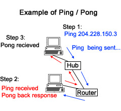
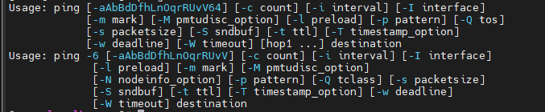
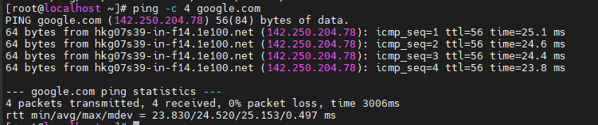
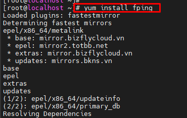
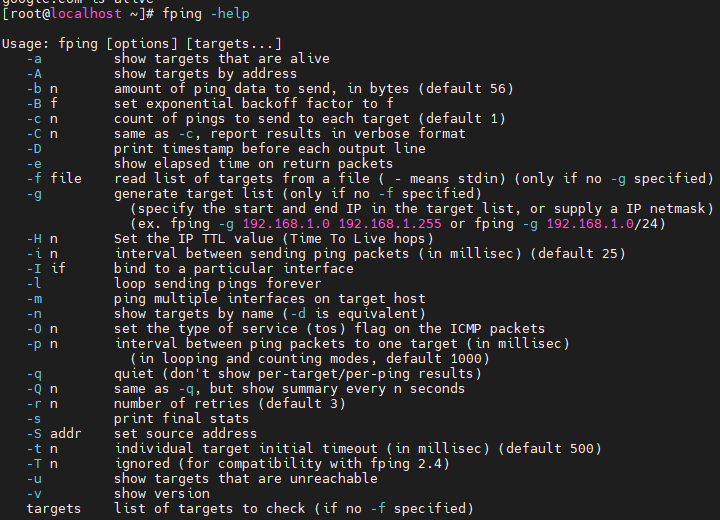

Tìm hiểu các vấn đề liên quan đến giao thức Ping

- [1. Ping là gì?](#1-ping-là-gì)
- [2. Các options của Ping](#2-các-options-của-ping)
- [\2. Fping](#2-fping)
  - [2.1fping](#21fping)
  - [2.2 Các tuỳ chọn](#22-các-tuỳ-chọn)

## 1. Ping là gì?

- Ping là 1 công cụ để kiểm tra xem có thể kết nối tới một máy chủ cụ thể nào đó hay không và ước lượng khoảng thời gian trễ để gửi gói dữ liệu
- Dùng ping kiểm tra sự cố về kết nối mạng

Hoạt động của giao thức Ping

Các bạn có thể hình dung nó đơn giản như sau:

- Bước 1: máy tính hoặc thiết bị A sẽ gửi đi 1 tín hiệu, 1 gói tin - packet đến địa chỉ IP của máy tính, thiết bị B và lắng nghe trả lời
- Bước 2: bên B có nhận được tín hiệu, gói tin - packet từ phía A hay không?
- Bước 3: phản hồi từ B trả về cho A và hiển thị thành kết quả của lệnh PING (như ảnh ví dụ trên).

## 2. Các options của Ping

Cú pháp:

Ping [options] [ip/host] 

[-c] count - Số gói tin gửi đi(xác định số packets hoặc request người dùng muốn thực hiện.)

[-q] - Chỉ hiện kết quả tóm tắt của ping

[-s] - Kích thước gói tin gửi đi(0-65500)

[-i] interval - Khoảng nghỉ giữa các packet

[-f] - cho phép người dùng gửi 100 packets trở lên mỗi giây (Nó là cách để kiểm tra xem website hay server xử lý lượng request như thế nào)

-t TTL - Thời gian sống của gói tin

-n - Sử dụng tùy chọn này để hiển thị địa chỉ mạng dưới dạng số thay vì tên máy chủ

-V - Hiển thị phiên bản

\3. Ý nghĩa thông báo của ping

RTT(Round Trip Time) là thời gian cân thiết để 1 gói tin đến được máy tính đích và trở về máy tính nguồn. RTT trong ping được tính theo mili giây.

- **min –** là số phút ít nhất để nhận phản hồi
- **avg –** là thời gian trung bình nhận phản hồi
- **max –** là thời gian tối đa để nhận phản hồi
- mdev - tượng trưng cho độ lệch

\- Số lượng byte dữ liệu. Mặc định là 56, dịch thành 64 byte dữ liệu ICMP - 64 bytes 

\- Địa chỉ IP của đích from hkg07s39-in-f14.1e100.net (142.250.204.78)

\- Số thứ tự ICMP cho mỗi gói. icmp\_seq=1 Thời gian để sống. - ttl=56

\- Thời gian ping hoạt động như thế nào? Thời gian ping, tính bằng mili giây là thời gian khứ hồi để gói đến được máy chủ và để phản hồi trả về cho người gửi. - time=25.1 ms

Khi lệnh dừng, nó sẽ hiển thị một thống kê bao gồm phần trăm mất gói. Mất gói có nghĩa là dữ liệu bị bỏ ở đâu đó trong mạng, cho thấy có vấn đề trong mạng. Nếu có mất gói, bạn có thể sử dụng lệnh traceroute để xác định nơi xảy ra mất gói.

Nếu ping không trả về trả lời, điều đó có nghĩa là giao tiếp mạng không được thiết lập. Khi điều này xảy ra, điều đó không có nghĩa là IP đích không hoạt động. Một số máy chủ có thể có tường lửa chặn lưu lượng ICMP hoặc được đặt thành không đáp ứng với yêu cầu ping.

## \2. Fping

**fping** là mộttiện ích giống **ping** sử dụng yêu cầu echo Giao thức thông báo điều khiển Internet (ICMP) để xác định xem máy chủ đích có phản hồi hay không. **fping** khác với **ping** ở chỗ bạn có thể chỉ định bất kỳ số lượng mục tiêu nào trên dòng lệnh hoặc chỉ định một tệp chứa danh sách các mục tiêu cần ping. Thay vì gửi đến một mục tiêu cho đến khi hết thời gian hoặc trả lời, **fping** sẽ gửi một gói ping và chuyển sang mục tiêu tiếp theo theo kiểu vòng tròn,

Ở chế độ mặc định, nếu một mục tiêu trả lời, **fping sẽ** ghi chú nó và xóa nó khỏi danh sách các mục tiêu cần kiểm tra; nếu mục tiêu không phản hồi trong một giới hạn thời gian nhất định và / hoặc giới hạn thử lại thì mục tiêu đó được chỉ định là không thể truy cập được. **fping** cũng hỗ trợ gửi một số ping cụ thể đến một mục tiêu hoặc lặp lại vô thời hạn (như trong **ping** ).

Không giống như **ping** , **fping** được sử dụng trong các tập lệnh, vì vậy đầu ra của nó được thiết kế để dễ dàng phân tích cú pháp.

### 2.1fping

cai dat

yum install fping

### 2.2 Các tuỳ chọn

**fping** [*options*] [*systems*]

options - Danh sách các tuỳ chọn

systems - Danh sách các địa chỉ IP

\- S address - Chọn địa chỉ IP nguồn dùng để ping

\- I interface - chọn giao diẹn mạng dùng để ping (vd eth0)

Note: S và I cùng xuất hiện trong câu lệnh fping thì I sẽ đc ưu tiên

