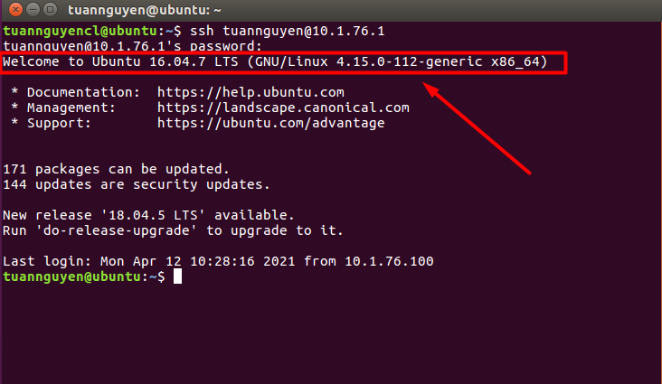

**Các vấn đề liên quan đến SSH**

- [**1. Copy private key từ máy trạm centos 7 vào MobaXterm laptop để add đến máy chủ CentOS 7**](#1-copy-private-key-từ-máy-trạm-centos-7-vào-mobaxterm-laptop-để-add-đến-máy-chủ-centos-7)
- [**2. Tạo ssh key trên laptop và ssh đến server centos 7**](#2-tạo-ssh-key-trên-laptop-và-ssh-đến-server-centos-7)
- [**3. Cấm truy cập từ xa sử dụng tài khoản Root trên CentOs 7**](#3-cấm-truy-cập-từ-xa-sử-dụng-tài-khoản-root-trên-centos-7)
- [**4. Dùng user thường trên máy trạm CentOS 7 để ssh vào máy chủ CentOS 7**](#4-dùng-user-thường-trên-máy-trạm-centos-7-để-ssh-vào-máy-chủ-centos-7)
- [**Tìm hiểu về SSH Key Pair**](#tìm-hiểu-về-ssh-key-pair)
  - [**1. SSH Key Pair là gì?**](#1-ssh-key-pair-là-gì)
  - [**2. Các thành phần của SSH Key Pair**](#2-các-thành-phần-của-ssh-key-pair)
  - [**3. Nguyên tắc hoạt động của ssh key Pair**](#3-nguyên-tắc-hoạt-động-của-ssh-key-pair)
  - [**4.Ưu điểm của xác thực SSH key pair**](#4ưu-điểm-của-xác-thực-ssh-key-pair)
  - [**5.Nhược điểm của xác thực SSH key**](#5nhược-điểm-của-xác-thực-ssh-key)
  - [**6. Cách tạo SSH Key pair trên Linux**](#6-cách-tạo-ssh-key-pair-trên-linux)
    - [**6.1 SSH từ Client đến Server không sử dụng khóa công khai**](#61-ssh-từ-client-đến-server-không-sử-dụng-khóa-công-khai)
      - [**6.1.1 Thực hiện trên server**](#611-thực-hiện-trên-server)
      - [**6.1.2 Thực hiện bên Client**](#612-thực-hiện-bên-client)
    - [**6.2 Sử dụng SSH key pair**](#62-sử-dụng-ssh-key-pair)

# **1. Copy private key từ máy trạm centos 7 vào MobaXterm laptop để add đến máy chủ CentOS 7**
Bước 1: SSH vào máy trạm có địa chỉ là 192.168.33.139 để lấy private key


`		`Bước 2: Ta tìm đến mục root/.ssh/  để download file chứa key của máy trạm sau đó lưu trên máy(tùy chọn chỗ lưu file của bạn) 


Bước 3: Ta ssh vào máy chủ có địa chỉ 192.168.33.138 Ta điền địa chỉ private key  máy trạm vừa được lưu trên máy.


Thành công


# **2. Tạo ssh key trên laptop và ssh đến server centos 7**
`	`Bước 1: tạo key trên laptop


Bước 2: dùng mobaxterm ssh đến máy chủ có địa chỉ 192.168.33.138.Làm tương tự như bài trên

Bước 3:tạo file authorized\_keys trên máy chủ 


Bước 4: past key vừa tạo trên máy vật lý vào file authorized trên máy chủ


Bước 5: ta thêm private key vừa tạo vào mobaxterm

Bước 7: Ket noi lai ta thay da truy cap vao centOS 7 server bang cong VMnet 8 voi dia chi 192.168.33.1


# **3. Cấm truy cập từ xa sử dụng tài khoản Root trên CentOs 7**
`	`Bước 1: thực hiện lệnh cấm đăng nhập từ xa trên máy chủ CentOs 7


Sửa “yes” thành “no” sau đó gõ lệnh ETC và sau đó ấn shift zz để lưu và thoát


Bước 3: Reboot lại máy chủ CentOS 7

Bước 4: thực hiện SSH lại bằng Mobaxterm

Kết quả: không thể ssh vào tài khoản root


`	`Thử đăng nhập bằng user thường.Kết quả,thành công


# **4. Dùng user thường trên máy trạm CentOS 7 để ssh vào máy chủ CentOS 7**
Bước 1; đăng nhập vào tài khoản user của bạn bằng lệnh: su -test1.

Bước 2: ta tạo key cho user  


Bước 3: copy key của user sang máy chủ CentOS


Bước 4: ssh vào máy chủ CentOS bằng user thường.


`	`Kết quả thành công


**Hướng dẫn sử dụng SSH KEY PAIR**


# **Tìm hiểu về SSH Key Pair**
SSH Keys là một phương thức xác thực đăng nhập với máy chủ thông qua truy cập SSH bằng việc đối chiếu giữa một cặp keys (Private và Public Key)

## **1. SSH Key Pair là gì?**

- SSH Keys là một phương thức xác thực đăng nhập với máy chủ thông qua truy cập SSH bằng việc đối chiếu giữa một cặp keys, bao gồm một khóa riêng tư (private key) và khóa công khai (public key) tương ứng. SSH Keys sử dụng giao thức xác thực hỏi và trả lời trong đó một bên trình bày một câu hỏi và một bên khác phải cung cấp một câu trả lời hợp lệ để được chứng thực.

- Thông thường, một người dùng đăng nhập VPS(Virtual Private Server- là phương pháp phân chia một máy chủ vật lý thành nhiều máy chủ ảo ) thông qua username root và password của user đó. Người dùng có thể mất quyền truy cập VPS nếu bị quên hoặc để lộ mật khẩu hay bị dò tìm mật khẩu qua Brute Force Attack. Do đó, việc sử dụng SSH Keys sẽ bảo mật hơn rất nhiều so với phương pháp đăng nhập dùng mật khẩu truyền thống.

- Hiểu cách đơn giản ta có thể so sánh Private Key như là chìa khóa còn Public Key là ổ khóa

## **2. Các thành phần của SSH Key Pair**

Khi tạo ra một SSH Key, bạn cần biết sẽ có 3 thành phần

- Public Key : Bạn sẽ copy ký tự key này sẽ bỏ vào file ~/.ssh/authorized\_keys trên server của bạn.
- Private Key : Bạn sẽ lưu file này vào máy tính, sau đó sẽ thiết lập phiên ssh sử dụng key này để có thể login.
- Keyphrase : Mật khẩu để mở private key, khi đăng nhập vào server nó sẽ hỏi cái này (Nếu không đặt pass cho private key thì có thể bỏ qua)
## **3. Nguyên tắc hoạt động của ssh key Pair**
- Private key và Public key luôn có liên hệ chặt chẽ với nhau để nó có thể nhận diện lẫn nhau. 
- Khi tạo một SSH Key thì người dùng sẽ có cả 2 loại key này. 
- Sau đó người dùng mang public key upload lên máy chủ của mình, còn cái private key của người dùng sẽ lưu ở máy
- Khi đăng nhập vào server, người dùng sẽ gửi yêu cầu đăng nhập kèm theo cái Private Key này để gửi tín hiệu đến server, server sẽ kiểm tra xem cái Private key của người dùng có khớp với Public key có trên server hay không, nếu có thì bạn sẽ đăng nhập được.
## **4.Ưu điểm của xác thực SSH key pair**
Đầu tiên là các SSH key khó bị hack hơn mật khẩu và do đó an toàn hơn.

SSH key không phải do con người tạo ra, do đó, sẽ không có các trường hợp đặt khóa dễ đoán như "123456" hay "password".

Cho phép nhiều nhà phát triển đăng nhập với tư cách người dùng cùng một hệ thống mà không cần phải chia sẻ một mật khẩu duy nhất giữa họ.
## **5.Nhược điểm của xác thực SSH key**
- Nhược điểm đầu tiên của việc sử dụng xác thực SSH key là private key cần được lưu trữ trên thiết bị mà bạn đăng nhập. Các thiết bị này, chẳng hạn như máy tính xách tay và điện thoại di động, có thể bị mất hoặc bị đánh cắp. Và nếu chúng không được bảo vệ đúng cách, tin tặc có thể truy cập vào private key và cuối cùng là máy chủ.
- Nhân viên có thể thay đổi các mật khẩu này để chỉ họ biết cụ thể mất khẩu đó là gì. Sysadmin sẽ không còn có quyền truy cập vào mật khẩu của nhân viên nữa.
## **6. Cách tạo SSH Key pair trên Linux**
Mô hình mạng


### **6.1 SSH từ Client đến Server không sử dụng khóa công khai** 
#### **6.1.1 Thực hiện trên server**
Bước 1: cài đặt địa chỉ IP 


Hiển thị: dùng lệnh ifconfig


Bước 2:Cài SSH 


Bước 3: Tạo Domain


#### **6.1.2 Thực hiện bên Client**
Bước 1: ta vào máy client SSH đến Server


### **6.2 Sử dụng SSH key pair**
Thực hiện cấu hình trên client

Bước 1:chạy lệnh ssh-keygen -t rsa để tạo key


Bước 2: Nhập passphrase

 

Ví dụ xem primary key.Gõ lệnh ở terminal:

```
nano /home/tuannguyencl/.ssh/id\_rsa
```

Hiển thị key Private dưới dạng mã hóa


Bước 3:Client dùng mật mã khóa SSH

Chúng ta sử dụng lệnh copy key giữa client linux và server linux như sau,

Hiểu 1 cách đơn giản là  nếu ta muốn copy Key từ server có IP là A lên server có IP là B thì ta ssh vào server A và gõ lệnh


```
ssh-copy-id tuannguyen@10.1.76.1

```


Với B là địa chỉ IP của server B, sau đó hiển thị thông báo nhập password của server B, bạn nhập pass root ssh của server B để copy key hoàn thành nhé

Nhập pass:


Ta gõ lệnh ssh từ client vào server:

lệnh:


```
ssh tuannguyen@10.1.76.1
 ```


Hiển thị kết quả trả về thành công, ta đã ssh vào server dùng keypair:


